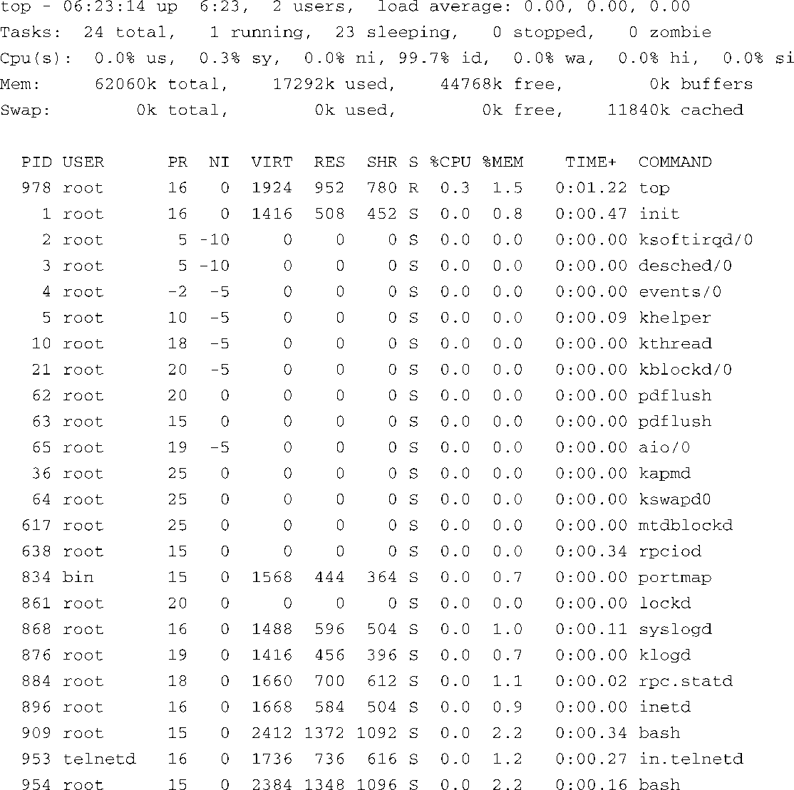

### 13.4.5　top

ps是当前系统状态的一个瞬时“快照”，而top则会定期“抓拍”系统和进程状态的“快照”。与ps类似，top也有很多命令行和配置选项。它是交互式的，可以在运行的过程中（通过键盘按键）重新配置，以定制其输出信息，从而满足你的具体需求。

如果不带任何参数，top会显示出所有运行中的进程，显示方式非常类似于代码清单13-9中的 `ps aux` 命令，而且每隔3秒更新一次。当然，top的更新时间和其他参数都是用户可以配置的。top输出的开始几行显示了系统信息，它们也是3秒钟更新一次。这包括系统的运行时间、用户个数、进程个数及状态等。

代码清单13-10显示了采用默认配置时 `top` 命令的输出，也就是在执行 `top` 命令时不带任何参数的结果。

代码清单13-10　 `top` 的默认显示

代码清单13-10中默认显示的列包括PID、用户名、进程优先级、进程的nice值、进程使用的虚拟内存、驻留内存的大小、任务使用的共享内存以及其他一些和前面ps示例中描述相同的字段。

由于篇幅有限，我们在这里只能简要介绍这些有用的工具。建议你查看一下top和ps的帮助手册，并花一个下午的时间来探究它们丰富的功能。

