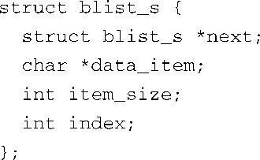
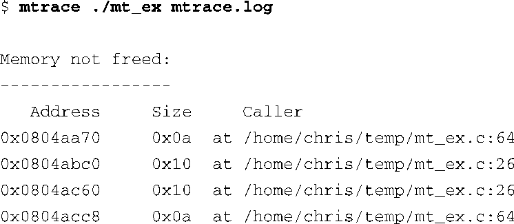

### 13.4.6　mtrace

mtrace是一个简单的实用程序，能够分析应用程序调用 `malloc()` 、 `realloc()` 和 `free()` 的情况，并输出报告。它便于使用，而且很可能会帮助你找出应用程序中的问题。和我们在本章前面介绍的其他用户空间工具一样，mtrace必须针对嵌入式架构进行配置和编译。mtrace安装在你的目标板上，是一个替换 malloc的程序库。应用程序通过一个特殊的函数调用来开启它的功能。你的嵌入式Linux发行版中应该包含mtrace软件包。

为了说明这个工具的使用，我们编写了一个简单的程序，它能够在一个简单的链表上创建动态数据。每个链表项目都是动态创建的，而且链表项目中的数据项目也是动态创建的。代码清单13-11显示了这个简单的链表结构：

代码清单13-11　简单的线性链表

每个链表项都是像下面这样通过调用 `malloc()` 动态创建的，之后被放置在链表的末尾：

每个链表项中的数据项（结构体中的 `data_item` ，大小不定）也是动态生成的，链表项在设置了这个数据项后才会被放置到链表的末尾。这样的话，每个链表项的创建调用了两次 `malloc()` ——一次是创建链表项本身（由刚刚显示的结构体 `struct blist_s` 所代表），一次是创建大小不定的数据项。编写程序时，我们在链表中创建了10000个项，而每个项中包含一个变长的字符串数据，结果是调用了20000次 `malloc()` 。

要使用mtrace，应用程序必须满足3个条件：

+ 源码文件中必须包含一个名为mcheck.h的头文件；
+ 应用程序必须调用函数 `mtrace()` 以安装处理程序；
+ 环境变量 `MALLOC_TRACE` 必须指定一个可写文件的名称，追踪数据会被写入这个文件中。

当这些条件都满足后，每当应用程序调用被追踪的某个函数（ `malloc()` 、 `realloc()` 或 `free()` ）时，都会在原始的追踪文件（由 `MALLOC_TRACE` 指定）中生成一行信息。这个文件中的追踪数据看上去像是这样：

`@` 标志表示这行追踪数据中包含一个地址或函数名。程序的执行地址显示在方括号中，值为0x80486ec。使用一个二进制工具或调试器，很容易就能将这个地址和某个函数关联起来。加号（ `+` ）表示调用了分配内存的函数。如果调用的是 `free()` 函数，则会显示一个减号。下一个字段是分配或释放的内存块虚拟地址。最后一个字段是内存块的大小，在调用内存分配函数时会包含这个参数。

这个数据格式对于用户来说并不十分友好。因此，mtrace软件包中包含了一个实用程序，它能够分析原始的追踪数据，并报告程序中前后不一致的地方。这个分析工具实际上是一个Perl脚本（文件名也是mtrace）。在最简单的情况下，这个Perl脚本只会打印一行消息：No memory leaks。代码清单13-12显示了当mtrace检测到内存泄漏时产生的输出信息。

代码清单13-12　mtrace 错误报告

可以看到，这个简单的工具可以帮助我在问题出现之前发现它们，或是在问题出现时找到它们。注意一下，该Perl脚本显示出了每次调用 `malloc()` 时的文件名和行号，但它们分配的内存却没有相应地调用 `free()` 来释放。要想释放分配的内存，则需要在可执行程序中包含调试信息，这些信息是在编译程序时通过传递 `-g` 标志给编译器生成的。如果脚本没有找到调试信息，它只会打印出调用 `malloc()` 的函数的地址。

