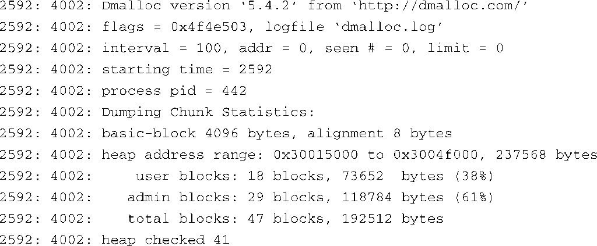
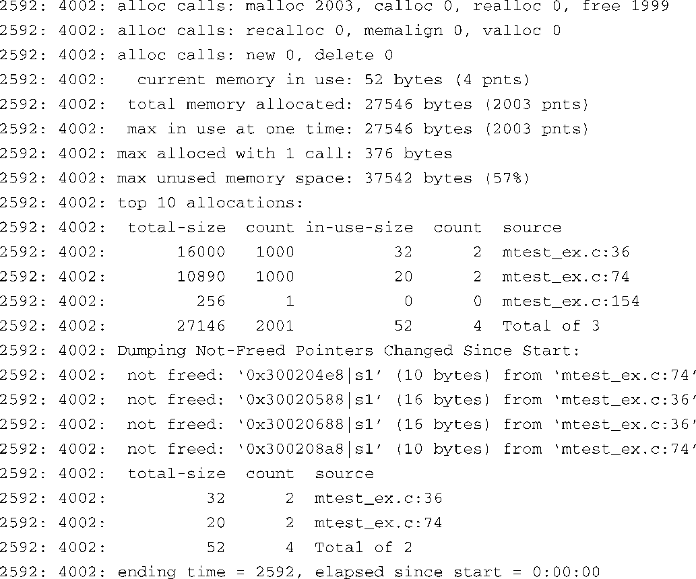

### 13.4.7　dmalloc

dmalloc实现了mtrace所欠缺的一些功能。mtrace软件包比较简单，对程序的影响也不大，它主要用于检测应用程序中不配对的 `malloc/free` 调用。dmalloc软件包则允许你检测更大范围的动态内存管理错误。与mtrace相比，dmalloc对程序的影响要大很多。根据具体配置，dmalloc能够让你的程序慢如蜗牛。如果你怀疑内存错误是由竞争条件或其他时序问题造成的，就不应该选择dmalloc来排查问题。因为dmalloc（和matrace，程度轻一些）必定会改变应用程序的时序。

dmalloc是一个非常强大的动态内存分析工具。它是高度可配置的，所以也比较复杂。学习和掌握这个工具需要一些时间。然而，从QA测试到消除程序故障，它都可以成为你最有力的开发工具之一。

dmalloc是一个替换 malloc的调试用的程序库。要想使用dmalloc，必须满足以下条件：

+ 应用程序代码必须包含dmalloc.h头文件；
+ 应用程序必须和dmalloc程序库链接在一起；
+ dmalloc程序库及工具必须安装到嵌入式目标板上；
+ 在目标板上运行应用程序之前，必须设置dmalloc程序库引用的一些环境变量。

虽然不是严格必须的，但你应该在应用程序中包含dmalloc.h。这允许dmalloc在输出信息中包含文件名和行号。

将你的应用程序和一个你选择的dmalloc程序库链接在一起。dmalloc软件包可以通过配置生成几个不同的程序库，这取决于配置时所做的选择。下面的几个例子使用了libdmalloc.so，它是一个共享程序库对象。将程序库（或是指向它的符号链接）放置在一个编译器能够找到的地方。用于编译应用程序的命令行看上去会像是下面这样：

这个命令行假设你已经将dmalloc程序库（libdmalloc.so）放到了由 `-L` 选项指定的位置——具体来说，就是指目录../dmalloc-5.4.2，它位于当前目录的上一级目录中。

要在目标板上安装dmalloc程序库，首先将它放在一个自己喜欢的位置中（也许是/usr/local/lib）。为了找到这个程序库，你可能需要配置自己的系统。在我们示例的Power架构系统中，在文件/etc/ld.so.conf中添加路径/usr/local/lib，并执行ldconfig工具来更新系统的程序库搜索缓存。

最后一步准备工作是设置一个环境变量，dmalloc程序库使用它来确定启用的调试级别。这个环境变量包含一个调试比特掩码，它将很多特性串联起来放到一个变量中以便使用。环境变量的设置看起来会像是这样：

这里， `debug` 就是指调试级别比特掩码，而 `inter` 则设置了一个间隔次数，每经过这么多次的内存函数调用，dmalloc就对其自身及堆进行一次彻底检查。dmalloc库将其日志输出写入由变量 `log` 指定的文件中。

dmalloc软件包中包含了一个实用程序（名称也是dmalloc），它可以根据传给它的标志来生成环境变量 `DMALLOC_OPTIONS` 的值。dmalloc软件包中的文档详细讲述了这个工具，我们就不在此复述了。刚才显示的那个例子是由下面这条dmalloc命令生成的：

当这些步骤完成后，应该可以将你的应用程序链接到dmalloc调试程序库并运行它了。

dmalloc会生成一个相当详细的输出日志。代码清单13-13显示了一个dmalloc日志输出示例，它所检查的示例程序有意制造了一些内存泄漏。

代码清单13-13　dmalloc 的日志输出

注意到这个日志是在程序退出时生成的，这一点很重要。（dmalloc有很多选项和操作模式，可以将dmalloc配置为在检测到错误时就打印输出信息。）

这个输出日志的前半部分报告了一些高层次的统计信息，它们与堆和应用程序的整体内存使用情况有关。其中包括每个malloc程序库调用（比如 `malloc()` 、 `free()` 和 `realloc()` ）的总的次数。有趣的是，这个默认的日志还显示了调用最多的前10名，并显示了它们在源码中出现的位置。这对于整体的系统层性能检测很有用。

在这个日志的后面，我们看到了应用程序中内存泄漏的证据。可以看到，dmalloc程序库检测到了4处内存泄漏，内存分配了但显然没有释放。因为我们在源码中包含了dmalloc.h，并且在编译时加上了调试符号，所以dmalloc能够在日志中显示出内存配置时的源码位置。

与本章介绍的其他工具一样，由于篇幅关系，我们只能简要介绍这个非常强大的调试工具。dmalloc能够检测很多其他情况和限制。例如，dmalloc能够检测到一个释放的指针何时又被写入了数据。它还能够判断一个指针是否用于访问超出其边界的数据，但此数据在应用程序允许访问的地址范围之内。实际上，我们可以配置dmalloc，使其记录几乎所有通过调用 `malloc` 系列函数完成的内存操作。花时间熟悉并掌握dmalloc这个工具，它一定会给你带来数倍的回报。

