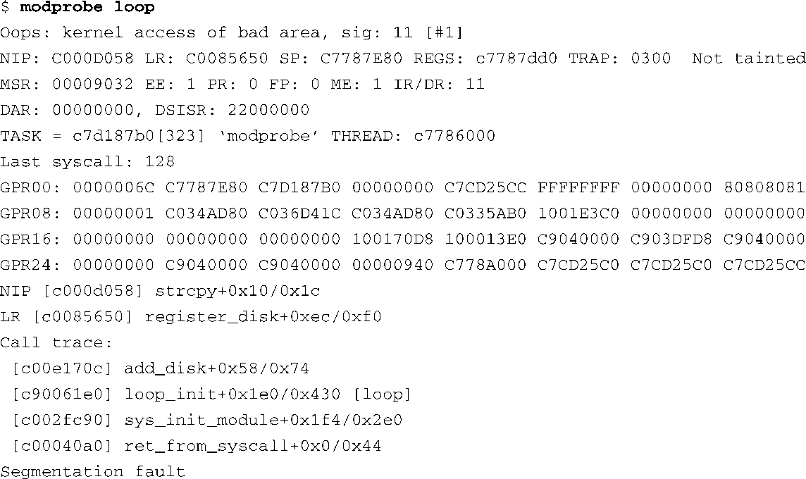
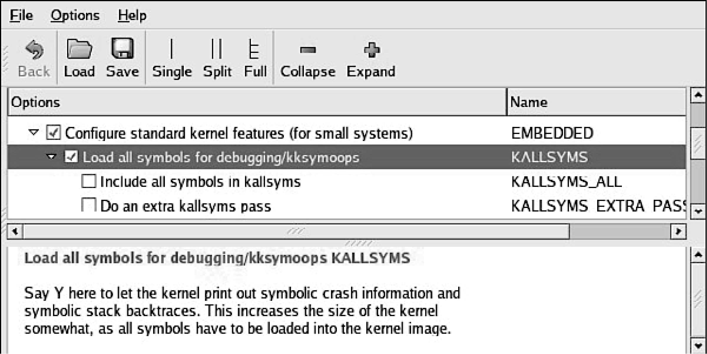

### 13.4.8　内核oops

虽然严格来说内核oops并不是一个工具，但它却包含了很多有用信息，能够帮助你找到问题的根源。很多内核错误都会造成内核oops，从一个进程产生的简单的内存错误（在大多数情况下可以完全恢复）到一个致命的内核异常。除了原始的16进制地址值之外，最新的Linux内核还支持显示符号信息。代码清单13-14显示了一个Power架构目标板上的内核oops信息。

代码清单13-14　内核oops信息

注意到上面的代码清单中还在一些合适的位置显示了符号信息（比如函数名称）。如果想要显示这些符号信息，内核在配置时必须开启 `KALLSYMS` 选项。图13-4显示了这个配置选项的位置，它位于General Setup主菜单的下面。

<b class="my_markdown">图13-4　配置oops中的符号信息</b>

内核oops消息中的大多数信息都与处理器直接相关。为了完全理解oops消息，我们有必要了解一些有关底层硬件架构的知识。

分析一下代码清单13-14中显示的oops消息，我们可以立刻发现这个oops产生的原因是“kernel access of bad area，sig：11”（内核访问了错误的区域，信号：11）。从本章前面的例子中我们已经知道，信号值为11表示这是一个段错误。

第一段是一个总结，显示了产生oops的原因、几个重要的地址值以及引起问题的任务。在代码清单13-14中，NIP（Next Instruction Pointer）寄存器是指下一指令指针，它的值在oops消息的后面被解码为对应的符号信息。它指向造成oops的出错代码。LR（Link Register）是一个Power架构的寄存器，一般用于存储当前执行的子函数的返回地址。SP寄存器存储了栈指针。REGS表示一个内核数据结构的地址，其中包含了寄存器的转储数据。TRAP表示与这个oops消息相关的异常类型。第7章的最后一节中引用了PowerPC架构用户手册，在参考这份文献之后，我们了解到TRAP 0300指的是一个数据存储中断（Data Storage Interrupt），而它是由数据内存的访问错误造成的。

在oops消息的第3行中，我们还看到了其他一些Power架构机器的寄存器，比如MSR（Machine State Register，机器状态寄存器），这个寄存器的一些比特位也被解码并显示出来。在下一行中，我们看到了DAR（Data Access Register，数据访问寄存器），它通常会包含引起问题的内存地址。通过查看DSISR寄存器的内容以及PowerPC架构的参考手册，我们可以详细了解产生异常的具体原因。

oops消息还包含了任务指针和解码后的任务名称，这可以帮助你快速确定oops消息产生时正在运行的任务或线程。我们还看到了详细的寄存器转储信息，这就给我们提供了更多的线索。同样，要想读懂这些寄存器值并理清线索，我们需要了解底层硬件架构以及编译器是如何使用寄存器的。例如，PowerPC架构使用r3寄存器来存放C函数的返回值。

oops消息的最后一部分提供了一个栈的回溯追踪，如果内核中包含符号信息的话， `backtrace` 中的地址值会被解码成对应的符号。使用这个信息，我们能够构建导致问题产生的一连串事件。

在这个简单的例子中，我们已经从oops消息中了解到了大量信息。我们知道了这是一个Power架构中的数据存储异常，它是由一个数据内存访问（而不是指令内存访问）的错误造成的。DAR寄存器告诉我们产生这个异常的数据地址是0x0000_0000。我们还发现是modeprobe进程产生了这个错误。通过查看backtrace和NIP寄存器，我们了解到这个错误是在调用 `strcpy()` 时发生的，而该调用可以直接回溯追踪到loop.ko模块中的 `loop_init()` 函数，modeprobe正是在尝试安装这个模块时产生了异常。有了这些信息，我们可以很容易地追查到空指针解引用的错误根源。

