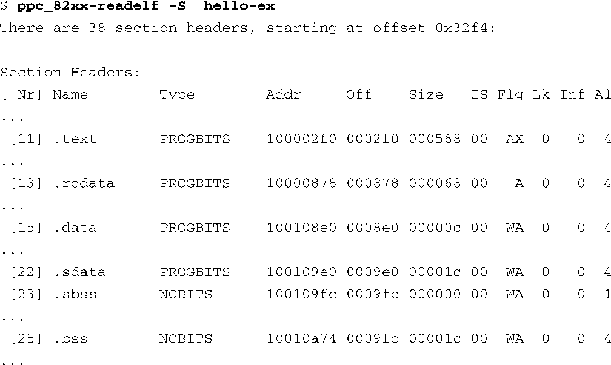
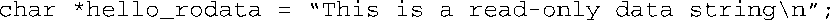
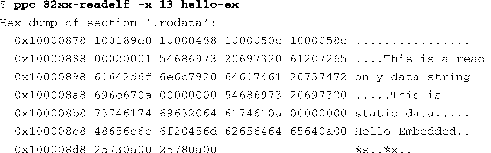

### 13.5.1　readelf

readelf这个工具能够检查一个（ELF格式的）目标二进制文件的成分。在构建以ROM或闪存为目标的镜像时，这个工具特别有用，因为这时需要显式地控制镜像的布局。你还可以通过它来了解工具链是如何构建镜像的，并深入理解ELF文件格式。

例如，为了显示ELF镜像中的符号表，可以使用以下这条命令：

为了发现和显示ELF镜像中的所有段，可以使用下面这条命令：

使用 `-S` 标志可以列出ELF镜像中所有的段头部。你也许会惊讶地发现，即使一个简单的只有7行代码的Hello World程序也会包含38个不同的段。其中有些你可能比较熟悉，比如 `.text` 段和 `.data` 段。在代码清单13-15中，我们列出了这个Hello World程序中的部分段。简单起见，这里只显示了与嵌入式开发人员相关的（或他们熟悉的）一些段。

代码清单13-15　使用readelf 读取文件的段头部

`.text` 段包含了可执行代码。 `.rodata` 段包含了程序中的常量数据。.data段一般包含已初始化的全局数据，由C程序库的启动代码（prologue code）使用，它还可以包含应用程序中使用的已初始化的数据成员。.sdata段用于较小的已初始化的全局数据项，而且它只存在于部分架构中。如果知道内存区域的相关属性，有些处理器架构能够使用优化的数据访问。 `.sdata` 和 `.sbss` 段就使这种优化成为可能。 `.bss` 和 `.sbss` 段中包含了程序中未初始化的数据。这两个段并不占用程序镜像的空间。它们的内存空间是在程序启动时由C程序库的启动代码分配的，并且被初始化为0。

我们可以查看任意段并显示其内容。如果你在C程序中函数外部定义了下面这一行，我们可以看到它是怎样放置在 `.rodata` 段中的。

执行 `readelf` 命令，并在命令行中指定预查看段的编号，编号代码清单13-15有显示：

在 `.rodata` 段中，我们看到了前面声明的那个全局变量的初始值，以及程序中定义的其他所有常量字符串。

