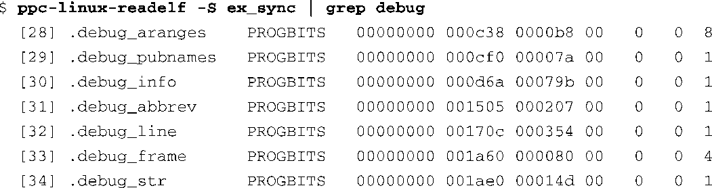
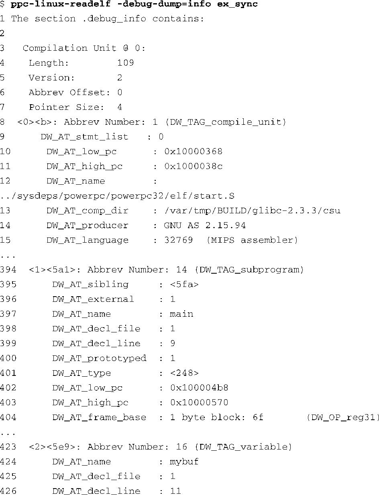
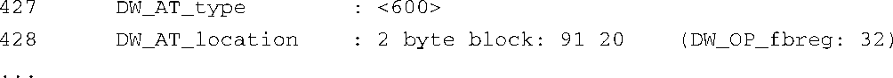

### 13.5.2　使用readelf查看调试信息

readelf有一个比较有用的特性，它能够显示出包含在ELF文件中的调试信息。如果在编译程序时使用了编译器的 `-g` 标志，编译器就会生成调试信息，并将它们放置在最终的ELF文件的一系列段中。我们可以使用 `readelf` 显示出这些ELF段头部：

使用 `readelf` 并带上 `--debug-dump` 选项，可以显示所有 `.debug_*` 段的内容。第14章会讲述这些信息给我们带来的帮助，到时还将讨论内核调试及优化的挑战性。

调试信息的数量会非常大。如果显示出Linux内核文件vmlinux（ELF格式）中的所有调试信息，会有600多万行输出信息。这看起来很吓人，但熟悉一点调试信息至少有助于你成为一个更好的嵌入式工程师。

代码清单13-16显示了一个示例应用程序中的 `.debug_info` 段的部分内容。为了节省空间，这里只显示了几条记录。

代码清单13-16　部分调试信息

第1条记录是由一个Dwarf2<a class="my_markdown" href="['#anchor139']">[9]</a>标签 `DW_TAG_compile_unit` 标识的，它代表了这个Power架构可执行文件的第1个编译单元。它是一个名为start.S的文件，提供了C程序的启动代码。下一个由 `DW_TAG_subprogram` 标识的记录代表了用户程序的开始，也就是我们熟悉的 `main()` 函数。这个Dwarf2调试记录包含了对文件和行号的引用，从而我们可以找到 `main()` 函数的位置。代码清单13-16中的最后一条记录代表了 `main()` 函数中的一个局部变量，名为 `mybuf` 。同样，这条记录也提供了行号和文件。你可以从这些信息中推导出， `main()` 函数位于源文件的第9行，而 `mybuf` 则位于第11行。ELF文件中的调试记录都是通过名为 `DW_AT_decl_file` 的Dwarf2属性与文件名相关联。

<a class="my_markdown" href="['#ac139']">[9]</a>　这一章最后引用了一篇文献，它专门讲述Dwarf2调试信息标准。

本章最后一节中提供的参考文献，能够帮助你了解所有关于Dwarf2调试信息格式的具体细节。

