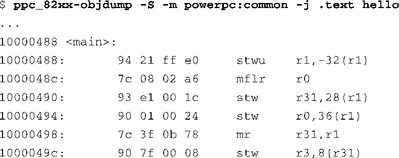
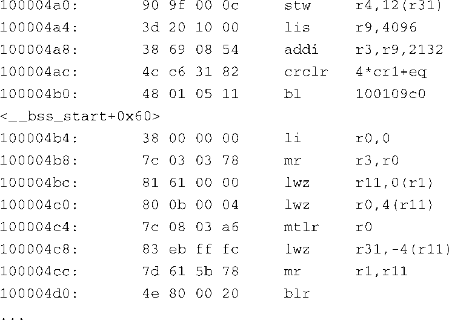

### 13.5.3　objdump

objdump与readelf有很多功能是重叠的。然而，objdump有一个比较有用的特性，它能够显示反汇编后的目标代码。代码清单13-17提供了一个反汇编 `.text` 段的例子，它来自一个Power架构版本的Hello World程序。为了节省空间，我们只列了 `main()` 函数。全部反汇编信息，包括C程序库的启动代码和关闭代码，会占用几页纸的篇幅。

代码清单13-17　使用objdump进行反汇编

这是个简单的 `main()` 函数，其中的大部分代码用于创建和销毁栈帧。靠近代码清单中间的那条 `bl` （branch link，跳转链接）指令是实际调用 `printf()` 函数的地方，其地址为0x100004b0，这是一个Power架构的函数调用指令。因为这个程序是被编译成一个动态链接的对象，所以直到运行时才会有 `printf()` 函数的地址，到那时，它会和共享程序库中的 `printf()` 函数链接到一起。如果将这个应用程序编译成一个静态链接的对象，我们就会看到调用 `printf()` 函数时的符号信息和相应的地址。

