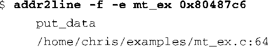

### 13.6.2　addr2line

我们在代码清单13-12中介绍了mtrace的使用，你可以看到这个分析脚本的输出信息中包含了文件名和行号。mtrace是一个用Perl语言编写的脚本，它使用了addr2line来读取可执行文件（ELF格式）中的调试信息，并显示出与地址相对应的行号。在代码清单13-12中，mtrace分析了可执行程序mt_ex，还是使用它，我们可以用addr2line找出一个虚拟地址所对应的文件名和行号：

注意，除了文件和行号之外，上面的命令还显示了函数名称 `put_data()` 。这说明地址0x80487c6位于文件mt_ex.c的第64行，而且是在函数 `put_data()` 中。对于那些包含多个文件名的二进制文件，比如Linux内核，这就更有用了：

这个特别的例子突出了我们在本章中反复强调的一点：这是一个与具体架构相关的工具。必须针对目标架构配置和编译你的工具，这样，它才能和目标二进制文件的架构相匹配。和交叉编译器一样，addr2line也是一个交叉工具，而且它是二进制实用程序软件包的一部分。

