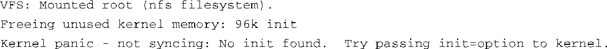

### 13.6.4　ldd

虽然严格来说ldd不是一个二进制实用程序，而是一个脚本，但它对嵌入式开发人员非常有用。它是C程序库软件包的一部分，而且几乎存在于所有的Linux发行版中。ldd可以列出一个或多个目标文件所依赖的共享对象库。我们在第11章中介绍过ldd。请看一下代码清单11-2中的示例，以了解它的使用方式。在开发ramdisk镜像的过程中，ldd脚本特别有用。在各种嵌入式Linux邮件列表中，一个最常提及的启动失败的问题就是在挂载根文件系统之后产生了内核异常：

一个最常见的原因是根文件系统镜像（ramdisk、闪存或NFS根文件系统）中没有包含可执行文件所依赖的程序库。使用ldd，你就可以知道一个可执行文件需要哪些程序库，并确保你的ramdisk或其他根文件系统镜像中包含了这些库。在前面那个内核异常的例子中，文件系统中确实有 `init` ，但没有Linux动态加载器ld.so.1。ldd的使用很简单：

这个简单的例子说明了 `init` 需要两个动态程序库：libc和ld-linux。它们必须存在于你的目标系统中，而且 `init` 可以访问——也就说，它们必须是可读和可执行的。

