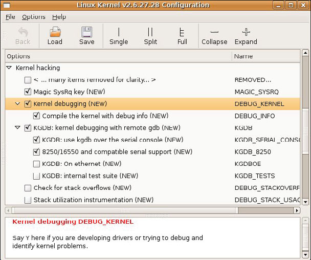

### 14.2.1　KGDB的内核配置

前面提到过，在对KGDB的支持方面，不同的架构和平台之间存在差异。下面这个例子基于CDS平台（来自飞思卡尔半导体公司）上的Power架构处理器MPC8548，并且使用了MontaVista公司出品的商业Linux发行版，而其中添加了对KGDB的支持。这个例子中的一些特性并不存在于主线内核源代码中，因为长期以来开发人员都不赞成在内核中包含对KGDB的支持，直到最近通用形式的KGDB（Linux 2.6.26）才开始出现。

KGDB是一个内核特性，必须在内核中开启它的功能。KGDB的配置选项位于Kernel hacking菜单下面，如图14-2所示（为了让图片能够显示在页面中，我们省略了Kernel hacking菜单下面的很多条目。实际上，在KGDB选项之前还有很多其他配置项）。作为配置的一部分，必须选择KGDB所使用的I/O驱动程序。在这个例子中，我们选择了串行端口驱动KGDB_8250。在图14-2中还要注意一点，我们选择了在编译内核时包含调试信息（DEBUG_INFO），这会在构建内核时加上编译器标志 `-g` ，从而可以进行符号调试。

<b class="my_markdown">图14-2　有关KGDB的内核配置</b>

