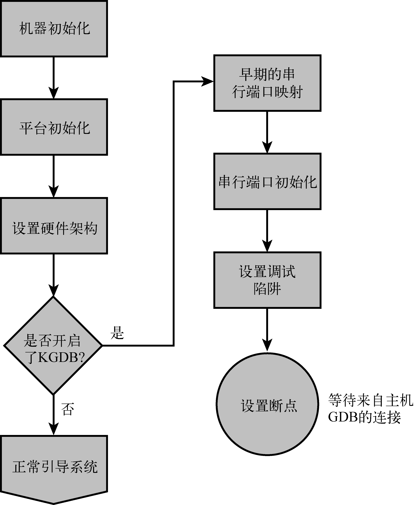
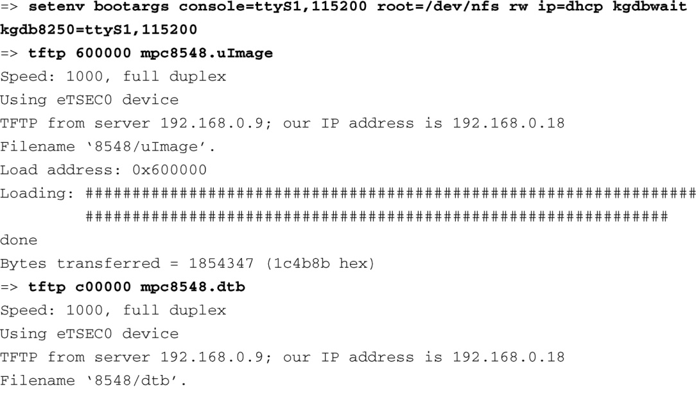
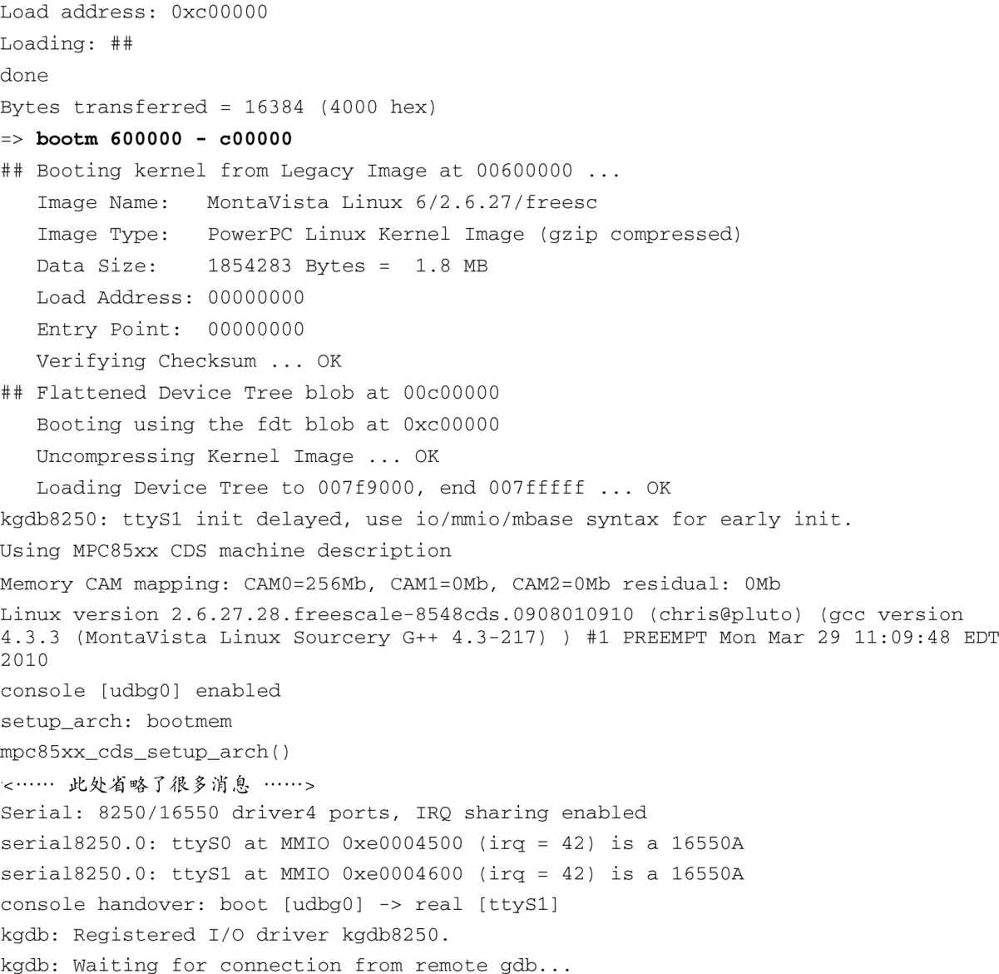
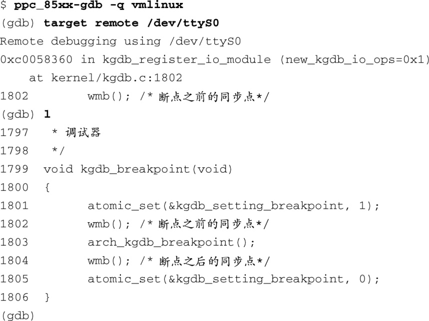

### 14.2.2　在开启KGDB时引导目标板

构建了支持KGDB的内核之后，必须在运行时开启它的功能。一般而言，在内核命令行中传递一个命令行开关即可开启KGDB。如果你已经将KGDB编译进了内核，但没有使用命令行开关开启它的功能，它是不会起作用的。开启KGDB之后，可以在系统引导过程的早期设置一个断点，让内核停在那儿，然后你就能够在开发主机上使用GDB连接到目标板上。图14-3显示了在开启KGDB之后设置一个初始断点的逻辑流程。

<b class="my_markdown">图14-3　KGDB的逻辑流程</b>

KGDB需要和开发主机之间通过串行端口进行连接<a class="my_markdown" href="['#anchor144']">[4]</a>。因此，设置KGDB的第一步就是在系统引导过程的早期阶段开启串行端口的功能。在很多架构中，在访问硬件UART之前，它必须首先被映射到内核内存中。在映射了地址范围之后，串行端口被初始化。接着会安装调试陷阱（debug trap）的处理函数，这样处理器异常能够陷入到调试器中。

<a class="my_markdown" href="['#ac144']">[4]</a>　在有些架构和平台上，你可以配置KGDB使用以太网甚至USB。

代码清单14-1显示了在开启KGDB的情况下系统引导时的终端输出信息。这个例子基于飞思卡尔公司的MPC8548CDS参考板，它在出厂时预装了U-Boot引导加载程序。

代码清单14-1　在开启KGDB的情况下使用U-Boot引导内核

这里的大部分输出信息看上去似曾相识，因为我们已经在第7章中介绍过U-Boot。回顾一下第7章的内容，U-Boot的环境变量 `bootargs` 定义了内核命令行的内容。注意到我们在命令行中添加了 `kgdbwait` 参数，它会让内核停在一个早期的断点上，并等待来自主机调试器（交叉版本的gdb）的连接。

另外需要注意的是，系统引导并没有完成。因为我们在内核命令行中指定了 `kgdbwait` ，内核的初始化流程会一直进行到串行端口驱动程序加载完成，然后停在一个预设断点上。这时，它会无限期地等待一个外部调试器和它建立连接。

你还应该注意到另一个新的内核命令行参数。这个特定的架构（Power）和平台（8548CDS）使用了8250串行端口驱动以及一个特殊的基于8250的KGDB驱动（它是由文件.../drivers/serial/ 8250_kgdb.c实现的）。必须告诉KGDB用于调试的串行端口设备，这是在内核命令行中指定的，使用的语法格式类似于描述一个控制台设备。

现在内核已准备就绪并等待主机调试器，可以开始一个调试会话了。我们在主机开发工作站上执行一个交叉版本的gdb，并通过GDB的远程协议连接到目标板上。在这个例子中，由于我们和控制台共享一个串行端口，因而必须先断开终端仿真器程序与目标板的连接，然后再尝试用GDB进行连接。代码清单14-2突出显示了GDB的连接过程。这里假设我们已经退出了终端仿真器程序，并将串行端口空出来给GDB使用。

代码清单14-2　连接到KGDB

我们在这里执行了3个动作：

+ 执行交叉版本的gdb程序，并将内核ELF文件vmlinux传递给它；
+ 使用命令 `target remote` 连接到目标板上；
+ 使用命令 `list` 的缩写形式 `l` 显示我们所处的源码位置。

一个显而易见的事实是，我们传递给GDB的vmlinux镜像和运行于目标板上的内核二进制镜像必须是在同一次内核构建中生成的。在编译它时还必须加上 `-g` 标志，以包含调试信息。回顾一下13.5.2节，可以使用一个交叉版本的readelf工具来验证这个vmlinux镜像是否包含了调试符号。使用下面这条命令就可以验证ELF文件中是否包含了调试段。

当我们执行命令 `target remote` 的时候，GDB显示了程序计数器的位置。在这个例子中，内核停在了函数 `kgdb_breakpoint()` 中，位置是文件.../kernel/kgdb.c的第1802行。执行 `continue(c)` 命令时，程序会从这里开始继续运行。

