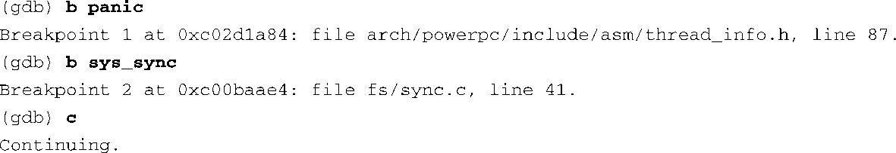
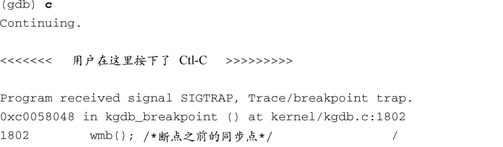
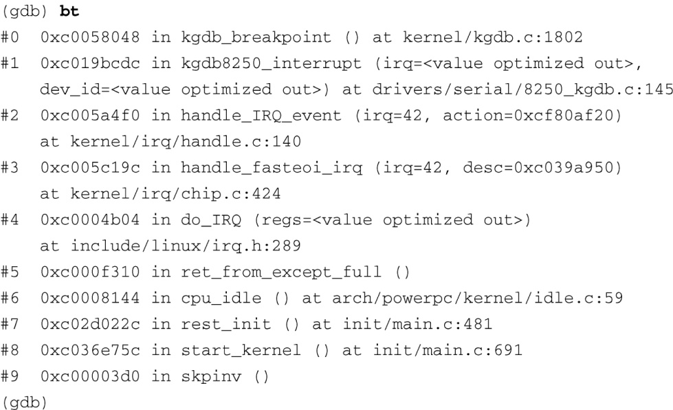

### 14.2.3　一些有用的内核断点

现在，开发主机和目标板上的内核之间已经建立了一个调试连接。当我们执行GDB的 `continue(c)` 命令时，内核会继续运行，而且，如果没有出现问题的话，引导过程会顺利完成。在这个阶段，你也许想设置几个断点，从而创建特定的调试会话。代码清单14-3中突出显示了两个最常用的断点。

代码清单14-3　常用的内核断点

使用GDB的 `breakpoint` 命令（上面的例子中使用了其缩写形式），我们设置了两个断点。一个位于 `panic()` ，另一个位于sync系统调用的入口 `sys_sync()` 。如果随后有一个事件引起了内核异常，前一个断点会被命中。这样，我们就可以使用调试器查看出现panic时的系统状态。第二个断点的用处在于，当我们在一个运行于目标板上的终端输入 `sync` 命令时，这个命令会执行内核的sync系统调用，从而让内核停在这个断点上，并且让应用程序从用户空间陷入调试器中。

我们现在准备就绪，可以继续调试会话。目前的情况是，目标板上运行了一个开启KGDB功能的内核，并且它暂停在一个KGDB定义的断点上。之后，我们建立了主机交叉调试器（在这个例子里是ppc_85xx-gdb）与目标板之间的连接，并且设置了几个有用的系统断点。现在我们能够利用它们来完成手上的调试任务。

一个警告：根据定义，我们不能使用KGDB单步调试 `breakpoint()` 之前的代码，因为我们是使用它来建立（开启了KGDB功能的）内核和主机上的交叉gdb之间的连接。图14-3粗略地描述了KGDB获得控制权之前的代码执行流程。调试这段早期的代码需要使用一个辅助调试的硬件探测器。我们将在14.4节中讨论这个主题。

一旦设置好这些初始断点，并执行了 `continue` 命令，你可以在任何时候停止程序的执行，只需按Ctrl-C就行了，这会向交叉gdb发送一个信号。代码清单14-4显示了这个过程。

代码清单14-4　正在执行的内核调试会话

可以在代码清单14-4中看到编译器优化的效果。14.3.2节将深入讨论这个主题。

