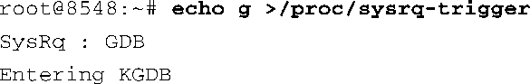
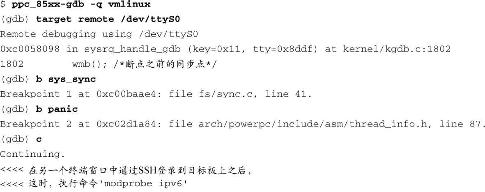
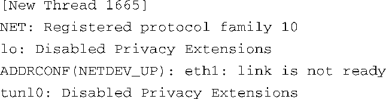

### 14.2.4　KGDB与控制台共享一个串行端口

虽然系统控制台和KGDB调试可以共用同一个串行端口，但这显然不够理想。在不同的架构和平台上，KGDB具备的功能有所不同。一旦离开了x86架构，事情就变得不太确定了。KGDB有很多连接选项，包括使用串行端口、以太网端口，甚至在某些平台上可以行使USB。可以确定的一点是，在任意一个给定的平台上，并不是所有这些组合都会经过测试。

本书的其他地方已经说过：如果你确信需要使用KGDB来进行内核调试，在目标板上添加一个串行端口无可非议，如果这个串行端口可以在生产阶段节省成本的话，就更是如此了。它所减轻的负担（可理解为开发人员的时间）足够补偿它所增加的开发成本。

要在控制台和KGDB之间共享一个串行端口，需要两个命令行参数。使用内核命令行参数 `kgdboc` 指定使用的串行端口，并使用 `kgdbcon` 表示KGDB会和控制台共享此串行端口。在使用 `kgdboc` 参数指定一个串行端口时，它所采用的方法类似于在内核命令行中描述一个控制台设备：

当你引导内核并建立了KGDB连接后，所有的控制台消息都会由主机上的交叉gdb显示出来。代码清单14-5展示了这样的一个例子。首先，我们使用刚才所说的命令行参数引导目标板。目标板正常启动，直到显示一个登录提示符。现在，我们必须使用SysRequest开启KGDB的功能。在一个串行端口控制台中，最简单的方法是使用/proc接口：

现在，我们将串行端口终端从控制台断开，释放它给KGDB使用。我们接着执行交叉gdb，代码清单14-5显示了之后的调试会话。

代码清单14-5　与KGDB共享串行端口控制台

正如代码清单14-5所示，我们设置了断点，并执行 `continue` 命令让内核继续运行。在主机的另一个终端窗口中，使用SSH协议登录到目标板上，并加载一个模块，在这里，它是指 `ipv6.ko` 。具体加载哪个模块并不重要，我们的目的是生成一些内核的 `printk` 打印消息，以验证他们确实会被输出到GDB的终端窗口中。你可以看到这些消息是从 `[New Thread 1665]` 行开始的。内核 `printk` 消息先是被路由到系统控制台，接着被KGDB通过GDB远程协议路由到GDB控制台。真的是非常酷！

