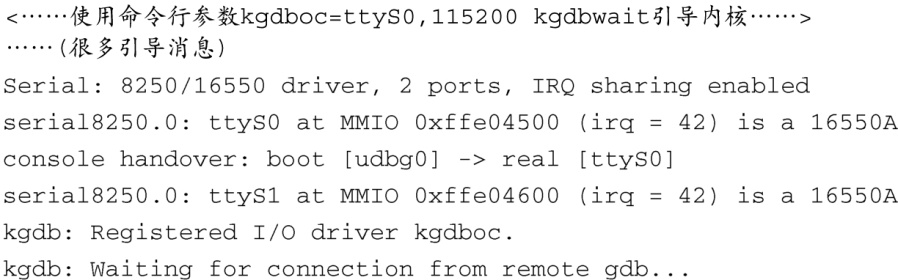

### 14.2.6　主线内核对KGDB的支持

从Linux 2.6.26开始，通用的KGDB功能已经并入kernel.org发布的Linux内核版本中。如果如前所述在编译内核时选择了支持KGDB，有两个内核命令行参数可在运行时配置KGDB。 `kgdboc` 指定使用的串行端口，而 `kdgbwait` 让内核在引导时停在一个断点上，从而允许调试器（gdb）获得控制权。 `kgdboc` 使用的语法格式和 `kgdb8250` 相同，刚刚在14.2.5节中已经介绍过了，它可以指定串行端口设备和波特率。 `kgdbwait` 是独立使用的，不带参数值。与14.2.5节中的例子类似，如果要在Linux 2.6.26及以后版本的内核中开启KGDB，可以使用下面这些内核命令行参数。注意，这些参数的顺序很重要。必须先指定串行端口，之后才能让内核停在断点上。

在系统引导时，内核会完成大部分的系统初始化，然后等待来自调试器的连接。代码清单14-6说明了这个过程。

代码清单14-6　引导一个Kernel.org发布的内核，其中包含了通用的KGDB功能

这时，内核正在等待一个来自远程GDB会话的连接，连接上之后就可以开始调试了。注意，这已经到了内核引导过程的后期阶段。如果想要在引导过程中的早期调试一个通用Linux内核，必须使用JTAG探测器进行硬件辅助调试。我们很快就会介绍相关内容。

