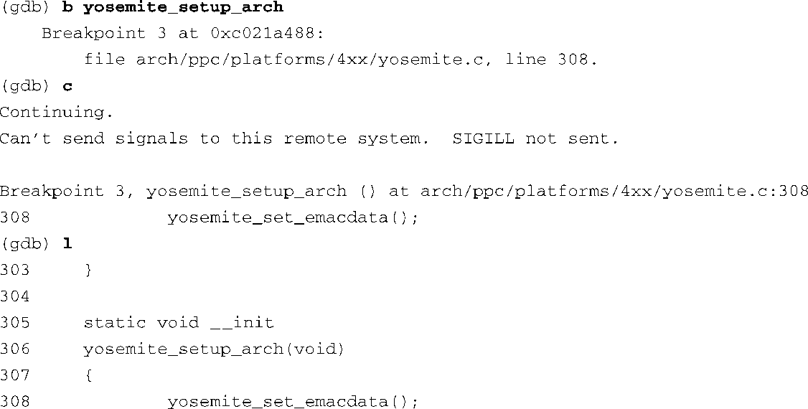
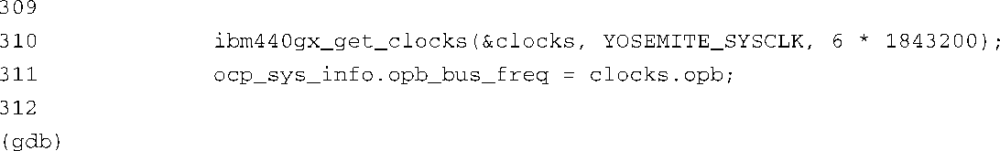

### 14.3　内核调试技术

单步调试内核代码的常见原因之一是，你需要针对目标板的具体架构和平台修改或编写代码。让我们以AMCC公司的Yosemite开发板为例，看一下具体如何操作。我们在架构设置函数中放置了一个断点，这部分代码是与具体平台相关的，然后使用 `continue` 命令让内核继续执行直到命中这个断点。代码清单14-7显示了这个过程。

代码清单14-7　调试架构设置代码

当位于 `yosemiste_setup_arch()` 的断点被命中时，GDB获得了控制权，这个断点的位置是在文件yosemite.c的第308行。 `list(1)` 命令显示了这个断点附近的源码。执行 `continue` 命令之后，GDB输出了一条有关SIGILL的警告消息，我们完全可以忽略它。这是GDB在测试远端系统能力的过程中产生的。它首先会向目标板发送一条 `continue_with_signal` 命令。但这个目标板上的KGDB版本并不支持这条命令；因此，目标板对这条命令回复了NAK<a class="my_markdown" href="['#anchor146']">[6]</a>。收到NAK之后，GDB就会显示这条警告消息，并发送标准的 `continue` 命令。

<a class="my_markdown" href="['#ac146']">[6]</a>　NAK是Negative Acknowledgement的缩写，含义是拒绝接收或没有响应。——译者注

