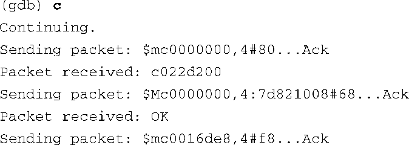
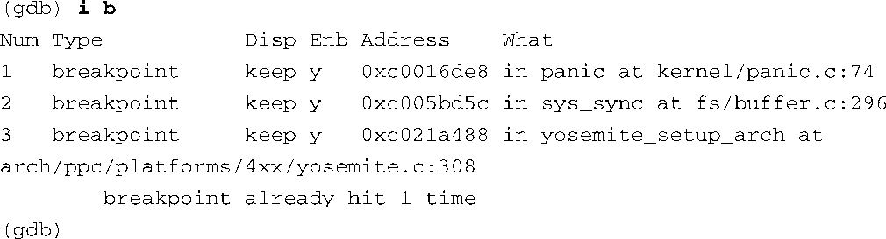
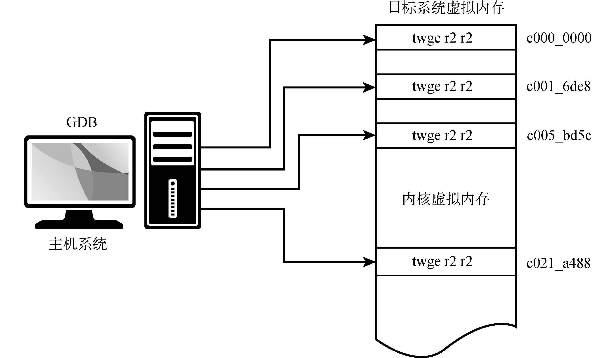
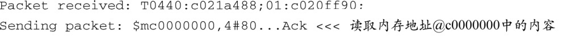
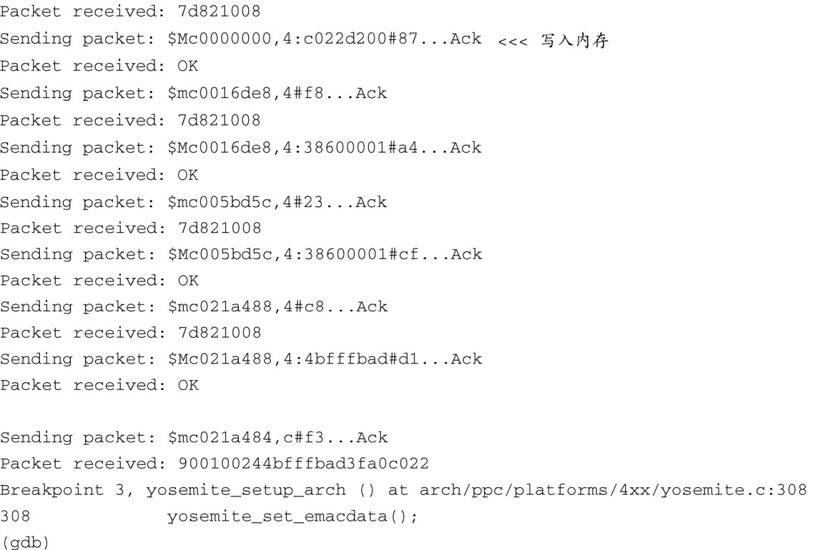

### 14.3.1　gdb远程串行协议

GDB包含了一个调试开关，它使我们能够观察开发主机上的GDB和目标板之间使用的远程协议。这对于理解协议的底层机制非常有用，而且能够帮助解决目标板的故障，并纠正其异常或错误行为。执行下面这条命令就可以开启调试模式：

开启调试模式之后，我们可以观察GDB是如何处理 `continue` 命令的，这很有启发性。代码清单14-8以 `continue` 命令为例说明了远程协议的运作流程。

代码清单14-8　远程协议示例： `continue` 命令

虽然这么多消息初看起来有些吓人，但其原理却很容易理解。简而言之，GDB是在恢复目标板上的所有断点。回顾一下代码清单14-3，我们设置了两个断点——一个位于 `panic()` ，另一个位于 `sys_sync()` 。后来，在代码清单14-7中，我们又添加了第三个断点，位于 `yosemite_setup_arch()` 。因此，一共有3个用户指定的活动断点。GDB的 `info breakpoints` 命令可以用于查看这些断点的信息。像往常一样，我们使用了命令的缩写形式：

代码清单14-8中显示了GDB和目标板之间发送和接收的数据包。其中，$m数据包代表一条“读取目标板内存”命令，$M数据包代表一条“写入目标板内存”命令。可以比较一下这些数据包中携带的地址和前面 `info breakpoints` 命令所显示的断点的地址。对于每个断点，GDB从目标板中读取该断点地址中的指令，存储在主机中（以便于在后面恢复它），并将它替换为Power架构的trap指令 `twge r2, r2`  `(0x7d821008)` 。这导致控制权交还给调试器。图14-4说明了这个过程。

<b class="my_markdown">图14-4　GDB在目标内存中插入断点</b>

你也许已经注意到了，GDB一共更新了4个断点，而我们只设置了3个。第一个断点是由GDB在启动时自动设置的，它在目标内存中的位置为0xc000_0000。这个位置是链接后的内核镜像的基地址——其实就是_start。这等价于在调试用户空间程序时，在 `main()` 函数的起始处设置了一个断点，而且是由GDB自动完成的。另外3个断点是我们在前面设置的。

当有事件（比如命中一个断点）发生时，控制权会交还给GDB，然后，同样的事情会按照相反的次序发生。代码清单14-9显示了位于 `yosemite_setup_arch()` 处的断点被命中时的详细过程。

代码清单14-9　远程协议：命中断点

`$T` 报文是一个GDB 停止回复（Stop Reply）报文。当一个断点被命中时，目标板会发送这个报文给GDB。在我们的例子中， `$T` 报文返回了程序计数器和寄存器r1的值<a class="my_markdown" href="['#anchor147']">[7]</a>。其余的过程与代码清单14-8相反。Power架构的 `trap` 断点指令被去除掉了，而GDB在相应的内存位置中恢复了原来的指令。

<a class="my_markdown" href="['#ac147']">[7]</a>　本书前面说过，GDB手册详细介绍了GDB远程协议，请参考本章末尾的文献。

