### 14.3.2　调试优化的内核代码

我们在本章开头说过，调试内核代码的挑战之一是由编译器的优化所引起的。我们还特别提到Linux内核在编译时采用的默认优化级别是-O2。下面举例说明为什么编译器的优化会使调试过程变得复杂。

因特网上的相关邮件列表里满是有关查找故障工具的问题。有时，发帖人说他的调试器正在“向后”单步调试，或者行号和源码中的不一致。我们在这里举一个例子，说明一下编译器的优化是如何让源码级调试变得复杂的。在这个例子中，当一个断点被命中时，GDB报告的行号和源码中的行号不匹配，而这是由内联函数引起的。

为了讲解这个例子，我们使用了和代码清单14-7相同的调试代码片段。代码清单14-10显示了这个调试会话的结果。

代码清单14-10　优化后的架构设置代码

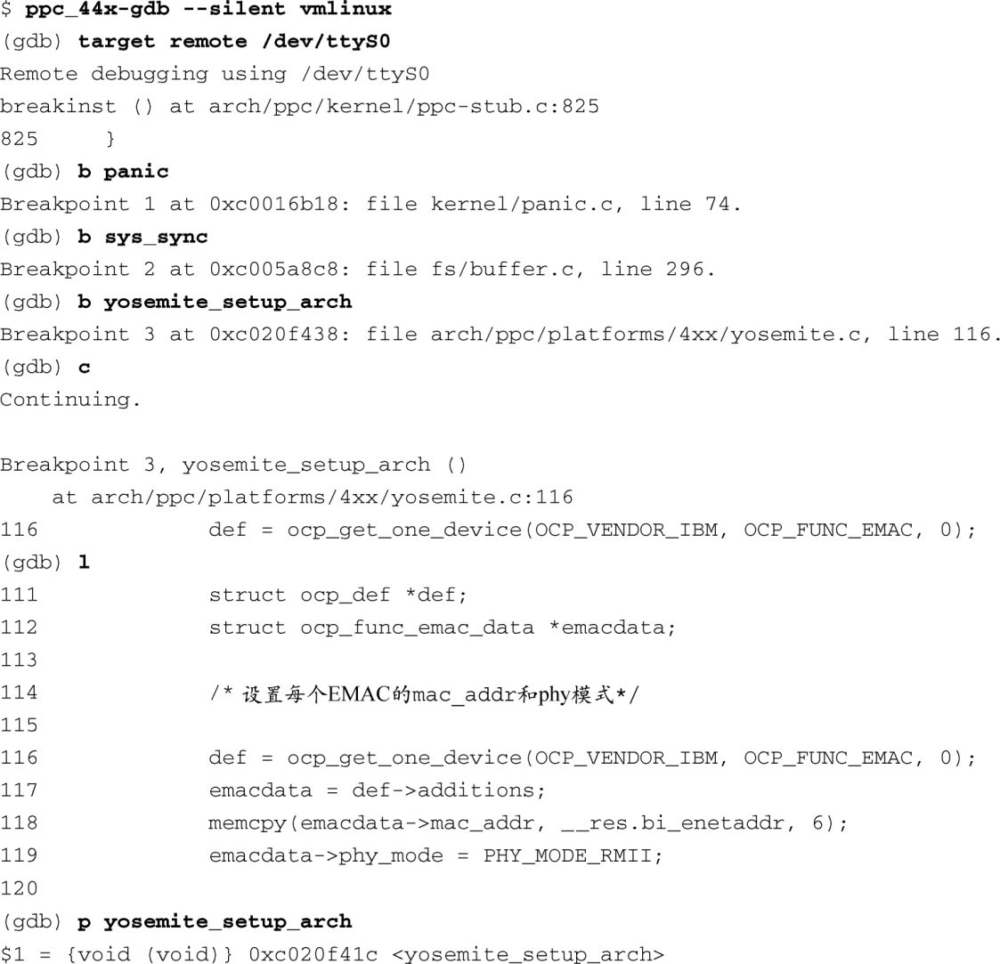
参考代码清单14-7，我们可以知道函数 `yosemite_setup_arch()` 实际上位于文件yosemite.c的第306行。现在将它与代码清单14-10作个比较。我们命中了断点，但GDB报告说这个断点位于文件yosemite.c的第116行。第一眼看上去，调试器报告的行号和对应源码的行号不匹配。这是一个GDB的bug吗？我们先确认一下编译器生成了哪些调试信息。使用第13章中介绍的readelf工具<a class="my_markdown" href="['#anchor148']">[8]</a>，我们就能够查看编译器生成的有关这个函数的调试信息了：

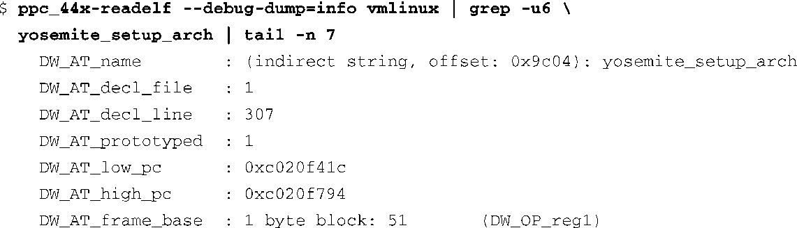
<a class="my_markdown" href="['#ac148']">[8]</a>　记得使用交叉版本的readelf，比如针对PowerPC 44x架构的ppc_44x-readelf。

我们不用成为专家就可以读懂这些DWARF2格式的调试记录<a class="my_markdown" href="['#anchor149']">[9]</a>，并发现问题函数位于源码的第307行。我们还可以使用addr2line工具（同样是在第13章中介绍的）来确认这一点。在执行 `addr2line` 命令时，我们使用了代码清单14-10中由GDB打印出的函数地址（p yosemite_ setup_arch）：

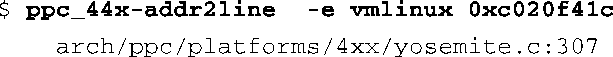
<a class="my_markdown" href="['#ac149']">[9]</a>　本章末尾引用了DWARFT调试标准。

不过，GDB报告说断点位于文件yosemite.c的第116行，而不是这里的第307行。要想明白这里发生了什么，我们需要看一下汇编器的输出。代码清单14-11显示了函数 `yosemite_setup_arch()` 的反汇编码，这是由GDB的 `disassemble` 命令生成的。

代码清单14-11　反汇编 `yosemite_setup_arch`

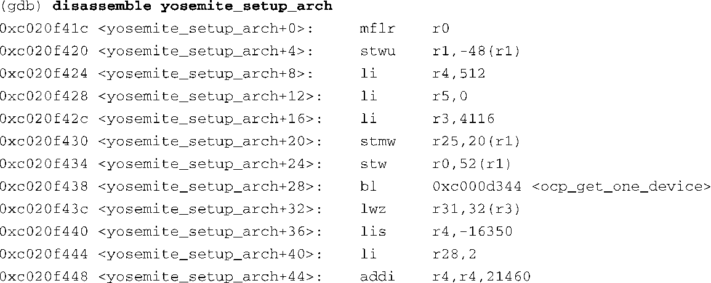

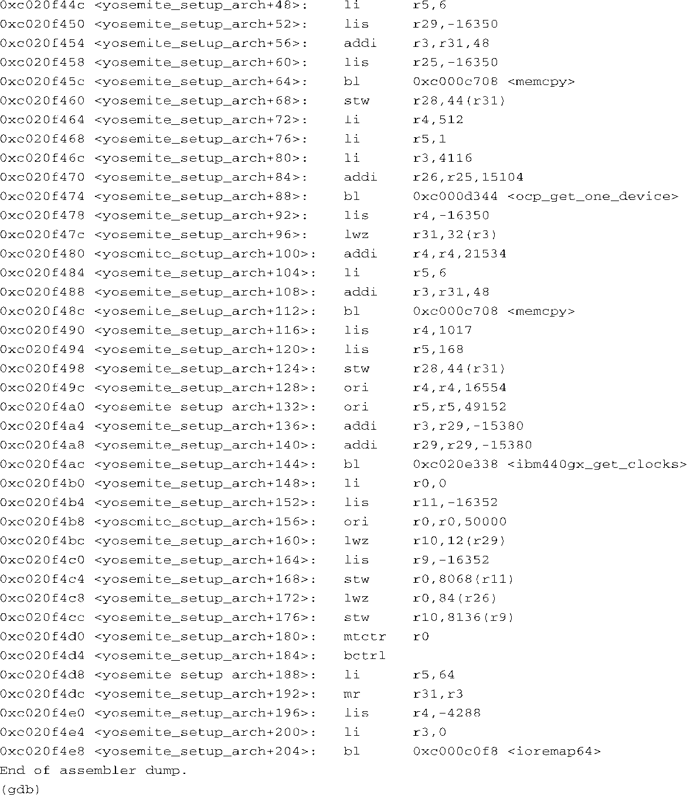
同样，我们不需要成为Power架构汇编语言的专家就可以理解这段代码。注意其中的 `bl` 指令以及相关的标号。在Power架构汇编语言的助记法中， `bl` 代表函数调用。与 `bl` 指令相关的标号则代表函数的符号名称，它们是重要的数据点。粗略分析一下，我们看到在这段汇编代码起始附近有以下这些函数调用：

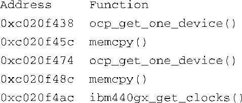
代码清单14-12显示了源码文件yosemite.c的部分内容。将它与GDB反汇编命令输出的函数标号相关联，我们可以看到其中的一些函数调用发生在 `yosemite_set_emacdata()` 中。当 `yosemite_setup_arch()` 处的断点命中时，GDB报告的断点位置是在第116行，而这些函数调用正是出现在这一行的附近。理解这个异常现象的关键是要注意到 `yosemite_setup_arch()` 最开始的那个子函数调用。编译器在处理对 `yosemite_set_emacdata()` 的调用时，将它内联化了，而不是生成相应的函数调用指令。简单地检查一下源码就能看出这一点。这个内联处理造成了GDB在命中断点时报告了不匹配的行号。虽然函数 `yosemite_set_emacdata()` 没有使用 `inline` 关键字进行声明，但从性能优化考虑，GCC编译器还是对它进行了内联处理。

代码清单14-12　源码文件yosemite.c的部分内容

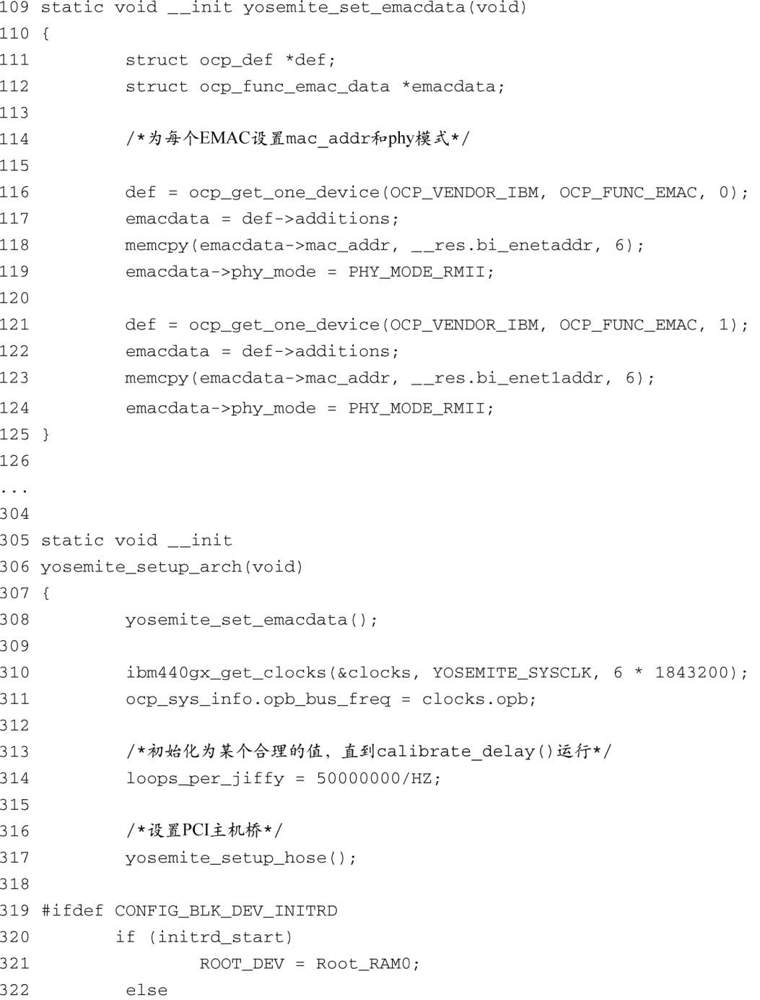

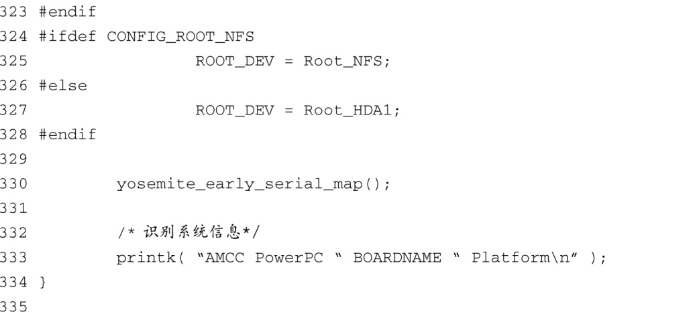
下面总结一下前述的讨论。

+ 在GDB中设置了一个断点，位于 `yosemite_setup_arch()` 。
+ 当这个断点被命中时，我们位于源码文件的第116行，而这和我们设置断点的实际函数位置相去甚远。
+ 使用GDB的命令生成了函数 `yosemite_setup_arch()` 的反汇编码，并找出这段代码中的函数调用标号。
+ 将这些标号和源码进行对比，我们发现编译器将子函数 `yosemite_set_emacdata()` 内联到了函数 `yosemiet_setup_arch()` 中（我们在此设置了断点），因而造成了潜在的混乱。

这就解释了为什么位于 `yosemite_setup_arch()` 处的断点被命中时GDB报告了不匹配的行号。

回顾一下代码清单14-4的内容，它包含了另一种类型的优化的几个例子，其中调试器报告说某些变量已经被优化掉了（value optimized out）。在函数的执行过程中，这些局部变量被处理器的寄存器替代了，并因此被编译器优化掉了。使用文件cmd_bootm.c中的一段U-Boot代码可以很容易地说明这一点。代码清单14-13显示了 `do_bootm()` 函数中的几行代码。

代码清单14-13　局部变量被优化掉的例子

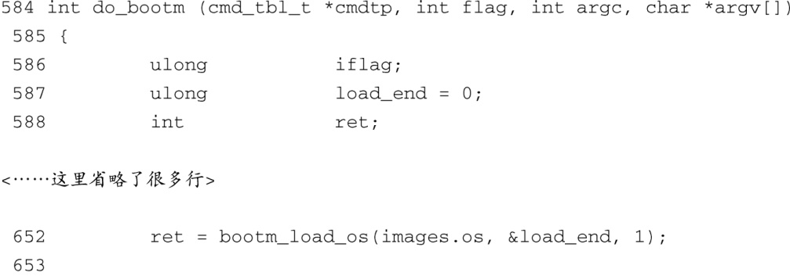

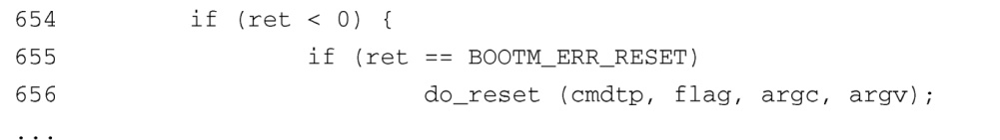
使用交叉gdb和BDI-2000/3000单步跟踪这段代码时，会出现下面这样的情况：

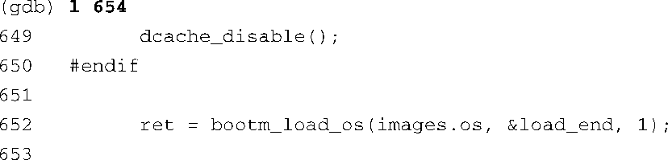

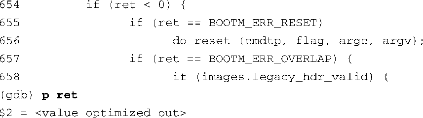
注意一下，在调用了 `bootm_load_os()` 之后，我们读取了这个函数的返回值。根据源码的第652行，这个返回值存储在一个名为 `ret` 的局部变量中。当我们尝试显示 `ret` 的值时，结果却是一条 `<value optimized out>` 消息。因为我们知道Power架构会将函数调用的返回值放在R3寄存器中，所以为了获知返回值，可以在函数返回后立刻显示R3寄存器的内容。

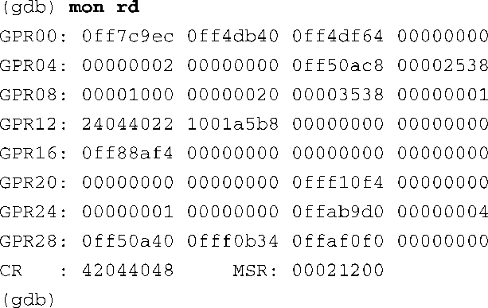
这个命令直接执行了BDI-2000/3000的 `rd` 命令（显示通用寄存器的内容）并返回结果。GPR03（R3）的内容是全零，这说明函数调用是成功的。

为了优化代码，编译器会使用多种不同类型的优化算法。这个例子只是展示了其中的一种：函数内联。每一种算法都会以不同方式给调试者（人和机器）带来困惑。作为开发人员，我们面临的挑战是要理解机器层次的代码行为，并将其转化成为我们想要做的。现在你应该能够体会到尽可能地降低优化级别是有利于调试的。

