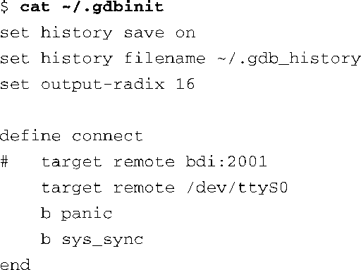

### 14.3.3　GDB的用户自定义命令

你也许已经知道GDB在启动时会查找一个名为.gdbinit的初始化文件。当它第一次被调用时，GDB会加载这个初始化文件（通常位于用户主目录中），并执行其中的命令。一个常用的命令组合是连接目标系统并设置一些初始的断点。在这种情况下，.gdbinit文件的内容看上去会像代码清单14-14中所显示的那样。

代码清单14-14　一个简单的GDB初始化文件

这个简单的.gdbinit文件首先开启了将命令历史保存到用户指定文件的功能，并设置了打印输出值的默认基数（16进制）。接着，它定义了一个GDB的用户自定义命令，名为 `connect` （用户自定义命令也常常称作宏）。当我们在GDB的命令行提示符后输入这个命令时，GDB会使用它所期望的方法（在这个例子中是串行端口）连接到目标系统上，并在 `panic()` 和 `sys_sync()` 处分别设置一个系统断点。命令中的网络方法（ `host:port` ）被注释掉了，我们将在14.4节介绍这种方法。

GDB用户自定义命令的创新使用是无止境的。在调试内核时，我们常常需要查看一些全局的数据结构，比如任务列表和内存映射，这对调试很有帮助。我们在下一节中会介绍几个有用的GDB用户自定义命令，它们能够显示内核调试过程中可能需要访问的一些具体内核数据。

