### 14.3.4　有用的内核GDB宏

在进行内核调试时，查看系统中正在运行的进程和它们的一些公共属性通常很有用。内核维护了一个任务（进程）链表，其中的每个任务都由结构体 `struct task_struct` 描述。链表中第一个任务的地址保存在内核全局变量 `init_task` 中，它代表了内核在启动时生成的初始任务。每个任务结构体中包含一个 `struct list_head` 类型的成员，它们将任务链接成一个环形链表。这两个随处可见的内核结构是在下面的头文件中定义的：

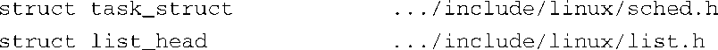
通过使用GDB宏，我们能够遍历这个任务链表并显示出其中的有用信息。可以很容易地修改这些宏，从而提取出你所感兴趣的数据。它们也是了解内核内部细节的有效工具。

代码清单14-15中我们要查看的第一个宏（ `find_task` ）很简单，它的功能是搜索内核的任务链表（每个成员的类型是 `task_struct` ），直到找到给定的任务。如果找到的话，这个宏会显示出该任务的名称。

代码清单14-15　GDB的find_task宏

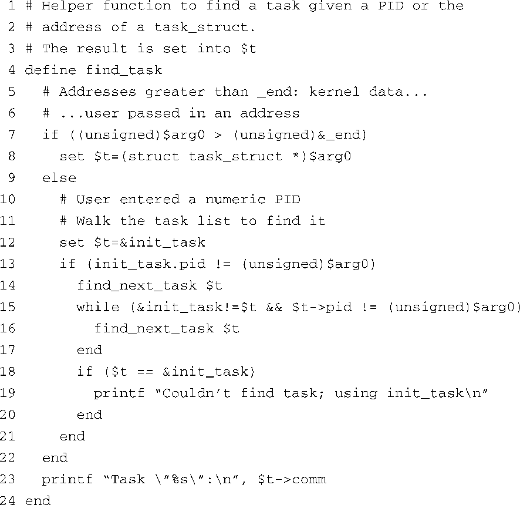
将这个宏的内容写入文件.gdbinit中并重启GDB，或者使用GDB的 `source` 命令<a class="my_markdown" href="['#anchor1410']">[10]</a>对它进行处理。（我们将在后面的代码清单14-19中解释 `find_next_task` 宏。）按照下面的方式执行它（参数是任务的PID）：

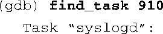
<a class="my_markdown" href="['#ac1410']">[10]</a>　在GDB宏的开发过程中，GDB的 `source` 命令提供了一条捷径。这个命令打开并读取一个包含宏定义的源文件。

注意，你也可以传递一个地址给 `find_task` 宏，像下面这样：

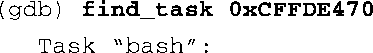
当然，你必须根据实际情况提供有效的参数。

代码清单14-15的第4行定义了这个宏的名称。第7行判断输入参数是任务的PID（数值范围从0到几百万）还是 `task_struct` 结构体的地址，如果是地址，它必须超过Linux内核镜像本身的末尾（由符号 `_end` <a class="my_markdown" href="['#anchor1411']">[11]</a>定义）。如果入参是一个地址，所需的唯一动作就是将它转换为合适的指针类型，从而可以访问对应的 `task_struct` 结构体。这是在第8行中完成的。正如第3行中的注释所说，这个宏会返回一个GDB自由变量，其类型是指向 `structtask_struct` 结构体的指针。

<a class="my_markdown" href="['#ac1411']">[11]</a>　符号 `_end` 是在最后的内核链接过程中由链接器脚本文件定义的。

如果入参是一个任务的PID，这个宏会遍历整个链表并查找匹配的 `task_struct` 。第12行和第13行初始化循环变量（GDB的宏命令语言中没有 `for` 语句），第15行至第17行定义了查找的循环体。其中的 `find_next_task` 宏用于提取任务链表中下一个 `task_struct` 的指针。最后，如果查找失败，返回值会被设置为一个合理的值（ `init_task` 的地址），从而它可以安全地用于其他宏。

在 `find_task` 宏的基础之上，很容易就可以编写一个简单的 `ps` 命令，用它来显示系统中运行的每个进程的信息。

代码清单14-16定义了一个名为 `ps` 的GDB宏，它可以显示所有正在运行的进程的信息，而这些信息来自进程的 `structtask_struct` 结构体。和其他GDB命令一样，执行这个命令的时候只需要输入它的名字和所需的参数即可。注意， `find_task` 宏只需要一个参数，可以是任务的PID或是 `task_struct` 结构体的地址。

代码清单14-16　打印进程信息的GDB宏

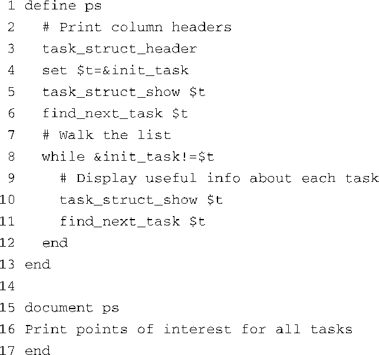
这个 `ps` 宏类似于 `find_task` 宏，不同之处在于它不需要参数，并且还添加了另一个宏（ `task_struct_show` ），并用它来显示每个 `task_struct` 结构体中的信息。第3行打印了标题行，其中包含每一列的名称。第4行至第6行设置了循环体并显示了第一个任务的信息。第8行至第11行循环遍历每个任务，并调用 `task_struct_show` 宏来显示它们的信息。

注意，这个宏还包含了一条GDB  `document` 命令。这使GDB用户可以得到有关 `ps` 命令的帮助信息，只需要在GDB的命令行提示符后输入 `help ps` 命令即可，像下面这样：

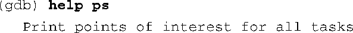
代码清单14-17显示了在目标板上执行这个命令时的输出结果，从中可以看出，目标板上只运行了必需的服务程序。

代码清单14-17　 `ps` 宏的输出

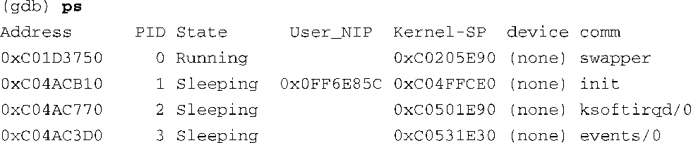

`ps` 宏的大部分工作都是由 `task_struct_show` 宏完成的。正如代码清单14-17所示， `task_struct_show` 宏显示了 `task_struct` 结构体中的以下字段：

+ Address——进程的 `task_struct` 结构体的地址；
+ PID——进程ID；
+ State——进程的当前状态；
+ User_NIP——用户空间的下一条指令指针；
+ Kernel_SP——内核栈指针；
+ device——和此进程相关联的设备；
+ comm——进程的名称（或命令）。

很容易就可以修改这个宏，让它显示其他一些信息，从而完成特定的内核调试任务。唯一复杂的地方在于宏语言本身的功能比较简单。因为GDB的用户自定义命令语言不支持字符串处理函数（比如 `strlen` ），所以必须手工调整屏幕输出信息的格式。

代码清单14-18显示了 `task_struct_show` 宏，代码清单14-17中的输出信息就是由它生成的。

代码清单14-18　 `task_struct_show` 宏

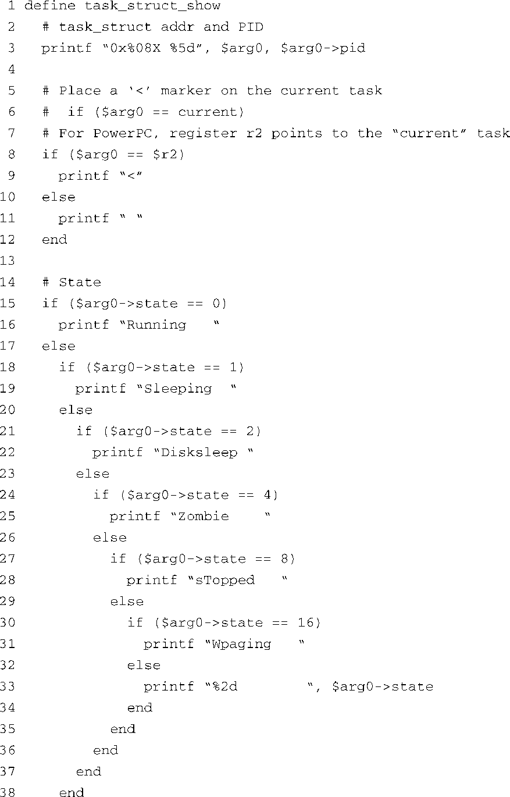

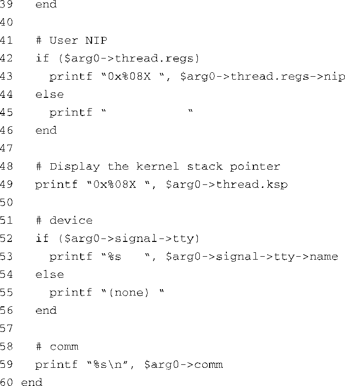
第3行显示了 `task_struct` 结构体的地址。第8行至第12行显示了进程ID。如果这是当前进程（断点被命中时正在CPU上运行的进程），它会由一个“<”符号标记。

第14行至第39行解码并显示了进程的状态。接着显示了用户空间的下一条指令指针（NIP）和内核栈指针（SP）。最后显示了与此进程相关联的设备，随后是进程的名称（存储在 `task_struct` 结构体的成员 `->comm` 中）。

特别注意一点，这个宏是和具体的硬件架构相关的，正如第7行和第8行所示。一般而言，这类宏都是和硬件架构及版本密切相关的。一旦底层结构有所改动，就必须相应地更新这些宏。然而，如果需要花费很长时间使用GDB来调试内核，这么做是完全值得的。

为了叙述的完整性，我们在下面列出了 `find_next_task` 宏。它的实现原理并非显而易见，所以有必要解释一下。（这里假设你能够轻易地推导出 `task_struct_header` 宏的内容，而它是 `ps` 宏的必要组成部分。这个宏只不过是打印一行标题，并用合适数量的空格调整了列名称的位置。）代码清单14-19显示了 `find_next_task` 宏，前面列出的 `ps` 宏和 `find_task` 宏都使用了它。

代码清单14-19　 `find_next_task` 宏

`find_next_task` 的功能很简单，但其实现原理却不太容易理解。这个宏的目的是返回任务链表中下一个 `task_struct` 结构体的指针（起始地址）。然而， `task_struct` 结构体是由它的成员 `tasks` （类型为 `struct list_head` ）的地址，而不是 `task_struct` 本身的起始地址，链接在一起的。因为结构体成员 `tasks` 的 `->next` 指针指向的是链表中下一个 `task_struct` 结构体的 `tasks` 成员，所以我们必须做减法，从而获得 `task_struct` 结构体自身的起始地址。我们从 `->next` 指针中减去的值是一个偏移量，它代表结构体成员 `tasks` 的地址和结构体自身的起始地址之间的距离。我们首先计算了这个偏移量，然后用它来调整 `->next` 指针，从而获得了 `task_struct` 结构体的起始地址。图14-5说明了这个过程。

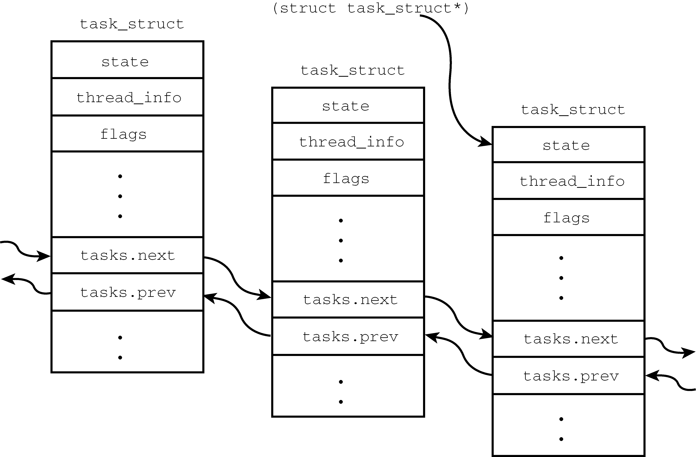

<b class="my_markdown">图14-5　任务结构体链表</b>

现在介绍最后一个宏—— `lsmod` 。当我们在下一节中讨论可加载模块的调试时，它会很有用。代码清单14-20显示了这个简单的宏，它能够列出当前内核中所有已安装的可加载模块。

代码清单14-20　列出所有可加载模块的GDB宏

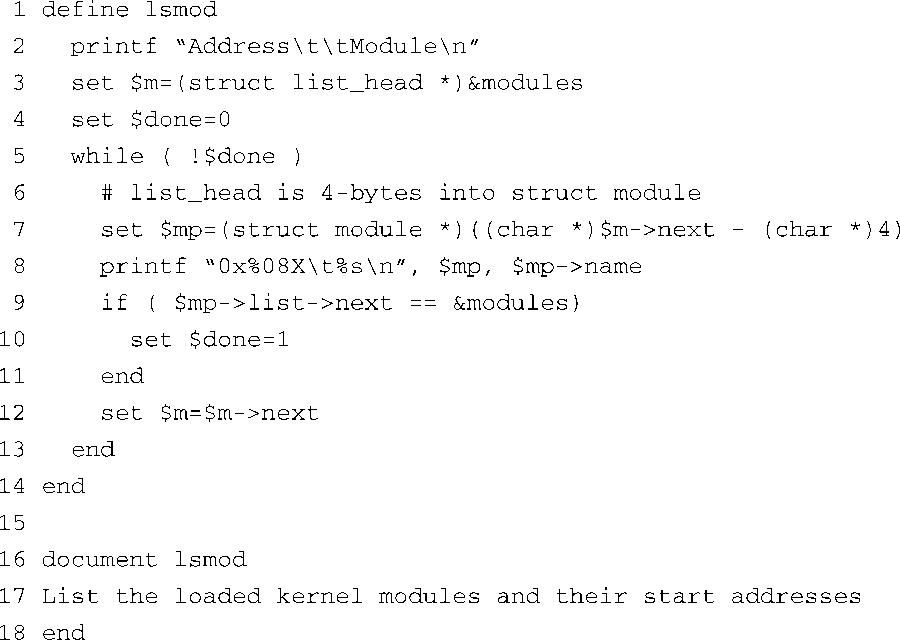
这个简单的循环是从内核全局变量 `modules` 开始的。该全局变量的类型是 `struct list_head` ，代表可加载模块链表的开始。唯一复杂性与代码清单14-19中描述的一样。我们必须从 `struct list_head` 指针中减去一个偏移量，从而获得 `struct module` 的起始地址。这是由第7行完成的。这个宏简单列出了每个模块的信息，包括 `struct module` 的地址和模块的名称。下面是一个使用它的例子：

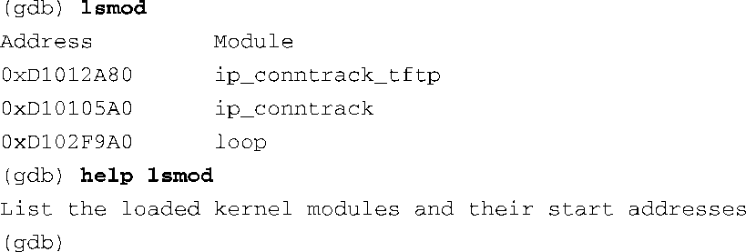
这里介绍的这些宏对调试大有裨益。你可以采用类似的方式编写新的宏，以显示内核中的数据，特别是那些存储于链表中的主要数据结构。这样的例子包括进程的内存映射信息、模块信息、文件系统信息和定时器列表等。这里给出的信息应该能够让你入门了。

