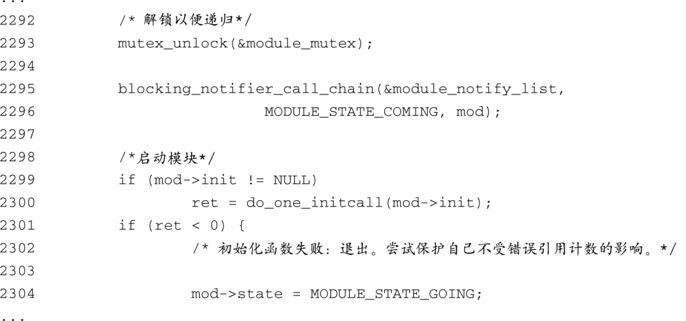
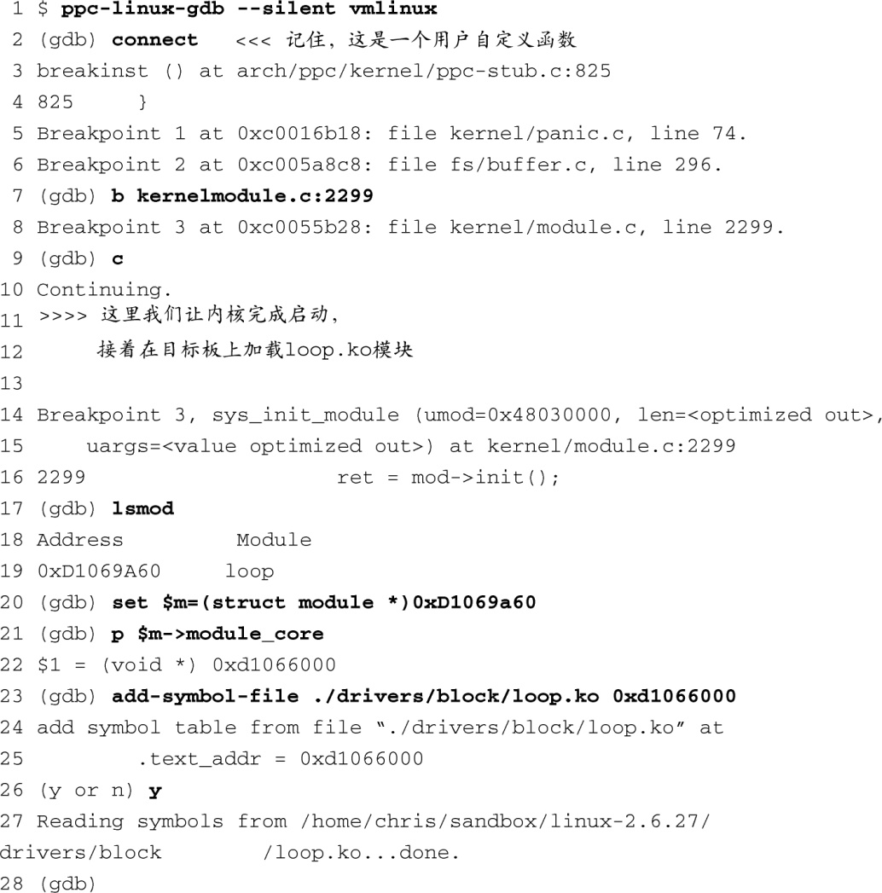
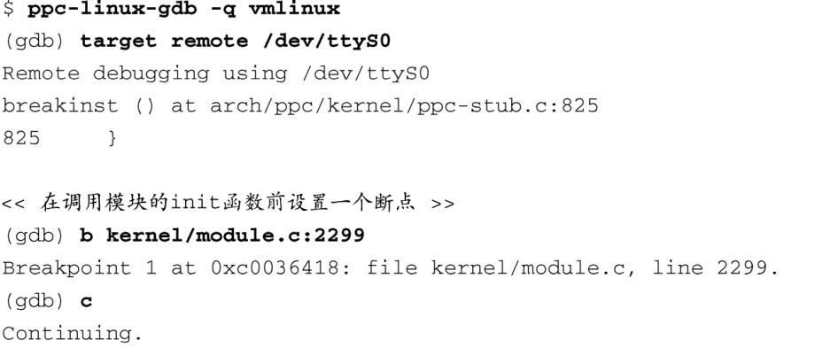
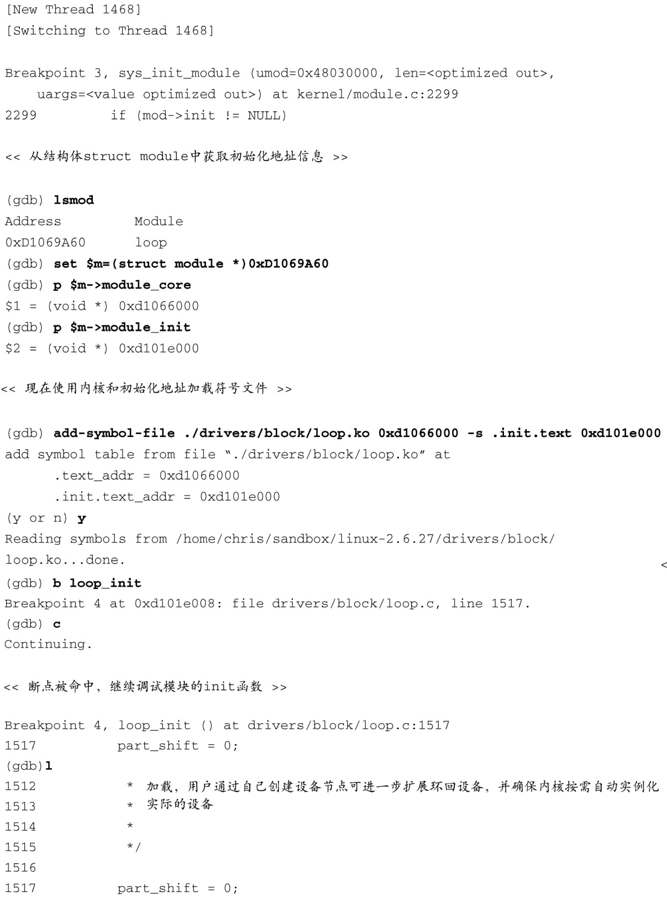
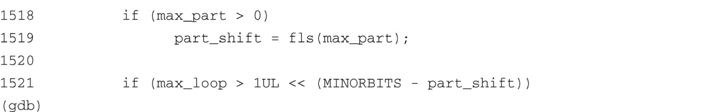

### 14.3.5　调试可加载模块

KGDB常用于调试可加载的内核模块——也就是设备驱动程序。可加载模块的一个比较有用的特性是，在大多数情况下，不需要重启内核就可以开始新的调试会话。你可以启动一个调试会话，作一些修改，然后重新编译并重新加载模块。在这个过程中，你不用重启内核，从而能够避免很多麻烦和延误。

调试可加载模块的难点在于获取模块目标文件中的符号调试信息。可加载模块是在它们被加载到内核中时进行动态链接的，因此，只有在调整了符号表之后，包含在目标文件中的符号信息才能起作用。

回顾一下我们在前面的例子中是怎样使用GDB调试内核的：

这条命令会在你的主机上开启一个GDB调试会话，并从ELF格式的Linux内核文件vmlinux中读取符号信息。当然，你不会在这个文件中找到任何可加载模块的符号信息。每个可加载模块都是一个独立的编译单元，而且它们会被链接为单独的ELF目标文件。因此，如果想对一个可加载模块进行源码级调试，我们需要从ELF文件中加载它的符号信息。GDB的 `add-symbol-file` 命令提供了这个功能。

`add-symbol-file` 命令从指定的目标文件中加载符号信息，它假设模块本身已经被加载到内核中了。然而，我们面临一个类似“鸡生蛋还是蛋生鸡”的难题。直到模块被加载到内核中之后，我们才能使用 `add-symbol-file` 命令来读取其中的符号信息。然而，在模块被加载之后，设置断点以及调试模块的 `*_init` 和相关函数就已经太迟了，因为这时它们已经被执行过了。

走出困境的方法是在负责加载模块的内核代码处设置一个断点，这时模块已经被链接，但它的初始化函数还没有被调用。这个工作是由内核源文件.../kernel/module.c完成的。代码清单14-21显示了文件module.c中的相关部分。

代码清单14-21　module.c：模块初始化

我们使用modprobe工具（请参考第8章的代码清单8-5）加载一个模块，命令格式如下：

这条命令会执行一个特殊的系统调用，指示内核加载这个模块。模块的加载是从module.c中的 `load_module()` 函数开始的。当模块加载到内核内存中并且被动态链接之后，控制权转交给了模块的 `*_init` 函数。相关代码位于module.c的第2299行至2300行，如代码清单14-21所示。我们就将断点放置在这里。这使我们能够将模块的符号信息添加到GDB中，并且随后在模块中设置断点。我们使用Linux内核的回环驱动（名为loop.ko）来说明这个过程。因为这个模块与其他模块没有依赖关系，所以讲解起来会比较容易。

代码清单14-22显示了用于发起这个调试会话的GDB命令。

代码清单14-22　发起一个模块调试会话: loop.ko

在第2行中，使用GDB的用户自定义宏 `connect` （请参考代码清单14-14）连接到目标板上并设置一些初始的断点。接着在module.c中设置一个断点，如第7行所示，然后执行 `continue(c)` 命令。现在，内核会完成其启动流程，之后使用Telnet登录到目标板上并加载 `loop.ko` 模块（没有显示在代码清单中）。当loop模块被加载时，我们立刻命中了断点3。GDB接着显示了第14行至第16行的消息。

这时，我们需要知道Linux内核将模块的 `.text` 段链接到了哪个地址。Linux会将这个地址存储在结构体 `struct module` 的成员 `module_core` 中。使用代码清单14-20中定义的 `lsmod` 宏，先获取与 `loop.ko` 模块对应的 `struct module` 的地址。这显示为代码清单的第17行至第19行。然后使用这个地址从结构体成员 `module_core` 中获取模块的 `.text` 段的地址。将这个段地址传递给GDB的 `add-symbol-file` 命令，GDB使用这个地址来调整其内部的符号表，从而匹配模块的实际链接地址。从这里开始，我们可以像往常一样调试模块了，比如设置断点，单步跟踪代码，查看数据，等等。

作为这一节的结束，我们将在这里演示一个调试的例子。在回环模块的初始化函数中设置一个断点，从而可以单步跟踪模块的初始化代码。这里的难点在于内核会将模块的初始化函数加载到一个单独分配的内存中，目的是在函数调用结束后释放这块内存。回顾一下第5章中有关_ _ `init` 宏的讨论。这个宏展开后是一个编译器属性，它让链接器将标记的代码放置到一个特别命名的ELF段中。实际上，任何使用这个属性定义的函数都会被放到名为 `.init.text` 的ELF段中。它的使用方式类似于下面这样：

这会将编译后的 `loop_init()` 函数放到目标模块 `loop.ko` 的 `.init.text` 段中。当这个模块被加载时，内核会分配一块内存给这个模块的主体部分，其地址存储在 `struct module` 的成员 `module_core` 中。接着，内核会分配另一块单独的内存，用于存放 `.init.text` 段。当初始化函数的调用完成后，内核会释放这块包含初始化函数代码的内存。因为模块是以这种方式被分开存放的，所以需要将它们的地址信息都告诉GDB，以便它能够使用符号数据调试初始化函数。代码清单14-23演示了这些步骤。

代码清单14-23　调试模块的初始化代码

