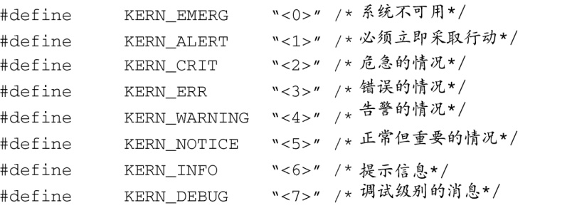

### 14.3.6　 `printk` 调试

使用 `printk()` 调试内核和设备驱动程序代码是一种很流行的技术，这主要是因为 `printk` 已经发展成为一个非常可靠的方法。几乎可以在任何环境下调用 `printk` ，包括在中断处理函数中。 `printk` 是内核版本的C库函数 `printf()` 。 `Printk` 是在文件.../kernel/prink.c中定义的。

为了进行调试，我们有必要了解 `printk` 在使用时的一些限制。首先， `printk` 需要一个控制台设备。此外，虽然内核在其初始化流程中尽可能早地配置了控制台设备，但在控制台设备初始化之前，内核代码中有很多地方调用了 `printk` 。我们将在14.5节中介绍一种应对这些限制的方法。

`printk` 函数允许调用者设置一个字符串标记，用它来表示消息的严重程度。头文件.../include/linux/kernel.h中定义了8个级别：

一个简单的printk消息看上去会像是这样：

如果没有指定一个标记消息严重程度的字符串，如这里所示，内核会分配一个默认的严重性等级，它是在 `printk.c` 中定义的。在最新的内核版本中，这个默认等级被设为4，用 `KERN_WARING` 代表。一个指定了严重性等级的 `printk` 消息（这是首选的使用方式）看上去会像是这样：

这个不寻常的C语法格式并不是笔误。 `KERN_CRIT` 本身是一个文本字符串，所以这里不需要使用逗号来分开参数。实际上，如果有逗号的话，这个函数不会产生预想的结果。编译器会自动将这两个字符串拼接成一个新的字符串。默认情况下，低于某个预定义日志级别的所有 `printk` 消息都会被打印到系统控制台设备上。在最新的Linux内核版本中，这个级别的值是7。这意味着任何比 `KERN_DEBUG` （在.../include/linux/kernel.h中定义）更重要的 `printk` 消息都会显示在控制台上。

有多种方法可用来设置默认的内核日志级别。在系统启动时，可以传递合适的内核命令行参数给内核，从而设置目标板上的默认日志级别。文件main.c中定义了3个能够影响默认日志级别的内核命令行选项：

+ `debug` 设置控制台的日志级别为10；
+ `quite` 设置控制台的日志级别为4；
+ `loglevel=` 设置控制台的日志级别为一个自选值。

使用 `debug` 日志级别会显示出所有的 `printk` 消息。使用 `quiet` 则会显示出所有 `KER_ERR` 以及比 `KER_ERR` 更严重的 `printk` 消息。

可以将 `printk` 消息记录到目标板的文件中，或是通过网络进行传输。klogd（内核日志守护进程）和syslogd（系统日志守护进程）可以控制 `printk` 的日志行为。很多Linux帮助手册和参考文献都介绍了这两个流行的工具，这里就不再复述了。

