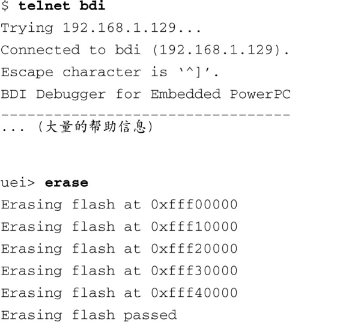
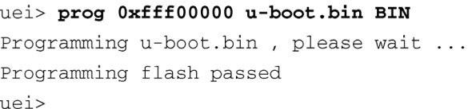

### 14.4.1　使用JTAG探测器对闪存进行编程

很多硬件探测器都能够对多种型号的闪存芯片进行编程。Abatron公司的BDI-3000也不例外。BDI-3000的配置文件中包含一个[FLASH]段，用于定义目标板上闪存的特征。请参考附录E中的示例。[FLASH]段定义了用于某个特定硬件设计中的闪存芯片的属性，比如芯片类型、设备大小和它的数据总线的宽度。同时定义的还有它的内存位置和存储结构。

在更新闪存的一部分内容时，你常常希望保留闪存中其他部分的内容。在这种情况下，硬件探测器必须能够通过某种方式限制被擦除的扇区的数量。如果使用的是Abatron探测器，这是通过在配置文件中添加指令来完成的，每条指令擦除一个扇区，指令以关键字ERASE开头，后面跟着将要被擦除的扇区的地址。当我们使用Abatron的Telnet用户界面执行 `erase` 命令时，所有使用ERASE定义的扇区都会被擦除掉。代码清单14-24演示了这样一个场景：我们先擦除目标板上闪存的一部分内容，然后对它进行编程，将一个U-Boot引导加载程序镜像写入其中。

代码清单14-24　擦除闪存并对其进行编程

首先我们建立一个Telnet会话连接到Abatron BDI-2000。经过一些初始化之后，我们看到了一个命令行提示符。在执行 `erase` 命令时，每擦除配置文件中定义的一个扇区，Abatron就会显示一行输出信息。在附录E的配置文件中，我们定义了5个要被擦除的扇区。这一共预留出256 KB的空间，用于存放U-Boot引导加载程序的二进制镜像。

上面代码清单中显示的 `prog` 命令使用了全部的3个可选参数。这些参数分别指定了镜像文件加载到内存中的位置、镜像文件的名称和文件格式——这里是一个二进制文件。你也可以在BDI-2000的配置文件中指定这些参数。在这种情况下，只需要输入 `prog` 命令就行了，不用带任何参数。

这个例子只是粗略介绍了BDI-2000的两个命令。BDI-2000还支持很多其他的命令组合和功能。每一种硬件JTAG探测器都会使用自己独特的方式对闪存进行擦除和编程，具体情况请参考其说明文档。

