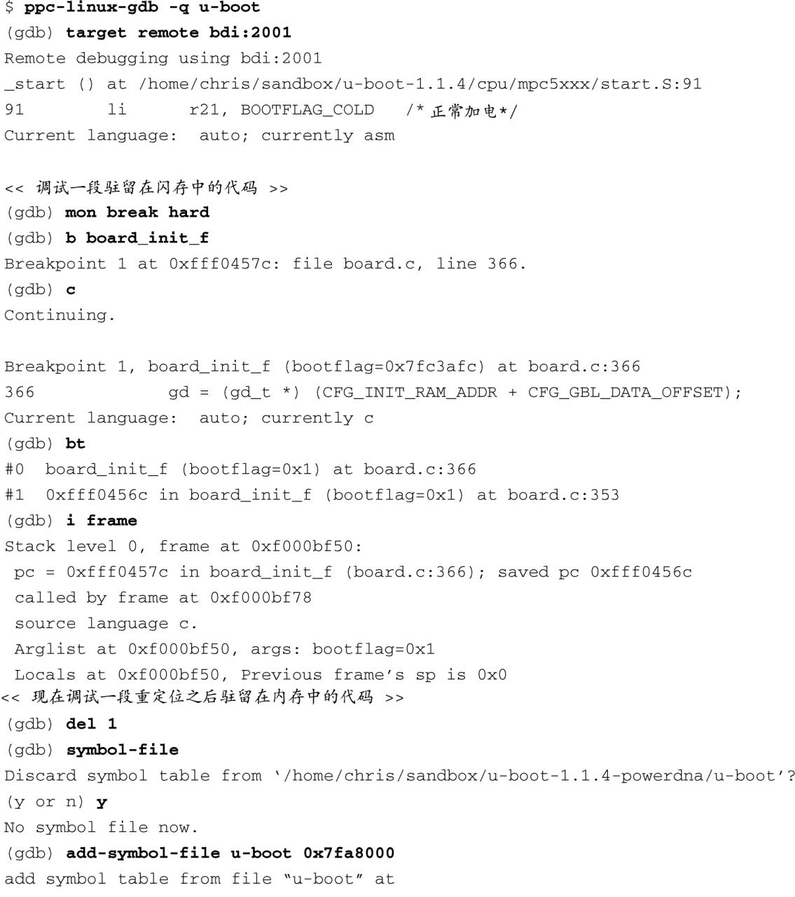
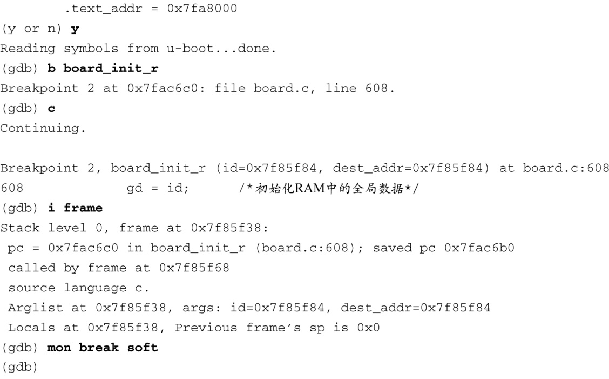
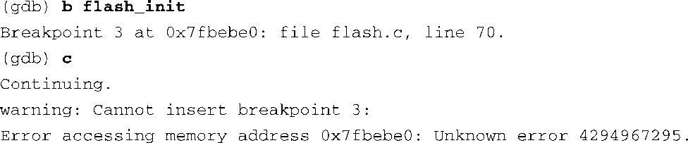

### 14.4.2　使用JTAG探测器进行调试

很多JTAG探测器能够与一个源码级调试器进行交互，而不是通过其用户界面直接和用户打交道。到目前为止，获得硬件探测器广泛支持的最流行的调试器就是GDB。在这种使用场景中，GDB开始一个调试会话，并使用一个外部连接（通常是以太网）连接到目标板上。这时，JTAG探测器不会通过其用户界面与开发人员直接通信，相反，调试器会在其自身和JTAG探测器之间来回传递命令。在这种模式下，JTAG探测器成为了调试器的代表，并且使用GDB远程协议来控制目标硬件。请参考图14-6中各个设备之间的连接情况。

JTAG探测器特别有助于引导加载程序和早期启动代码的源码级调试。在这个例子中，我们将会展示如何在一个Power架构的目标板上使用GDB和Abatron BDI-2000来调试U-Boot引导加载程序的部分代码。

很多处理器都包含一些调试寄存器，它们能够设置传统的地址断点（当程序执行到某个地址时停住）和数据断点（当有条件的访问某个特定的内存地址时停住）。在调试那些驻留在只读存储器（比如闪存）中的代码时，这是设置断点的唯一途径。然而，这些寄存器的数量通常是有限的。很多处理器只包含一个或两个这样的寄存器。在使用硬件断点之前你必须意识到这个限制。下面的例子说明了这一点。

使用如图14-6所示的开发环境设置，假设目标板上的U-Boot存储在闪存中。我们在第7章中介绍过，U-Boot和其他引导加载程序会在启动后尽早地将其自身复制到RAM中。这是因为硬件从RAM中读取（和写入）数据的速度要比一般的只读存储器（比如闪存）的快上几个数量级。这给调试带来了两个特定的挑战。首先，不能修改只读存储器的内容（比如添加一个软件断点），因此必须依靠处理器中的断点寄存器来设置断点。

第二个挑战基于这样一个事实：GDB是从ELF可执行文件中读取符号调试信息的，但这个文件只能代表一个执行环境（闪存或RAM）。对于U-Boot而言，因为最初它会被存放在闪存中，所以它是针对闪存环境进行链接的。然而，早期的代码会重新部署自身的位置并进行必要的地址调整。这就意味着我们需要同时在这两种执行环境中使用GDB。代码清单14-25显示了一个这样的调试会话。

代码清单14-25　使用JTAG探测器调试U-Boot

请仔细研究这个例子。其中的一些微妙之处是绝对值得花时间去理解的。首先，我们使用命令 `target remote` 连接到Abatron BDI-2000上。这条命令中的符号名称bdi代表Abatron探测器的IP地址<a class="my_markdown" href="['#anchor1412']">[12]</a>。默认情况下，Abatron BDI-2000使用端口号2001来建立远程GDB协议的连接。

<a class="my_markdown" href="['#ac1412']">[12]</a>　主机系统中的/etc/hosts文件会包含一个条目，通过它我们能够得到符号名称（主机名称）所对应的IP地址。

接着，使用GDB的 `mon` 命令向BDI-2000发出一条命令。 `mon` 命令告诉GDB将剩余的命令内容直接传递给远程的硬件设备。因此， `mon break hard` 会设置BDI-2000进入硬件断点模式。

然后在 `board_init_f` 处设置一个硬件断点。这是一个在闪存中执行的函数，它的地址为0xfff0457c。定义了断点之后，使用 `continue(c)` 命令让程序继续执行。立刻，位于 `boad_init_f` 处的断点就被命中了，这时我们可以像往常一样随意进行调试，包括单步跟踪代码和查看数据。可以看到我们使用 `bt` 命令查看了栈回溯调用序列，并使用 `i frame` 命令查看了当前栈帧的细节。

现在我们继续调试，但这一次我们知道U-Boot会将自身复制到RAM中并在那里继续执行。所以我们需要在保持调试会话有效的同时改变调试环境。为此，我们丢弃了当前的符号表（使用 `symbol-file` 命令，且不带任何参数），并使用 `add-sysmbol-file` 命令再次加载同一个符号文件。这一次，命令GDB对符号表进行偏移，从而使它与U-Boot在内存中重新部署后的位置相匹配。这就保证了源码及符号调试信息与实际驻留在内存中的镜像相匹配。

加载了新的符号表之后，我们可以将断点设置在某个执行时位于内存中的位置。这个断点的设置是微妙而复杂的。因为我们知道U-Boot当前正在闪存中运行，但正准备将自身移到RAM中并跳转到那里，所以我们必须仍然使用一个硬件断点。考虑一下我们在这里使用一个软件断点会发生什么情况。GDB会忠实地将断点指令写入指定的内存位置，但之后U-Boot在将其自身复制到内存时会覆盖它。结果是这个断点永远都不会被命中，而我们则会开始怀疑调试工具是否出了问题。当U-Boot已经在内存中执行，并且符号表也已经更新并反映内存地址之后，我们就可以随意使用基于RAM的断点（软件断点）了。代码清单14-25的最后一条命令表明了这一点，它将Abatron BDI-2000设置回软件断点模式。

为什么要关心硬件断点和软件断点在使用上的区别呢？如果硬件断点寄存器的数量没有限制，我们就不会关心了。但这种情况是不会出现的。如果你在一个调试会话中用完了处理器（比如4xx系列处理器）支持的所有硬件断点寄存器，你会遇到类似下面这样的情形：

因为是在进行远程调试，所以直到我们设置了新的断点并尝试让程序继续执行时才知道资源不足了。这和GDB处理断点的方式有关。当一个断点被命中时，GDB会恢复所有断点所处的特定内存位置的原有指令。而当它继续执行时，会在指定位置恢复断点指令。可以通过开启GDB的远程调试模式来观察这个行为，正如前面所看到的：

