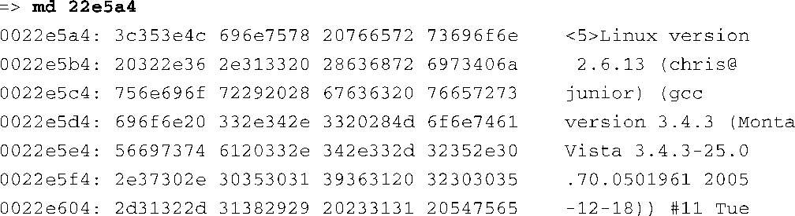
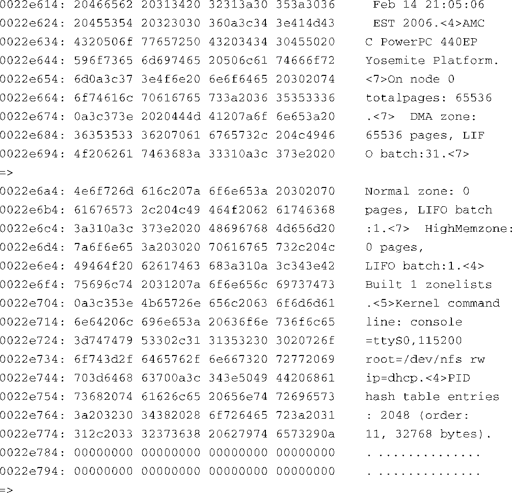

### 14.5.2　转储 `printk` 的日志缓冲区

在14.3.6节中讨论 `printk` 调试时，我们指出了这种方法在使用上的一些限制。 `printk` 本身的实现是非常可靠的，但它有一个缺点，那就是直到系统引导过程的后期，当控制台设备被初始化之后才能看到由 `printk` 打印出的消息。通常，当开发板在启动过程中挂起时，很多打印信息都已经存在于 `printk` 的缓冲区中了。如果知道在哪儿能够找到它们的话，就能够确定造成启动过程挂起的问题了。实际上，你经常会发现这是由于内核遇到了一个错误并导致它调用了 `panic()` 。 `panic()` 的输出很可能已经被转储到了 `printk` 的缓存区中，从而你可以从中找到出错代码的准确行号。

这项工作最好是由JTAG调试器来完成，不过，也可以使用引导加载程序和它的内存转储功能来显示复位后的 `printk` 缓冲区的内容。虽然复位会造成一些内存内容的损坏，但是日志缓冲区中的消息一般是很容易理解的。

实际存储 `printk` 消息文本的缓冲区是在源码文件.../kernel/printk.c中声明的：

很容易就能从Linux内核的映射文件System.map中找到这个缓冲区的链接地址：

如果系统在启动过程中碰巧是在显示了“Uncompressing Kernel Image . . . OK”这条消息后挂起的，你可以重启系统并使用引导加载程序来查看这个缓冲区的内容。因为在某个给定的架构中，内核虚拟内存和物理内存之间的关系是固定的，是一个常量，所以我们可以简单地进行转换。前面显示的 `__log_buf` 的地址是一个内核虚拟地址，而我们必须将它转换为一个物理地址。对于这个特定的Power架构处理器来说，转换过程只是简单地从中减去常量 `KERNELBASE` 的值，也就是0xc0000000。我们就是要使用这个内存地址来读取 `printk` 日志缓冲区中的内容。

代码清单14-26是使用U-Boot的内存转储命令来显示缓冲区内容的一个例子。

代码清单14-26　转储原始的 `printk` 的日志缓冲区

这些内容读起来有些费劲，但是数据都在那儿。在这个特定的例子中，我们可以看到内核在初始化完PID哈希表的表项之后崩溃了。我们可以在代码中增加一些 `printk` 消息，从而逐步确定系统崩溃的实际原因。

如本例所示，在使用这项调试技术时是不需要其他工具的。如果你正在将Linux移植到一块新的板卡上，你就能体会到这些早期串行端口输出的重要性。

需要注意的是，有些平台上的引导加载程序会在完成初始化之前对内存内容进行初始化。因此，在这些平台上，内核日志缓冲区的内容会遭到破坏，只有修改引导加载程序的代码才能使用这项调试技术。

