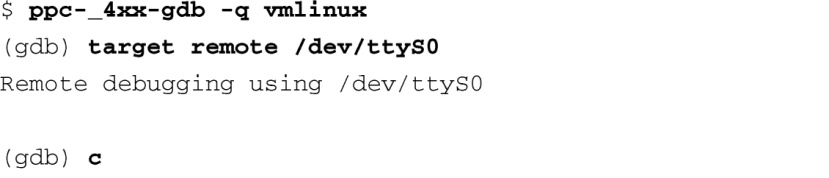
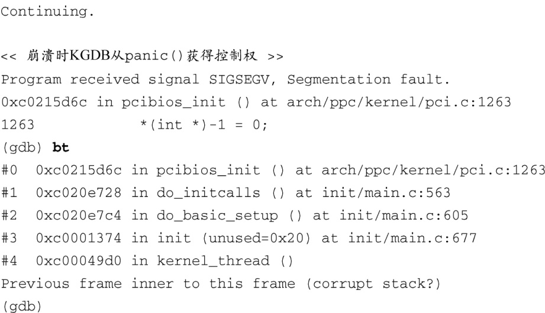

### 14.5.3　使用KGDB调试内核异常

如果开启了KGDB，内核在遇到错误异常时会尝试将控制权转交给KGDB。在某些情况下，错误本身是显而易见的。为了使用这个特性，KGDB和GDB之间必须已经建立起了连接。当异常条件出现时，KGDB会发送一个停止回复（Stop Reply）数据包给GDB，指明陷入调试处理函数的原因和出现异常情况的地址。代码清单14-27说明了这个过程。

代码清单14-27　使用KGDB捕捉内核崩溃

这个例子中的崩溃是由于向一个无效的内存地址（全1）写入一个值而人为造成的。我们首先建立了从GDB到KGDB的连接，并让内核继续启动。注意，甚至不需要设置断点，当崩溃发生时，可以看到出错的那行代码以及栈中的回溯调用序列，从而帮助我们确定错误的原因。

