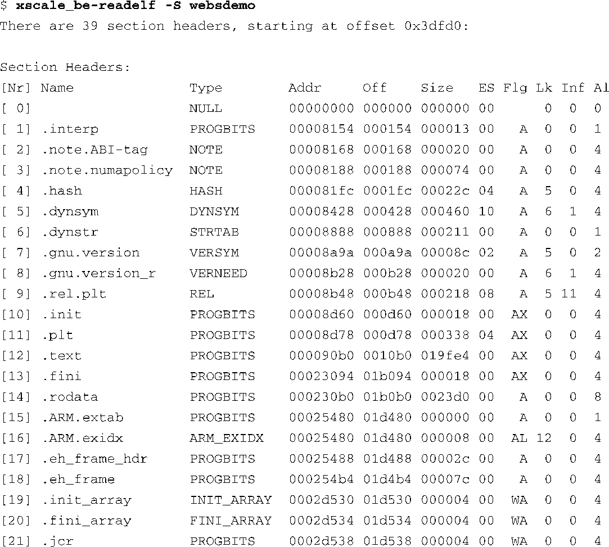
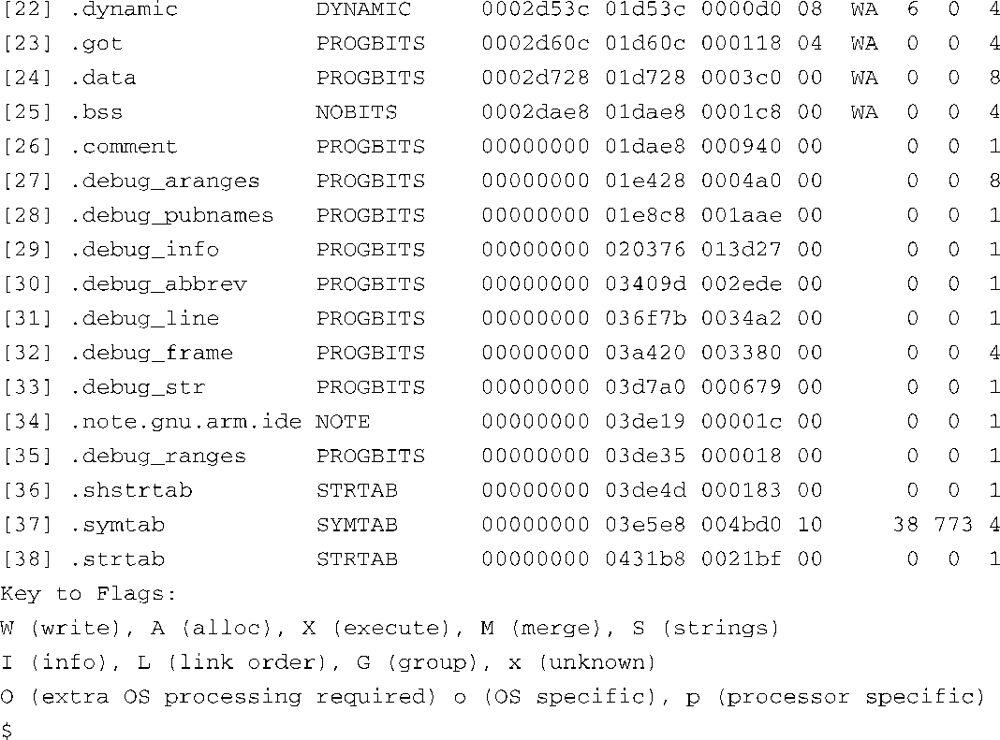
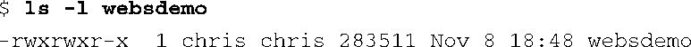
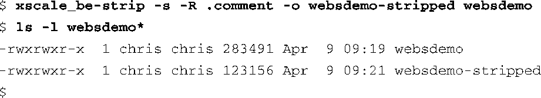
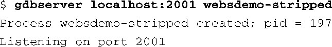
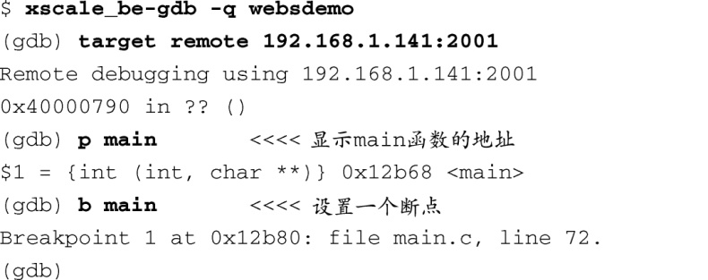
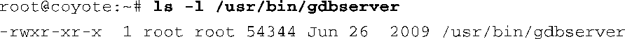
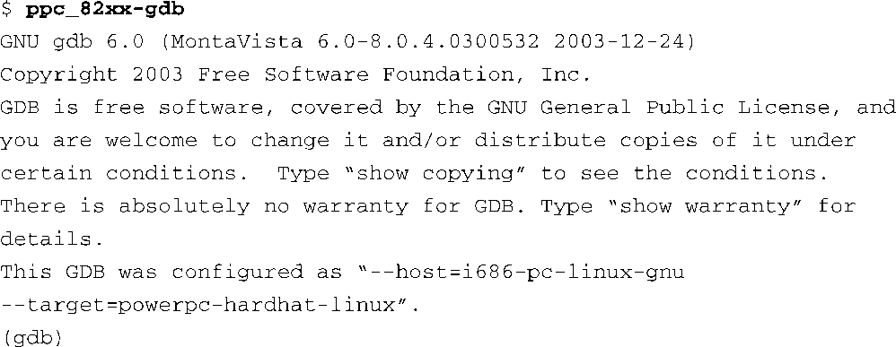

### 15.2　远程（交叉）调试

开发交叉开发工具的主要目的是为了克服嵌入式平台上的资源限制。一个普通大小的应用程序如果在编译时带上了符号调试信息，它的大小会很容易超过几兆字节。在进行交叉调试时，可以让开发主机来承担这些负担。当在开发主机上执行交叉版本的GDB时，传递给它一个带有符号调试信息的ELF文件。在目标板上，可以使用strip工具<a class="my_markdown" href="['#anchor151']">[1]</a>去除掉ELF文件中所有不必要的调试信息，从而确保最终的镜像保持最小尺寸。

<a class="my_markdown" href="['#ac151']">[1]</a>　记得使用交叉版本的strip，比如ppc_82xx-strip。

我们在第13章中介绍了readelf工具，并在第14章中用它来查看一个ELF文件中的符号调试信息。代码清单15-1显示了使用readelf查看一个应用程序时的输出，这是一个针对ARM架构进行编译的Web服务器程序。

代码清单15-1　ELF文件中关于示例程序的调试信息

你可以从代码清单15-1中看到很多段都包含了调试信息。其中的 `.comment` 段包含了超过2KB（0x940）的信息，但它们并不是应用程序正常工作所必需的。算上调试信息，这个示例文件的大小超过了275 KB，如下所示：

如果我们使用交叉版本的strip工具处理一下这个文件，可以将它的尺寸最小化，从而节省目标系统上的资源。代码清单15-2显示了处理后的结果。

代码清单15-2　使用strip工具处理目标应用程序

这里同时删除了可执行文件中的符号调试信息和 `.comment` 段。我们在命令行中使用 `-o` 选项指定了处理后的二进制文件的名称。你可以看到精简后的二进制文件还不到原来大小的一半。当然，对于大一些的应用程序，节省的空间就更多了。Linux内核如果在编译时带上了调试信息，它的大小会超过18 MB。然而在使用strip工具精简之后，它的大小只是2 MB多一点儿！

在进行交叉调试时，可以将精简后的二进制文件放到目标系统中，并将包含符号信息的副本放在开发主机上。然后，可以在目标板上使用gdbserver运行精简后的二进制文件，并在开发主机上使用交叉gdb运行原来的二进制文件，而这两者之间则会通过网络进行通信来完成调试。

### gdbserver

gdbserver允许你在开发主机而不是目标嵌入式平台上运行GDB。这种运行方式的优点是显而易见的。对于初学者而言，开发主机一般会拥有比嵌入式平台更强的处理器、更多的内存和更大的硬盘存储空间。另外，你要调试的应用程序的源码一般也是存放在开发主机，而不是嵌入式平台中的。

gdbserver是一个小程序，它运行在目标板上并且允许远程调试目标板上的进程。在开发板上执行gdbsever时需要指定要调试的程序以及IP地址和端口，gdbserver会在这个地址和端口上侦听来自GDB的连接请求。代码清单15-3显示了在开发板上启动gdbserver时的情况。

代码清单15-3　在目标板上启动gdbserver

这个例子中的gdbserver会在端口2001上侦听以太网TCP/IP连接请求，并准备调试一个精简后的二进制应用程序webdemo-stripped。

然后，我们在开发主机上运行GDB，并将一个包含符号调试信息的二进制可执行文件作为参数传递给它。在GDB初始化之后，执行一条命令连接到远程目标板上。代码清单15-4显示了这个过程。

代码清单15-4　启动一个远程GDB会话

在代码清单15-4中，先在开发主机上执行交叉gdb。当GDB运行时，再执行GDB的 `target remote` 命令。这个命令会让GDB发起一个TCP/IP连接，用命令行中的IP地址（192.168.1.141）和端口（2001）连到目标板上。当目标板上的gdbserver接受了这个连接请求之后，它会打印如下信息：

现在GDB已经连接到了目标板上的gdbserver进程，并准备接收来自GDB的命令。这个调试会话的剩余过程和调试一个本地应用程序完全一样。这真是个强大的工具。它使你在调试会话中能够利用开发主机上的丰富资源，只将很小的相对不起眼的GDB stub和被调试的程序放在目标板上。你也许会对gdbserver的大小感到好奇，其实在这个特定的ARM目标板上它的大小仅有54 KB，如下所示：

这里提醒一点，也是邮件列表的FAQ中常被问及的一个问题：必须在开发主机上使用一个配置为交叉调试器的GDB，它是一个运行于开发工作站（通常采用x86架构）上的二进制程序，并且能够理解针对其他架构而编译的二进制可执行文件镜像。这个事实非常重要但常常被忽视。不能使用本地GDB（比如Ubuntu桌面Linux发行版中自带的GDB）调试一个采用Power架构的目标板。你所使用的GDB必须是针对主机和目标的架构组合而配置的。

在执行GDB时，它会先显示几行标题信息，然后再显示它的编译配置。代码清单15-5是一个执行GDB的例子，本书示例多次用到这个GDB示例。它来自一个由MontaVista软件公司提供的嵌入式Linux发行版，并且是针对Power架构的交叉开发环境而配置的。

代码清单15-5　执行一个交叉gdb

注意以上GDB启动消息中的最后几行，它们说明了这个GDB版本的编译配置。它会运行在一个采用x86（i686）架构并运行GNU/Linux的PC主机上，而它所调试的程序则是针对一个采用Power架构并运行GNU/Linux的目标板而编译的。这两部分配置分别是由消息中的 `--host` 和 `--target` 变量指定的。在构建GDB时，它们也会作为配置字符串的一部分被传递给 `./configure` 。

