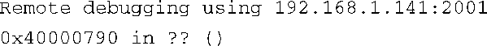
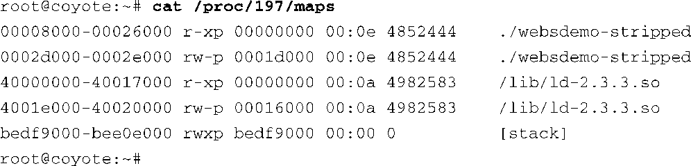
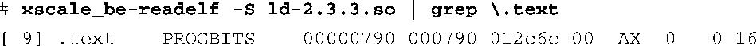
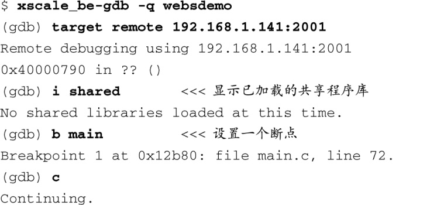
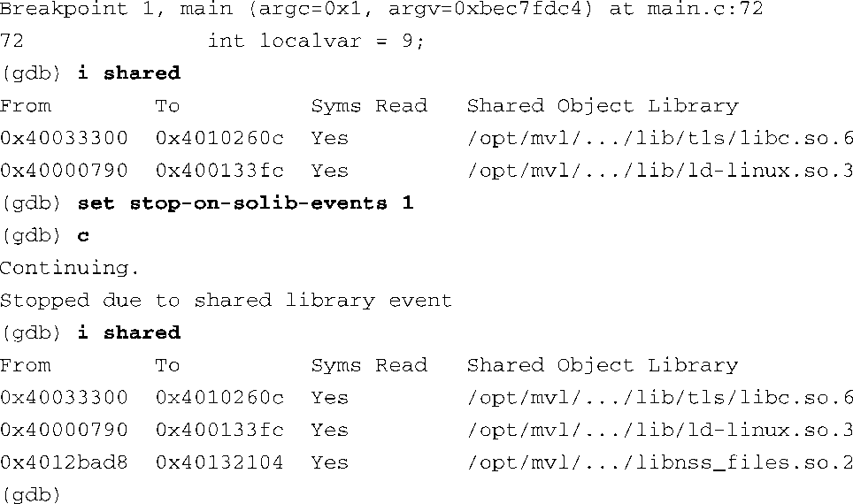
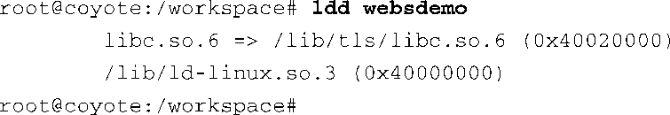
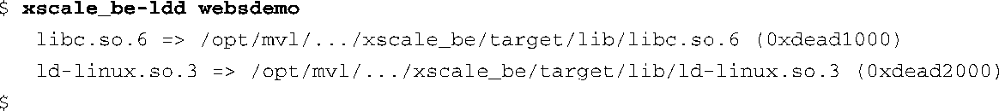
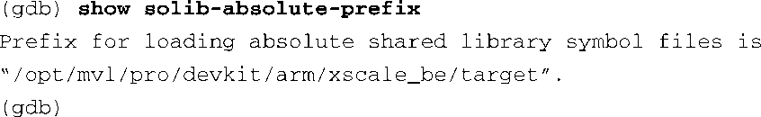
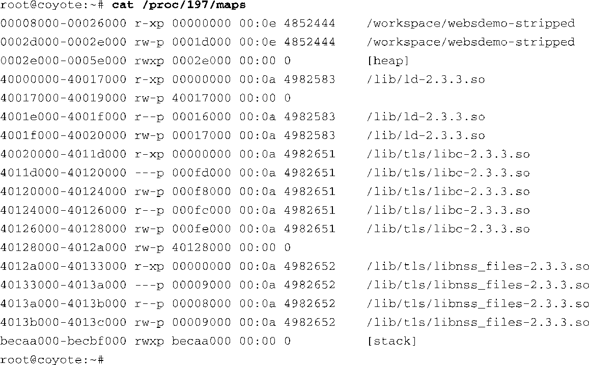

### 15.3　调试共享程序库

既然你已经理解了如何使用GDB（运行在主机上）和gdbserver（运行在目标板上）来启动一个远程调试会话，那么我们现在将注意力转向共享程序库和调试符号，它们也是很复杂的。除非你的应用程序是一个静态链接的可执行文件（链接时使用了 `-static` 选项），否则应用程序中的很多符号都会引用程序外部的代码。明显的例子包括使用标准C程序库中的函数，比如 `fopen` 、 `printf` 、 `malloc` 和 `memcpy` 。不太明显的例子包括调用一些与具体应用程序相关的函数，比如 `jack_transport_locate()` （一个来自JACK低延时音频服务器的函数），而它会调用一个标准C程序库以外的库函数。

要获取这些函数的符号信息，必须满足GDB的两个条件：

+ 必须有程序库的调试版本；
+ GDB必须知道在哪儿可以找到它们。

如果没有程序库的调试版本，仍然可以调试应用程序，只是不会有应用程序调用的库函数的符号信息。通常这是完全可以接受的——当然，除非你正在为嵌入式项目开发一个共享程序库。

回顾一下代码清单15-4的内容，我们使用GDB调试了一个远程目标板。在执行 `target remote` 命令连接到目标板后，GDB打印了以下两行信息：

这表明GDB确实已经连接到了目标板的指定IP地址和端口上了。接着，GDB报告说程序计数器的位置是0x40000790。但后面接着显示的是两个问号而不是函数的符号地址，为什么呢？因为这个地址在Linux动态加载器（ld-x.y.z.so）中，而这个特定的平台中并没有此共享程序库的调试符号。我们是怎么知道这个原因的呢？

回顾一下第9章中有关/proc文件系统的内容。/proc文件系统中一个比较有用的条目是各个进程目录下的maps文件（请看第9章的代码清单9-16）。通过观察代码清单15-3中gdbserver的输出，我们可以得知目标应用程序的进程ID（PID）是197。有了这个PID，我们就可以查看进程在启动后使用的各个内存段了，如代码清单15-6所示。

代码清单15-6　被调试进程的初始内存映射

这里我们看到目标应用程序websdemo-stripped占用了两个内存段。首先是一个只读的可执行代码段，从0x8000开始；其次是一个可读写的数据段，从0x2d000开始。我们感兴趣的是第三个内存段。它就是Linux动态链接器的可执行代码段。注意，它的起始地址是0x40000000。如果再深入调查一下，我们就能够确定GDB确实是停在了动态链接器的第一行代码上，而此时目标应用程序还没有被执行。我们可以使用交叉版本的readelf来 确认链接器的起始地址，如下所示：

我们能够从以上数据推断出GDB在启动时报告的那个地址（0x40000790）就是Linux动态链接器/加载器（ld-2.3.3.so）的第一条指令的地址。如果在调试某个进程或共享程序库时没有它们的符号调试信息，可以使用这个技术来了解代码的大概位置。

回忆一下我们是在开发主机上执行了这个交叉版本的readelf命令。因此，开发主机必须能够访问ld-2.3.3.so文件（它本身是一个XScale架构的二进制目标文件）。通常，这个文件是主机中安装的嵌入式Linux发行版的一部分，就存放在开发主机中。

### GDB中的共享程序库事件

GDB能够通知你有关共享程序库的事件。这可以帮助我们理解应用程序或Linux加载器的行为，或是在共享库函数中设置断点并对它们进行调试和单步跟踪。代码清单15-7演示了这个技术。正常情况下，程序库的完整路径会被显示出来。但为了提高代码清单的可读性，我们用省略号替换了长路径名的中间部分。

代码清单15-7　发生共享程序库事件时停止GDB

在调试会话刚开始的时候，还没有任何共享程序库被加载进来。你可以从第一条命令 `i shared` 的输出中看到这一点。这条命令会显示当前已加载的共享程序库。我们在应用程序的 `main()` 函数处设置了一个断点并让它继续执行，当断点被命中时，两个共享程序库被加载进来。它们分别是Linux动态链接器/加载器和标准C程序库组件libc。

接着，执行 `set stop-on-solib-event` 命令并让程序继续执行。当应用程序尝试执行另一个共享程序库中的函数时，那个程序库就会被加载。在这个例子中，应用程序调用 `gethostbyname()` 函数，造成下一个共享程序库被加载进来。

这个例子说明了一个很重要的交叉开发概念。运行在目标板上的二进制应用程序（ELF格式的镜像）中包含了它对其他库文件的依赖关系，并且需要使用它们来解析外部引用。我们可以使用 `ldd` 命令（请参考第11章和第13章）来查看这些信息。代码清单15-8显示了在目标板上执行 `ldd` 时的输出。

代码清单15-8　在目标板上执行 `ldd`

注意，代码清单中显示了共享程序库的绝对路径，它们都位于目标板根文件系统的/lib目录下。但是，运行于主机开发工作站上的GDB不能使用这些路径来找到所需的库文件。你应该认识到这样做会导致GDB加载错误的库文件（架构不对）。主机系统一般采用x86架构，其/lib目录下存放的库文件也都是针对x86架构而编译的，但这个例子中的目标板采用了ARM XScale架构。

如果在主机上执行交叉版本的 `ldd` ，你会看到那些预先配置在工具链中的程序库路径。工具链必须知道这些库文件在开发主机中的位置才能正常工作<a class="my_markdown" href="['#anchor152']">[2]</a>。代码清单15-9说明了这一点。同样，为了提高代码清单的可读性，长路径名的中间部分已经被省略号代替了。

代码清单15-9　在开发主机上执行 `ldd`

<a class="my_markdown" href="['#ac152']">[2]</a>　当然也可以在使用编译器、链接器和调试器时将这些位置信息传递给它们，但一个出色的嵌入式Linux发行版会将这些默认值配置在工具链中，从而为开发人员带来便利。

交叉工具链中应该已经预先配置好了这些库文件的路径。不仅主机上的GDB需要知道它们的位置，编译器和链接器也同样需要知道<a class="my_markdown" href="['#anchor153']">[3]</a>。GDB的 `show solib-absolute-prefix` 命令会告诉你它会在哪个预先配置的路径中查找这些库文件：

<a class="my_markdown" href="['#ac153']">[3]</a>　当然，编译器还需要知道其他一些目标文件的位置，比如与具体架构相关的系统头文件和程序库的头文件。

通过使用GDB的 `set solib-absolute-prefix` 和 `set solib-search-path` 命令，你还能够设置或修改GDB的库文件搜索路径。如果你正在开发自己的共享程序库或是还有其他存放程序库的路径，可以使用 `solib-search-path` 命令告诉GDB。请参考本章末尾列出的GDB手册，以了解这些命令的详细信息。

关于 `ldd` 的使用，最后再提醒一点。你可能已经注意到了，代码清单15-8和代码清单15-9中还显示了每个库文件的一个相关地址。它们是库文件的起始加载地址，当程序被Linux动态链接器/加载器加载时，这些代码段就会被加载到对应的地址中。代码清单15-8中的 `ldd` 命令是在目标板上执行的，这时，输出信息中的加载地址是有意义的，而且我们可以将这些地址和/proc/<pid>/maps中的地址关联起来。当目标进程（websdemo-stripped）完全加载并运行之后，我们在目标板上查看了这个进程的各个内存段，如代码清单15-10所示。

代码清单15-10　目标板上/proc/<pid>/maps中的内存段

注意代码清单15-8中 `ldd` 输出的地址和/proc文件系统中显示的地址之间的关联。从代码清单15-10中可以看到，Linux加载器的起始位置（ `.text` 段的开始）是0x40000000，libc的起始位置是0x40020000。它们都是虚拟地址，应用程序的这些部分就是被加载到这些位置上；这和 `ldd` 输出的地址是一致的。然而，代码清单15-9中交叉版本的 `ldd` 所报告的加载地址（0xdead1000 和 0xdead2000）并没有意义，它们只是提醒你这些库文件不能够被加载到主机系统中（它们是ARM架构的二进制文件，而主机系统是x86架构的）。

