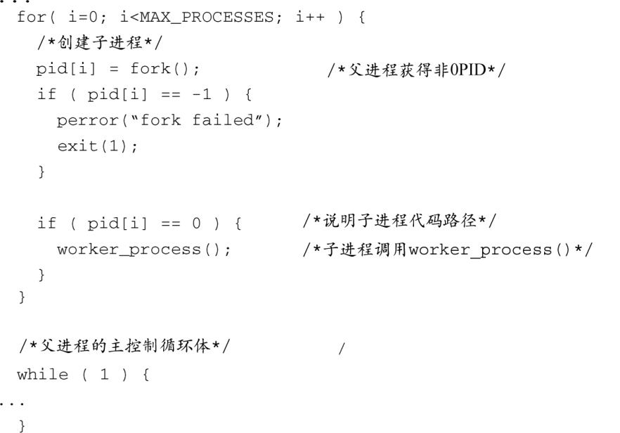
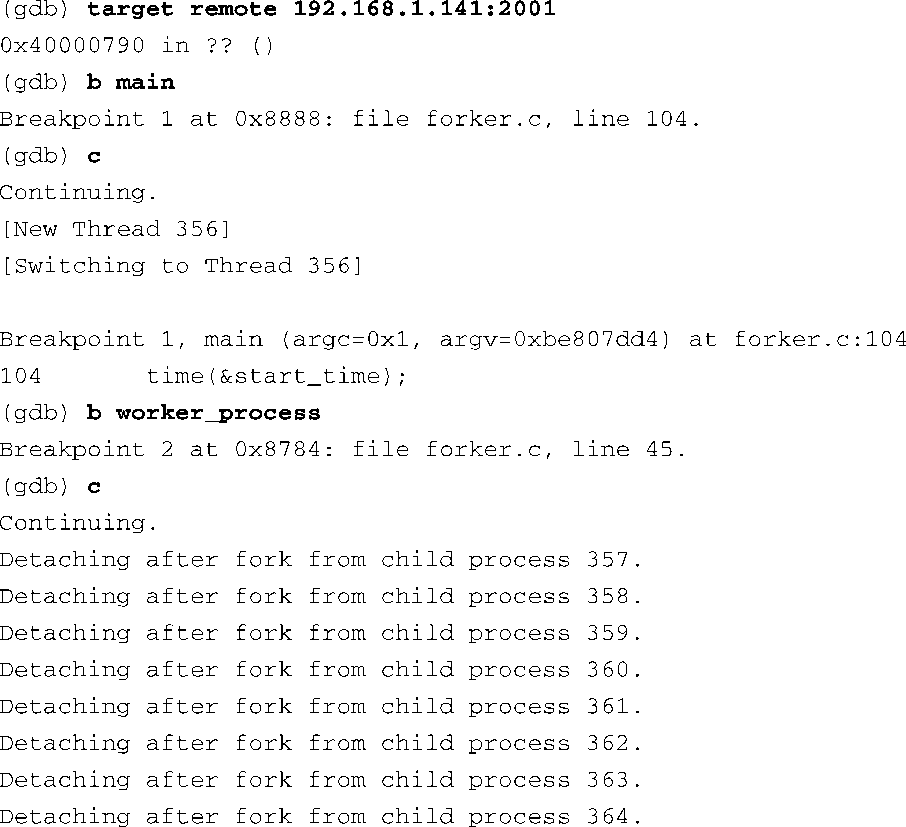
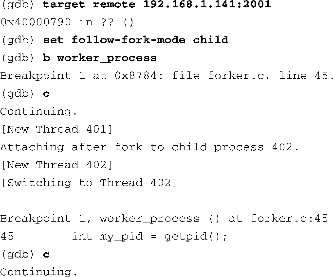

### 15.4.1　调试多个进程

在使用GDB调试一个进程的过程中，如果它调用了 `fork()` 系统调用<a class="my_markdown" href="['#anchor154']">[4]</a>来生成新的进程，这时GDB有两种处理方式。它可以继续控制和调试父进程，或者停止调试父进程并附着到新创建的子进程上。可以使用 `set follow-fork-mode` 命令来控制这个行为。两种可设置的模式分别是 `parent` 和 `child` 。GDB的默认行为是继续调试父进程（ `parent` 模式）。在这种情况下，子进程在成功调用 `fork()` 后立即执行。

<a class="my_markdown" href="['#ac154']">[4]</a>　这里的 `fork()` 并不是系统调用，实际上它是一个C库函数，调用了Linux的 `sys_fork()` 系统调用。

代码清单15-11显示了一个程序片段，这个简单的程序在其 `main()` 函数中使用 `fork()` 生成了多个子进程。

代码清单15-11　使用 `fork()` 生成子进程

这是个简单的 `for` 循环，它调用 `fork()` 系统调用创建了 `MAX_PROCESSES` 个进程。每个新创建的进程都会调用函数 `worker_function()` 。当我们使用GDB在默认模式下调试这段代码时，GDB会检测到新的进程被创建了，但是依然会附着在父进程上。代码清单15-12显示了这个GDB会话的过程。

代码清单15-12　parent模式下的GDB

这段程序创建了8个子进程，PID为357～364。父进程的PID是356。当位于 `main()` 处的断点被命中时，我们在 `worker_process()` 处设置了另一个断点，而这正是每个子进程在 `fork()` 之后要调用的函数。让程序从 `main()` 函数中继续执行，我们看到每个子进程被创建后与调试器分离了。它们永远都不会命中断点，因为GDB是附着在主进程上的，而主进程并不调用 `worker_process()` 。

如果你需要调试每个进程，你必须执行一个单独的GDB会话并在 `fork()` 之后附着到子进程上。GDB的文档（请见本章末尾）中介绍了一个有用的调试技术，你可以在子进程中调用 `sleep()` ，从而留出时间将调试器附着到新创建的进程上。15.5.2节解释了如何附着到一个新创建的进程上。

如果只需要调试子进程，可以在父进程调用 `fork()` 之前将 `follow-fork-mode` 的值设置为 `child` ，如代码清单15-13所示。

代码清单15-13　child模式下的GDB

这里我们可以看到父进程的PID是401。当 `fork()` 系统调用创建了第一个子进程时，GDB离开了父进程并附着到新创建的子进程上（PID为402）。GDB现在控制了第一个子进程并停在了 `worker_prcocess()` 处的断点上。不过需要注意的是，代码清单15-11中创建的其他子进程不会被调试，它们将继续运行直到结束。

总而言之，以这种方式使用GDB时只能一次调试一个进程。你可以在 `fork()` 系统调用后继续调试，但你必须在两者之间作出选择——父进程或子进程。正如我们在前面提到的，如果必须一次调试多个相互协作的进程，可以使用多个独立的GDB会话。

