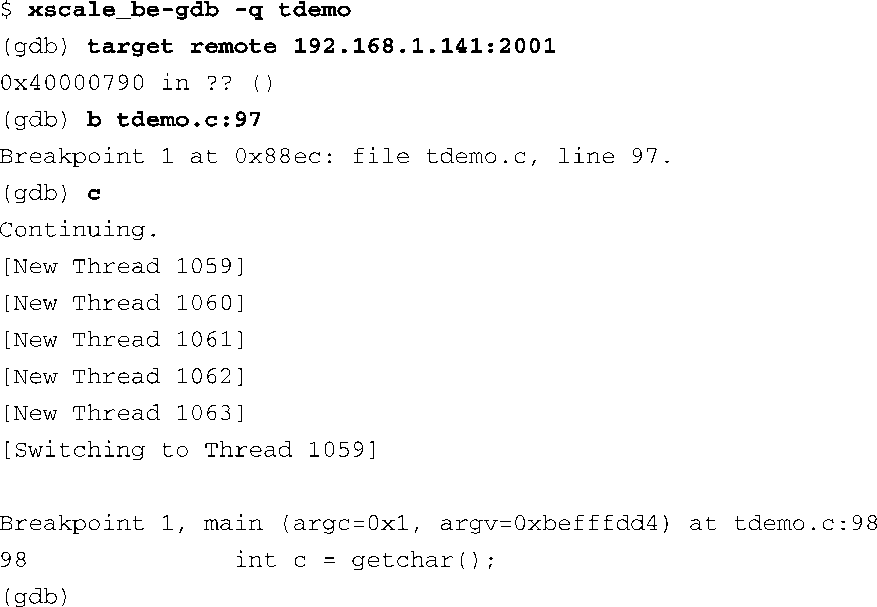
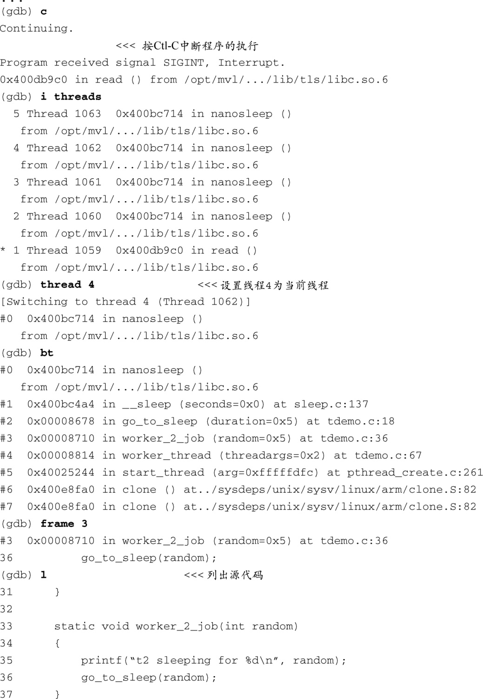
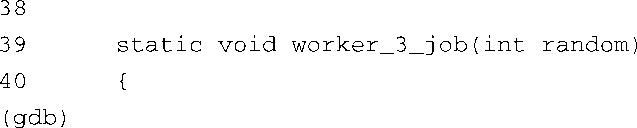

### 15.4.2　调试多线程应用程序

如果你的应用程序使用了POSIX线程库来实现其线程功能，GDB能够同时调试这种程序中的多个线程。在Linux系统（包括嵌入式Linux系统）中，NPTL（Native POSIX Thread Library，本地POSIX线程库）已经成为了事实上的线程库标准。在下面的讨论中，我们假设你正是使用了这个线程库。

为了方便这里的讨论，我们编写了一个演示程序，它在一个简单循环里重复调用库函数 `pthread_create()` ，从而创建了多个线程。在创建了这些线程后， `main()` 函数只是等待键盘输入以终止程序。每个线程会打印一条简短的消息，并睡眠一段预定的时间。代码清单15-14显示了这个程序在目标板上的启动过程。

代码清单15-14　演示程序在目标板上的启动过程

和前面的例子一样，目标板上的gdbserver准备好了运行要调试的应用程序，并等待来自主机交叉gdb的连接。当主机GDB发起连接之后，gdbserver会打印一条Remote debugging...消息说明具体的连接情况。现在，我们在主机上启动GDB并连接到目标板。代码清单15-15显示了这个调试会话的前半部分。

代码清单15-15　主机GDB连接到目标板并进行调试

这里，我们先连接到目标板上（连接后会产生代码清单15-14中的Remote debugging...消息），然后在创建新线程的那个循环语句的后面设置一个断点，并让程序继续运行。当新的线程被创建时，GDB会显示一条提示消息以及线程ID。线程1059是应用程序tdemo的主线程，它从 `main()` 函数开始执行。线程1060至1063是由调用 `pthread_create()` 创建的新线程。

当GDB命中断点时，它显示了一条[Switching to Thread 1059]消息，表示是该线程在执行时遇到了断点。这是调试会话中处于活动状态的线程，也就是GDB文档中所说的当前线程。

GDB使我们可以在线程间切换并像往常一样进行调试，比如设置断点，检查数据，显示栈中的回溯调用以及单独查看当前线程的每个栈帧。代码清单15-16提供了这些操作的例子，它是代码清单15-15的延续。

代码清单15-16　GDB对线程的操作

这里有几点值得注意。GDB会自己为每个线程分配一个代号，并用它们来引用对应的线程。当某个线程命中断点时，进程中的所有线程都会停止以接受检查。GDB用一个星号（ `*` ）来标记当前线程。可以为每个线程设置不同的断点——当然，假设它们会执行不同的代码。如果你在一段所有线程都会执行的公共代码中设置了断点，任意线程都可能首先命中断点。

本章末尾参考的GDB用户手册中包含了更多有关多线程调试的有益信息。

