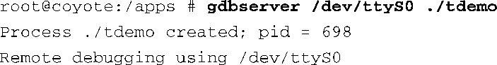
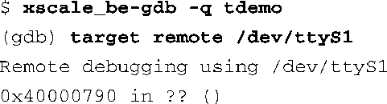

### 15.5.1　使用串行端口进行调试

使用串行端口进行调试很简单。当然，你的目标板上必须有一个空闲的串行端口，而它没有被其他进程，比如串行端口控制台所使用。另外，主机上也必须要有一个可用的串行端口。如果这两个条件都能满足的话，只需要在执行gdbserver的时候将传递给它的IP地址:端口号替换成串行端口设备名就行了。在主机上运行GDB连接到目标板上时也是这样。

在目标板上执行以下命令：

在主机上执行以下命令：

