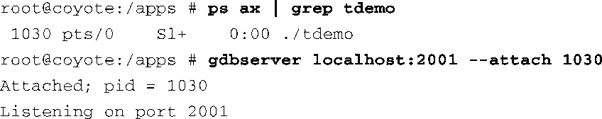

### 15.5.2　附着到运行的进程上

使用gdbserver，我们能够很容易地连接到一个正在运行的进程上并查看其状态，而不需要终止该进程并重新启动它：

查看完进程的状态后，可以使用GDB的 `detach` 命令来结束调试。这条命令会让gdbserver离开该应用程序进程并终止调试会话，而该进程则会继续运行。这是一个非常有用的调试技术，但要注意，当调试器附着到进程上时，它会停下来并等待来自调试器的指令。除非使用 `continue` 或 `detach` 命令让它继续执行，否则它是不会这么做的。还需要注意的是，几乎可以在任何时候使用 `detach` 命令来终止调试会话并确保应用程序在目标板上继续运行。

