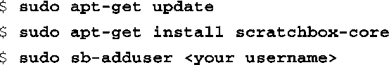

### 16.2.1　安装Scratchbox

安装过程很简单，只要按照Scratchbox网站上的指示进行操作即可。在基于Debian的系统，比如Ubuntu中，首先将下面这行添加到文件/etc/apt/sources.list中：

然后执行一下更新，安装需要的软件包，并将你的用户名<a class="my_markdown" href="['#anchor161']">[1]</a>添加到Scratchbox中。代码清单16-1显示了这个过程。

代码清单16-1　安装Scratchbox

<a class="my_markdown" href="['#ac161']">[1]</a>　必须是你当前使用的Linux用户名。

注意，以上这些命令都需要root权限。只要你有开发主机的root权限，这不是什么大问题。但是根据公司的IT政策，很多大型企业中的开发人员是没有root权限的。你应该考虑是否会遇到这个问题。

还要注意，在使用 `sb-adduser` 命令将用户名添加到Scratchbox中之后，必须先注销然后用一个新的shell重新登录才能让组员关系的修改生效<a class="my_markdown" href="['#anchor162']">[2]</a>。Scratchbox的文档详细描述了这一点。

<a class="my_markdown" href="['#ac162']">[2]</a>　在安装scratchbox-core时，它会创建一个名为sbox的用户组。——译者注

