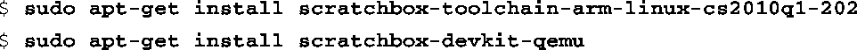
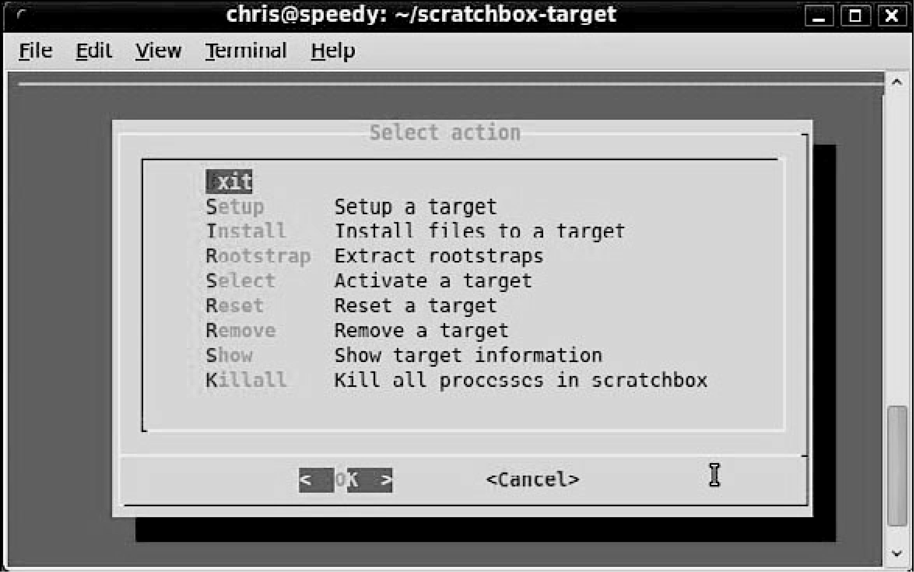
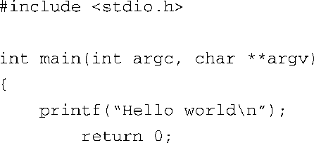
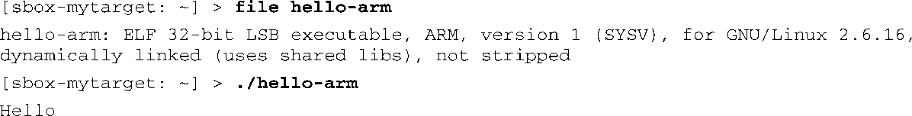

### 16.2.2　创建一个交叉编译目标

安装了Scratchbox之后，必须完成几个步骤才能开始构建。首先，必须安装工具链和用于模拟目标设备的qemu（一个流行的处理器模拟程序）。然后，必须登录到Scratchbox中并使用配置工具进行一些初始设置。如果你使用的是基于Debian的发行版，比如Ubuntu，工具链的安装并不困难。Scratchbox提供了好几个工具链，可以在其网站的下载页面中查看它们的当前版本。在这个例子中，我们选择一个ARM编译器：

接着，以Scratchbox用户的身份登录，并创建一个交叉编译目标。具体是使用Scratchbox的login程序进行登录：

登录之后，执行配置工具sb-menu。这是一个基于菜单的工具，命令如下：

图16-1显示了执行这条命令后的主配置界面。

<b class="my_markdown">图16-1　Scratchbox的菜单配置界面</b>

使用Scratchbox网站上的安装文档（installdoc.pdf）作为指南（<a class="my_markdown" href="['http://www.scratchbox.org/documen-tation/docbook/installdoc.html']">www.scratchbox.org/documen-tation/docbook/installdoc.html</a>），并按照以下步骤设置Scratchbox的环境。

(1) 选择主菜单中的Setup创建一个新的目标，并命名为mytarget。

(2) 选择一个交叉编译器。

(3) 在选择devkits时，选择qemu。

(4) 选择CPU transparency，再选择qemu-arm-sb。

完成这些步骤后，退出sb-memu配置工具。现在你可以开始研究Scratchbox的开发环境了。

我们将演示如何编译和运行一个简单的Hello World程序。在Scratchbox的shell中使用文本编辑器（比如vi）创建一个的简单的Hello World程序，如代码清单16-2所示。

代码清单16-2　简单的Hello World示例

现在，在Scratchbox的环境中编译这个程序：

这会使用你刚刚安装的ARM工具链来编译hello.c。这条命令通过一个Scratchbox 包裹程序<a class="my_markdown" href="['#anchor163']">[3]</a>来调用ARM工具链。你可以在/scratchbox/compilers/bin目录下看到这个工具链包裹程序。它会根据你创建的目标规格来决定使用哪个编译器。编译完成后，你可以核实生成的文件是一个ARM二进制文件，并且在Scratchbox的shell中运行这个文件，如下所示：

<a class="my_markdown" href="['#ac163']">[3]</a>　包裹程序的名称是sb_gcc_wrapper，命令中的gcc实际上是一个指向它的符号链接。——译者注

虽然这是个微不足道的例子，但它说明了Scratchbox的环境和使用方法。Scratchbox的模式是为开发人员提供一个与目标设备类似的开发环境。这种方法的优点是：使用模拟目标设备使很多原本有难度的开源软件包的交叉编译容易得多了。

当然，Scratchbox的实际使用情况会比这个例子复杂很多，但基本架构和方法都很简单。在实际的应用场景中，你可能会使用一系列makefile或者专门的构建脚本来编译大量的软件包和其他程序。

Scratchbox还包含一个远程shell特性，它允许开发人员直接在一个真实的目标硬件上执行一些操作（互动式的或非互动式的）。它的工作原理类似于我们熟悉的远程shell（rsh）。我称这种特性为sbrsh，并且是Scratchbox安装程序的一部分。可以在Scratchbox的文档中找到更多有关sbrsh的详细信息。

Scratchbox有很多优秀的文档。如果你想深入了解Scratchbox，可以将它安装到系统中并按照网站（<a class="my_markdown" href="['http://www.scratchbox.org']">www.scratchbox.org</a>）上的文档进行学习。

