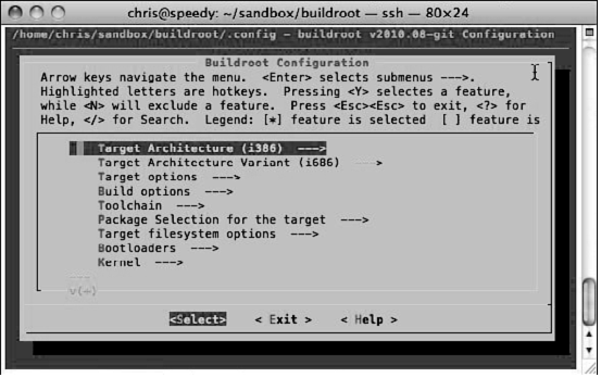

### 16.3.2　配置Buildroot

下载了代码（或git仓库）后，就可以配置它了。进入Buildroot的安装目录，并执行以下配置命令：

这条命令会生成一个你非常熟悉的配置工具，这与Linux内核以及Scratchbox的配置是类似的。图16-2显示了这个配置工具。

<b class="my_markdown">图16-2　Buildroot的配置</b>

Buildroot的配置范围很广，有很多选项可供选择。Buildroot会根据配置的属性来创建嵌入式Linux发行版。下面列出一些必须选择的重要属性：

+ 目标架构；
+ 架构的变种，比如PowerPC 603e或ARM 920t；
+ 目标选项，比如板载设备和串行端口；
+ 构建选项，比如构建目录和下载目录，并行性（同时执行的任务数量）和其他构建属性；
+ 工具链选项，包括程序库的类型（uClibc或glibc）和编译器版本；
+ 软件包的选择，比如目标板上会包含哪些软件包。

