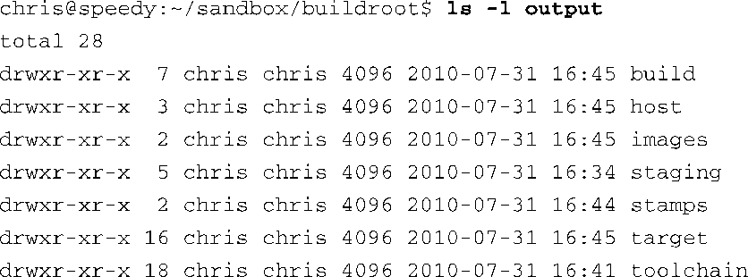
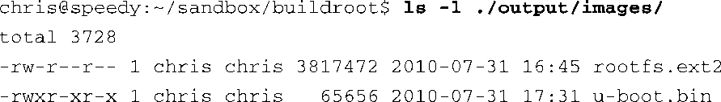

### 16.3.3　构建Buildroot

在进行简单配置之后，只需要输入 `make` 就可以开始构建了。如果配置正确而且你很幸运的话<a class="my_markdown" href="['#anchor165']">[5]</a>，最终会获得一个完整的嵌入式Linux发行版。构建过程可能需要一些时间，因为它要下载和编译很多软件组件并执行一系列步骤以实现目标。在此过程中，你的串行端口终端会有大量输出信息。Buildroot一般会执行以下步骤：

+ 根据配置下载所有软件包和工具链的源文件；
+ 构建交叉编译工具链；
+ 使用交叉工具链配置和编译所有需要的软件包；
+ 如果配置需要，构建一个内核镜像；
+ 使用你选择的格式创建一个根文件系统。

<a class="my_markdown" href="['#ac165']">[5]</a>　很多原因都可能造成构建失败，我们稍后就会讲述它们。

当构建结束时，结果会放在.../output目录中，如代码清单16-3所示。

代码清单16-3　Buildroot输出目录的结构

根文件系统镜像会被放置到.../output/images 目录中。因为我们在配置时指定了ext2文件系统，所以images子目录中有一个名为rootfs.ext2的镜像文件：

Buildroot相当灵活并且有很多配置选项。Buildroot能够为具体的目标板构建U-Boot镜像，只需要在配置Buildroot时指定目标板的名称（来自U-Boot的makefile，但不包含_config后缀）即可。在上面的例子中，我们指定了目标板的名称为ap920t，所以还会生成一个U-Boot镜像（u-boot.bin）。U-Boot文档对此有更多详细描述。

output目录中还包含其他一些子目录，代码清单16-3中有所显示。Staging子目录用于存放软件包的构建目标，这些软件包本身被其他软件包所依赖。toolchain目录包含了编译交叉工具链所需的组件。host目录包含了与主机相关的工具，用于支持Buildroot的操作。其中包括fakeroot（用于在没有root权限的情况下构建根文件系统）和生成镜像的程序。target目录几乎是根文件系统镜像的复本，但它不能直接用作根文件系统。因为其中的用户、组、权限和设备节点都不正确。fakeroot会使用这个目标目录来创建最终的镜像。最终，所有组件（除了交叉工具链之外）都是在build目录中构建的。

Buildroot是一个强大的构建系统，能够构建出完整的嵌入式Linux发行版。请参考以下网址中的文档并了解更多详细信息：http://buildroot.uclibc.org/docs.html。

