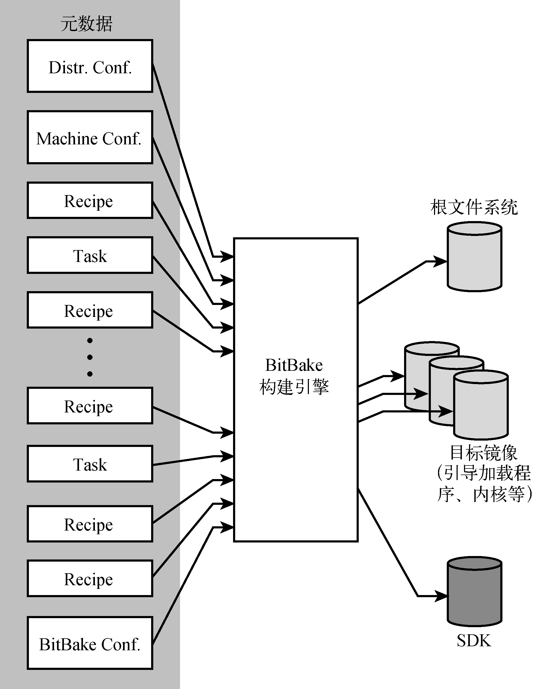

### 16.4.1　OpenEmbedded的组成

OpenEmbedded主要是由两部分组成的，如图16-3所示。BitBake是构建引擎，它是一个强大而灵活的构建工具。元数据是一组指令，它告诉BitBake要构建什么。

<b class="my_markdown">图16-3　BitBake和元数据</b>

BitBake处理元数据，并按照它的指示进行构建。在构建过程的最后阶段，BitBake会生成所有要求的镜像，包括根文件系统、内核、引导加载程序和中间镜像（比如Power架构特有的设备树二进制文件）。OpenEmbedded的一个非常强大的特性是它能够创建软件开发包（SDK）。这些SDK包含工具链、程序库和头文件，应用程序开发人员可以在一个独立的开发环境中使用它们。

