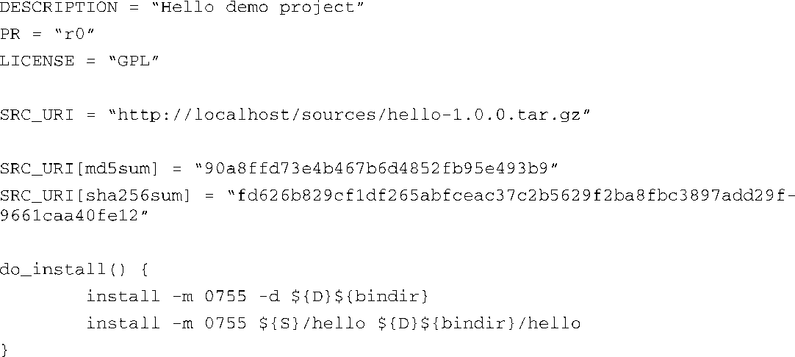
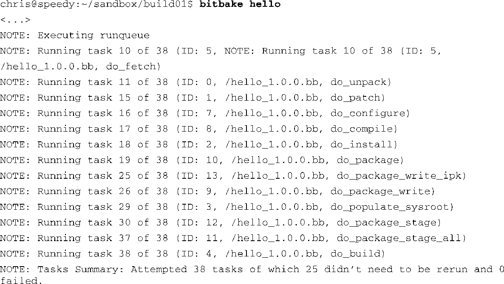

### 16.4.3　配方基础

最常见的OpenEmbedded元数据就是配方。一个配方构建一个软件包，它通常是一个单独的文件，或几个小文件的组合。下面我们通过研究一个简单的配方来理解OpenEmbedded使用的元数据语言。代码清单16-4是一个OpenEmbedded版本的Hello World。这个配方会构建一个简单的Hello World应用程序，并准备将它包含到最终的根文件系统中，它的文件名是hello_1.0.0.bb。

代码清单16-4　简单的OpenEmbedded配方：hello_1.0.0.bb

前几个字段只不过是一些管理信息：

+ `DESCRIPTION` ——有关软件包本身的描述信息；
+ `PR` ——软件包（配方）的版本号；
+ `LICENSE` ——软件包的许可类型。

每个配方中都必须有 `SRC_URI` 。它定义了BitBake用于获取软件包源文件的方法（这个例子中是http）和位置（localhost/sources/hello-1.0.0.tar.gz）。BitBake可以使用多种方法来获取<a class="my_markdown" href="['#anchor166']">[6]</a>源码，比如从本地或远端（因特网服务器上）的git、svn或cvs仓库中导出代码。源码的形式也不固定，可以是一个文件或是一个打包工具。

<a class="my_markdown" href="['#ac166']">[6]</a>　BitBake中有一个名为fetcher的模块。

`SRC_URI[md5sum]` 是一种指定校验值的方法，可用于验证源码文件的完整性。如果远端服务器上有md5或sha256格式的签名文件，BitBake会用签名文件中的值和配方中的这些值作比较，从而确保下载的文件是正确的。

`do_install` 方法是一个函数，它能覆盖BitBake的默认安装方法。在这个配方示例中， `do_install` 方法使用Linux的 `install` 命令定义了两个步骤：第一步创建用于存放构建结果（二进制文件hello）的输出目录；第二步将二进制文件复制到刚刚创建的输出目录中。以上命令中用于指定目录名的语法结构常见于autotools配置脚本和构建文件中。 `{bindir}` 指的是目标板上的/bin目录。 `S` 和 `D` 是OpenEmbedded元数据中的快捷变量，分别指源目录和目的目录。你可以从install命令的帮助手册中（man install）了解更多详细信息。

OpenEmbedded中的配方可以包含用Python语言或bash脚本语言编写的指令。代码清单16-4所示的例子中只使用了bash脚本语言。有关Python语言的讨论超出了本节的范围。

你也许在想这个简单的配方是如何构建出Hello World应用程序的。我们看到配方中定义了安装应用程序的步骤，但没有发现其他有关构建的指令。BitBake会使用一组默认的步骤来处理每个配方，而这些步骤是由OpenEmbedded的类定义的。BitBake类是以.bbclass结尾的文件。大多数默认的处理步骤都来自一个名为base.bbclass的基类。正是这个类定义了获取源码、解压、配置、编译和安装的默认命令。

代码清单16-5显示了BitBake在构建hello软件包时的输出。BitBake可以接受任何配方或任务<a class="my_markdown" href="['#anchor167']">[7]</a>作为构建的目标。

代码清单16-5　BitBake处理Hello配方

<a class="my_markdown" href="['#ac167']">[7]</a>　回顾一下，“任务”是一种特殊类型的OpenEmbedded元数据（配方），通常用于将一些软件包组合起来，以便于放到根文件系统中。

注意，为了方便阅读，我们已经调整了代码清单的格式。每行输出中省略了配方文件（hello_1.0.0.bb）的完整路径，同时，一些和讨论无关的输出信息也已经被删除了。

我们可以从代码清单16-5中看到BitBake在构建软件包（由配方文件hello_1.0.0.bb定义）时执行的每个步骤。第一步（fetch）从服务器上下载hello源码的打包工具。第二步（unpack）将这个打包工具解压到一个由配置元数据定义的工作目录中。我们在代码清单16-4中看到可以用一个名为 `S` 的元数据变量来引用这个工作目录。接着， `do_patch` 根据需要对源码打补丁。

打完补丁之后是配置源码。在这个简单的配方中，它是一个空方法。它没有做任何事情，因为没有什么需要配置的。下一个步骤是编译。BitBake会在hello源码的工作目录中执行 `make` 命令，并利用makefile来完成构建软件包的工作。编译之后是安装。注意，代码清单16-5中使用了我们自己定义的安装步骤，而不是默认的安装步骤。它会按照代码清单16-4中描述的步骤来安装hello二进制文件。

接下来的几个步骤与软件打包有关，结果是构建出一个包含所有已安装文件的二进制软件包。有关打包的详细讨论超出了本节的范围，但需要认识到每个配方会按照元数据指定的格式创建出一个二进制软件包。.ipk是最常用的软件包格式——这是一个紧凑的轻量级的打包技术，而且是专门为嵌入式Linux应用程序而设计的。最后生成的软件包会被放到一个特殊的由BitBake专门创建的输出目录中。

填充（populate）和暂存（stage）这两个步骤会将构建出的文件移动到一个特殊的暂存位置中，以便依赖这个软件包的其他软件包能够获取到这些构建结果。而且，根文件系统最终也是由特定的配方相关的目录（构建结果在此汇总）内容编译而来的。这项工作由 `do_build` 方法完成。

在BitBake成功处理了这个配方之后，软件包就构建好了。然后，构建结果（通常是一个或一组二进制文件或软件包）会被放置到一个特殊的与具体配方相关的目录中，以便其他程序在构建时能够引用它们。后续用于构建镜像的配方也可以从这些目录中收集构建结果并放到最终的根文件系统中。

下面几节将讨论其他几种主要的元数据——任务、类和配置。

