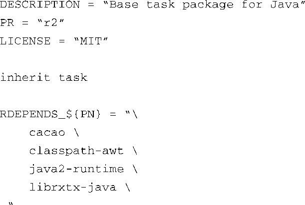

### 16.4.4　任务

任务是一种用于将软件包组合起来的配方，通常是为了构建根文件系统。任务本身不会产生软件包或构建结果，因为任务都是空的。它们的文件名中不一定包含“task”。

注意，在OpenEmbedded的术语中，任务一词被重载了。当我们说到BitBake任务时，它们指的是BitBake执行的步骤，比如do_compile；另外，它们也可以指这里讲的配方。请注意这个术语在不同环境中的含义！

代码清单16-6显示了一个简单的任务，它来自一个最新的OpenEmbedded版本。这个任务指定了Java需要的一些软件包，而且它们会被包含在最终生成的根文件系统中（task-java.bb）。

代码清单16-6　task-java.bb

有些任务很复杂，但是这个任务相对比较简单并且能够说明任务的基本思想。首先是几个必需的头域字段，包括 `DESCRIPTION` 、 `PR` 和 `LICENSE` 。然后是 `inherit` 关键字，这表明该配方使用了我们将要讨论的下一种元数据——类。你可以将这条指令看做C语言中的 `#include` 。它表示task.bbclass中定义的变量和方法应该包含到这个配方中并由BitBake进行处理。

代码清单16-6中的变量 `RDEPENDS_${PN}` 定义了运行时软件包的依赖关系。其中的 `PN` 代表软件包的名称，一般是配方的文件名，但不包括扩展名——在这个例子中就是task-java。如果在构建镜像时包含了这个配方（task-java.bb），REDPENDS中列出的软件包就会被构建并包含在最终的镜像中。如果下载了OpenEmbedded的代码快照，可以在镜像配方x11-gpe-java-image.bb中看到它使用了task-java.bb任务。

