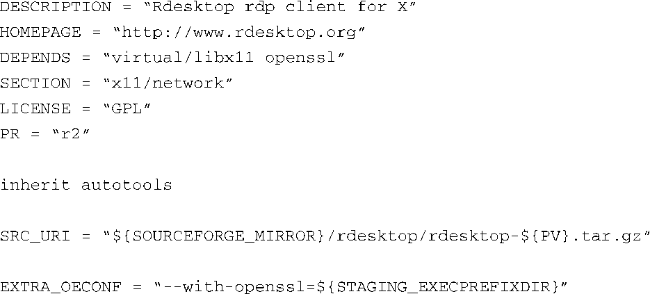

### 16.4.5　类

OpenEmbedded中的类和面向对象语言（比如C++和Java）中的类是相似的。它用于封装一些由多个配方共享的公共功能，而且，OpenEmbedded中的很多公共功能也是由类实现的。

我们在代码清单16-6所示的配方（task-java.bb）中看到了一个使用 `task` 类的例子。 `task` 类是由文件task.bbclass定义的，这个文件位于OpenEmbedded代码仓库的classes子目录中。它负责完成一些所有任务都需要的基本功能。其中的一些指令用于告诉BitBake这个配方本身不会生成任何需要打包或放到最终根文件系统中的构建结果。另外，它还包括一些处理逻辑，用于生成任务中包含的软件包的-dbg和-dev版本。

一个较为常用的类是 `autotools.bbclass` 。这个类提供了我们熟悉的autotools功能，很多常用的Linux软件包都是由autotools构建而来的。你可能已经熟悉autotools的使用方法了。在Linux桌面系统中，先下载和解压源码，然后使用命令序列 `./configure` 、 `make` 和 `make install` 来配置、编译和安装软件包，就可以构建一个基于autotools的软件项目。

`autotools.bbclass` 类提供了这个功能。如果你的源码包使用了autotools，那么配方会相当简单，不过软件包本身并不简单。代码清单16-7显示了一个基于autotools的配方。为了提高可读性，我们稍微调整了它的格式，但不会减少它的功能。

代码清单16-7　简单的基于autotools的配方：rdesktop_1.5.0.bb

几乎不能再简单了。这个配方提供了用于构建rdesktop（X窗口系统的rdp客户端）的指令。首先是几个标准头域，包括 `DESCRIPTION` 、 `LICENSE` 和 `PR` 等。接着它使用 `inherit` 关键字将 `autotools.bbclass` 的功能包含进来。 `SRC_URI` 则是告诉BitBake到哪里可以获取到源码。

最后一行说明了基于autotools的项目的一个重要特性。如果你曾经在构建项目时将参数传递给./configure脚本，你会对此很熟悉。在配置源码时， `EXTRA_OECONF` 变量会被传递给rdesktop的./configure脚本。在这个例子中， `--with-openssl` 参数（它的值是一个目录）被传递给了配置脚本。这样rdesktop就配置了openssl功能，并告知编译器在哪个目录中可以找到openssl的支持文件，从而编译这个特性。

类在OpenEmbedded中的应用很广泛。可以在.../openembedded/classes目录中看到当前所有已定义的类。

