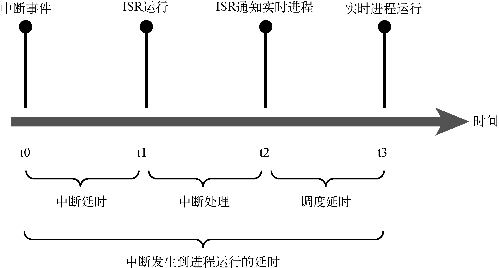

### 17.1.4　延时

实时进程通常和某个物理事件相关联，比如外围设备的中断。图17-1说明了Linux系统中延时的组成。延时的测量是从接收到中断的那一刻开始的，这表示为图17-1中的t0时刻。一段时间之后，中断的控制权被转交给了中断服务程序（Interrupt Service Routine，ISR），这表示为图中的t1时刻。中断延时几乎是由最大的中断关闭时间<a class="my_markdown" href="['#anchor171']">[1]</a>决定的——这是指某个执行线程在运行时禁止硬件中断的时间<a href="#anchor172" id="ac172">[2]</a>。

<b class="my_markdown">图17-1　延时的组成</b>

<a class="my_markdown" href="['#ac171']">[1]</a>　我们忽略了处理中断时的上下文切换时间，因为这与中断关闭时间相比可以忽略不计。

<a class="my_markdown" href="['#ac172']">[2]</a>　有些中断服务程序会在处理中断时关闭硬件中断，其他中断就不能得到及时处理。——译者注

一个设计良好的中断处理程序通常分为两个部分：上半部（top half）和下半部（bottom half）。上半部是实际的ISR，在其中完成的工作应该尽可能的少。事实上，这个执行上下文的能力是受限的（比如，ISR不能调用阻塞函数，也就是可能会睡眠的函数）。因此，ISR应该只完成一些紧急的硬件操作，而将耗时的数据处理留给下半部（也被称为softirq）来完成。Linux中包含多种下半部的处理机制，它们在Robert Love撰写的《Linux内核设计与实现》一书中有详尽的描述。具体细节请参考本章末尾的文献。

ISR/下半部完成处理后，通常会唤醒正在等待数据的用户空间进程，这表示为图17-1中的t2时刻。一段时间之后，调度器选择运行实时进程，并将处理器分配给它，这表示为图17-1中的t3时刻。调度延时主要受以下因素影响：等待处理器的进程数量和它们的优先级。通过设置某个进程的实时属性（ `SCHED_FIFO` 或 `SCHED_RR` ），可以使它的优先级高于普通的Linux进程，从而让调度器在下次调度时选择运行此进程，这里假设它是所有等待处理器的实时进程（设置了实时属性的进程）中优先级最高的那一个。优先级最高的实时进程一旦准备好（没有阻塞在I/O操作上）就会被调度器选中并运行。你很快就会看到如何设置这个属性。

