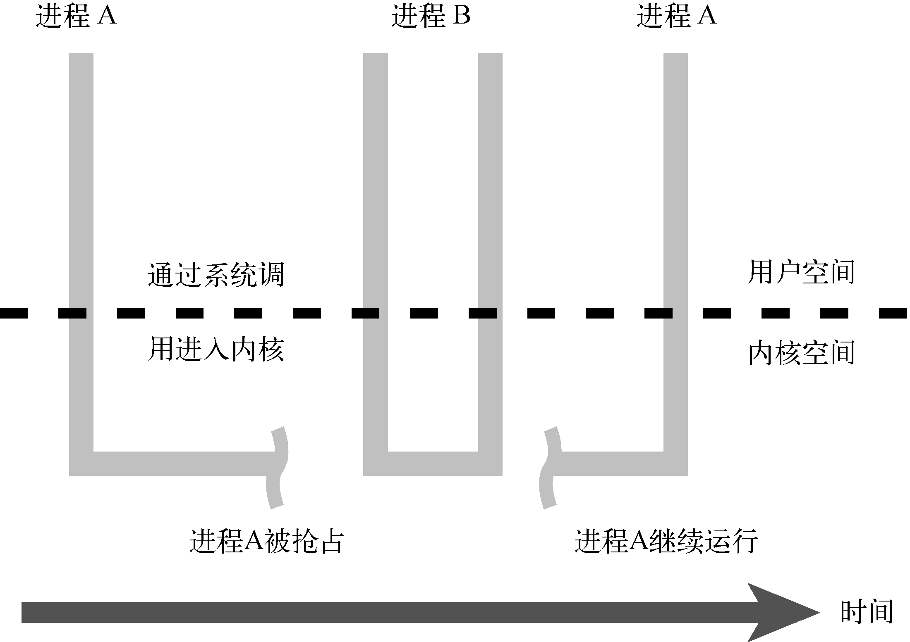

### 17.2　内核抢占

早期的Linux 1.x内核中没有内核抢占。这意味着当一个用户空间进程正在请求内核服务时，除非该进程处于阻塞状态（进入睡眠）并等待某个事件（一般是I/O事件）或者它请求的内核处理完成了，否则其他任务是不会被调度运行的。内核可抢占<a class="my_markdown" href="['#anchor173']">[3]</a>则意味着当一个进程正在内核中运行时，即使它在内核中的处理还没有完成，另一个进程也可以抢占它并运行。图17-2说明了这一系列事件。

<a class="my_markdown" href="['#ac173']">[3]</a>　有趣的是，关于抢占（preemptable）一词的正确拼写方法还存在不少争论。我遵从Rick Lehrbaum通过网上问卷得到的调查结果：<a href="http://www.linuxdevices.com/articles/AT5136316996.html">www.linuxdevices.com/articles/AT5136316996.html</a>。

在图17-2中，进程A通过系统调用进入内核。这可能是一个 `write()` 调用，用于向某个设备（比如控制台或磁盘文件）写入数据。当进程A正在内核中执行时，高优先级的进程B被一个中断唤醒了。这时，虽然进程A既没有被阻塞也没有完成它在内核中的处理，内核还是会抢占进程A并将处理器分配给进程B。

<b class="my_markdown">图17-2　内核抢占</b>

