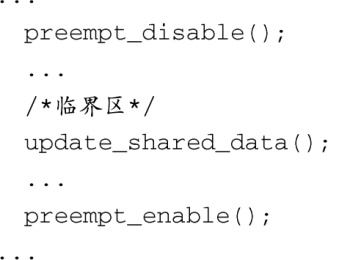
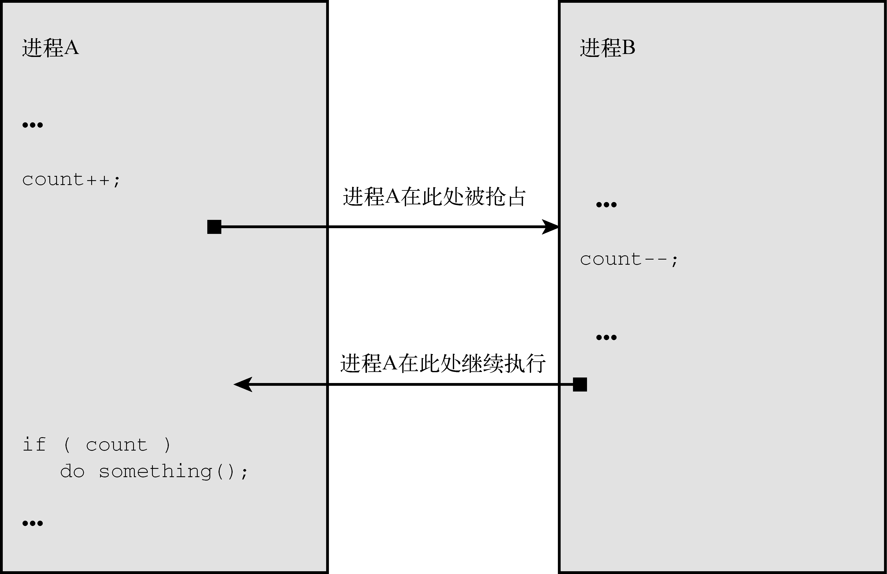

### 17.2.1　抢占的障碍

让内核完全可抢占的难点在于找出内核中所有不能够被抢占的代码，也就是内核中不允许抢占发生的临界区（critical section）代码。例如，假设图17-2中的进程A正在内核中执行一个文件系统操作。在某个时刻，此进程可能需要更新一个代表文件的内核数据结构。为了保护数据结构免受损坏，它必须阻止其他所有进程访问这个共享的数据结构。代码清单17-1使用一段C代码说明了这个概念。

代码清单17-1　对临界区加锁

如果我们没有用这种方式保护共享数据，更新共享数据结构的那个进程可能会在更新数据的过程中被抢占。如果另一个进程尝试更新同一共享数据，那么数据损坏几乎是不可避免的。一个经典的例子是两个进程都直接操作公共变量并根据变量的值来决定下一步的操作。图17-3说明了这种情况。

<b class="my_markdown">图17-3　并发访问共享数据时的错误</b>

在图17-3中，进程A在更新了共享数据后被中断（抢占）了，此时它还没有检查该数据的值。按照设计，进程A不能检测出它已经被抢占了。在进程B修改了共享数据的值之后，进程A再次运行。可以看到，这时进程A会根据进程B设定的值来决定其下一步操作。如果这不是你所期望的结果，必须在进程A访问共享数据的过程中（这里是指对变量 `count` 的修改和判断）禁止内核抢占。

