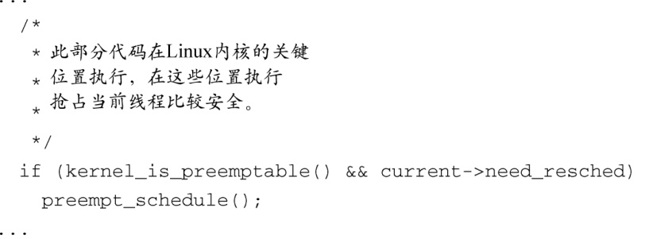
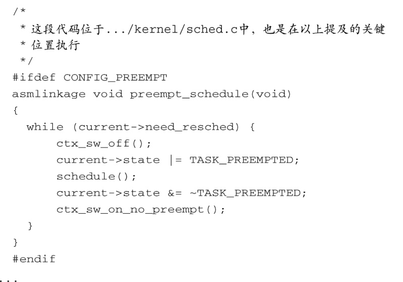

### 17.2.2　抢占模式

实现内核抢占的第一个方案是在内核代码的一些关键位置加上检查语句。这是一些可以安全地抢占当前执行线程的地方，包括系统调用的入口和出口、某些内核锁的释放点以及中断处理的返回点。在这些检查点上，类似代码清单17-2中的代码用于执行抢占操作。

代码清单17-2　Linux 2.4 + 抢占补丁中的抢占检查代码

代码清单17-2中的第一段代码（由实际代码简化而来）是在前面所说的关键位置上被调用的，内核可以在这些地方安全地进行抢占。第二段代码是实际的内核代码，来自一个打过抢占补丁的早期Linux 2.4内核。这个 `while` 循环很有趣，每次循环通过调用 `schedule()` 产生一次上下文切换，直至所有的抢占请求都已满足。

虽然这种方法能够减少Linux系统中的延时，但它并不理想。致力于降低系统延时的开发人员很快发现他们需要“调整一下思维逻辑”。早期的抢占模型具有以下特点。

+ Linux内核在大多数时候还是不可抢占的。
+ 抢占的检查点遍布于内核中可安全进行抢占的关键位置上。
+ 内核只会在这些安全的位置上执行抢占操作。

为了进一步降低延时，我们需要达到以下目标。

+ Linux内核在任何地方都是完全可抢占的。
+ 只有临界区代码才会禁止抢占。

自从最初的内核抢占补丁发布以来，内核开发人员一直在朝这个方向努力。然而，这并不是一项轻松的工作。因为它涉及审阅整个内核代码，准确分析哪些数据必须被保护从而使其免受并发操作的破坏，并且只在这些代码区域中禁止抢占。用于此目的的方法一直以来都是利用内核进行延时测量，找到那些产生最长延时的代码路径并作出修改。由于开发人员在“锁分解”（lock-breaking）方面的努力，最新的Linux 2.6内核已经可以配置用于那些需要极低延时的应用。

