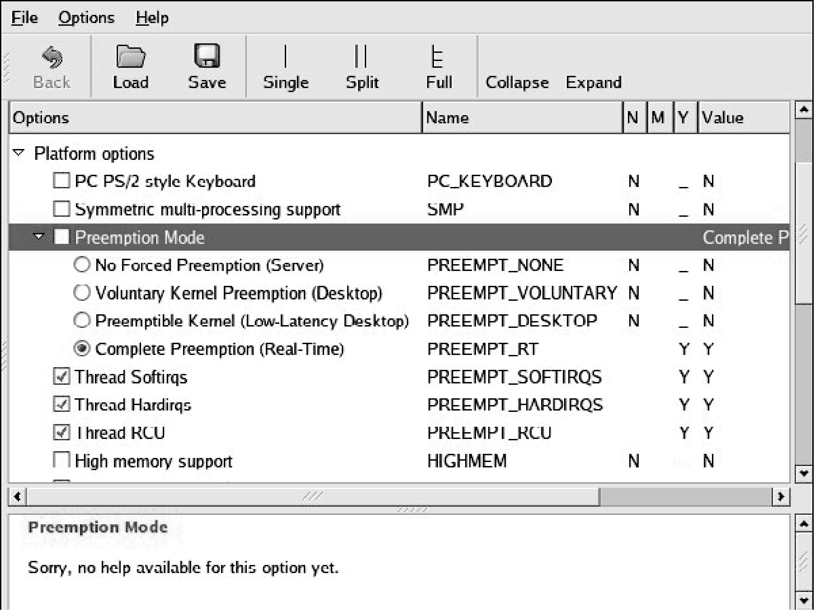

### 17.3　实时内核补丁

kernel.org发布的主线内核版本还不支持硬实时。为了开启硬实时的功能，必须对代码打补丁。实时内核补丁是多方努力的共同成果，目的是为了降低Linux内核的延时。这个补丁有多位代码贡献者，目前由Ingo Molnar维护，补丁网址如下：<a class="my_markdown" href="['http://www.kernel.org/pub/linux/kernel/projects/rt/']">www.kernel.org/pub/linux/kernel/projects/rt/</a>。自从2.6版本的内核发布以来，Linux内核的软实时性能已经有了显著改进。当2.6版本的内核首次发布时，2.4版本的软实时性能要比2.6版本好很多。从2.6.12版本之后，Linux内核已经可以在较快的x86处理器上实现10毫秒以内的软实时性能了。但如果想实现可重复的微秒级的延时，实时补丁就必不可少了。

实时补丁在Linux内核中添加了几个重要特性。在配置已经打过实时补丁的内核代码时，我们可以从多种抢占模式中选择一种，如图17-4所示。

<b class="my_markdown">图17-4　抢占模式和实时补丁</b>

实时补丁添加了第4种抢占模式，称为 `PREEMPT_RT` （实时抢占）。4种抢占模式的含义如下。

+ `PREEMPT_NONE` ——没有强制性的抢占。整体的平均延时较低，但偶尔也会出现一些较长的延时。它最适合那些以整体吞吐率为首要设计准则的应用。
+ `PREEMPT_VOLUNTARY` ——降低延时的第一阶段。它会在内核代码的一些关键位置上放置额外的显式抢占点，以降低延时。但这是以牺牲整体吞吐率为代价的。
+ `PREEMPT_DESKTOP` ——这种模式使内核在任何地方都是可抢占的，临界区除外。这种模式适用于那些需要软实时性能的应用程序，比如音频和多媒体。这也是以牺牲整体吞吐率为代价的。
+ `PREEMPT_RT` ——这在内核中增加了实时补丁的某些特性，包括使用可抢占的互斥量来替代自旋锁。除了使用 `preempt_disable()` 保护的区域以外，内核中的所有地方都开启了非自愿式抢占（involuntary preemption）功能。这种模式能够显著降低抖动（延时的变化），并且使那些对延时要求很高的实时应用具有可预测的较低延时。

如果在内核配置中开启了内核抢占功能，可以在系统引导时向内核传递以下命令行参数来关闭它：

