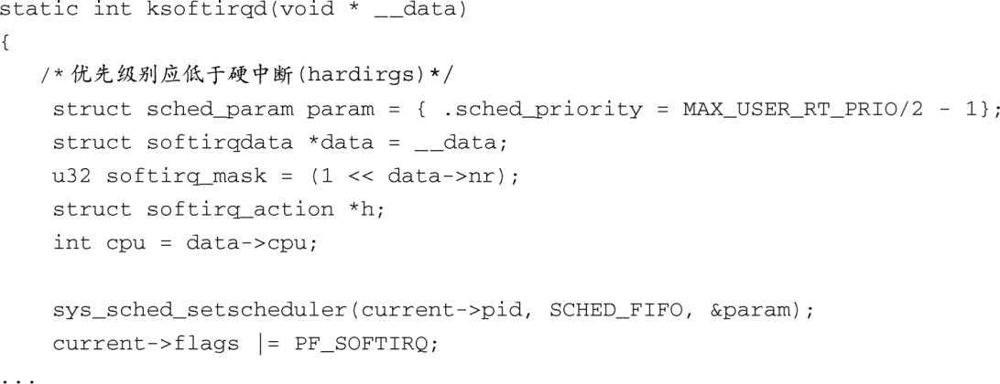

### 17.3.1　实时补丁的特性

配置选项 `CONFIG_PREEMPT_RT` 在Linux内核中增加了几个新的特性，图17-4中显示了一些新的配置选项。下面就介绍这些实时补丁的特性。

实时补丁将系统中大多数的自旋锁替换成了支持优先级继承的互斥量。这能够降低系统的整体延时，但同时会增加额外的处理自旋锁（互斥量）方面的开销，结果是系统的整体吞吐率也降低了。将自旋锁转换成互斥量的好处是它们能够被抢占。如果进程A持有一个锁，更高优先级的进程B也需要同一个锁，当它持有一个互斥量时，进程B能够抢占进程A。

选择 `CONFIG_PREEMPT_HARDIRQS` ，会强制中断服务程序（ISR）在进程上下文中运行。这样开发人员能够控制ISR的优先级，因为这时它们已经变成了可调度的实体。同样，它们也变成可抢占的，从而允许优先级高的硬件中断先得到处理。由于它们能够被调度，你就可以根据系统的需要来分配它们的优先级。

这是个强大的特性。有些硬件架构并不支持中断的优先级，即使支持，硬件中的优先级设置也有可能与实时系统的设计目标不一致。通过使用 `CONFIG_PREEMPT_HARDIRQS` ，你就可以随意设置每个IRQ的运行优先级了。

`CONFIG_PREEMPT_SOFTIRQS` 通过在ksoftirqd（内核softirq守护程序）的上下文中运行softirq来降低延时。ksoftirqd本身就是一个Linux任务（进程）。因而，可以设置它的优先级并能够与其他任务一起被调度。如果你的内核是针对实时应用而配置的，并且开启了配置选项 `CONFIG_PREEMPT_SOFTIRQS` ，ksoftirqd内核任务的优先级会被提升为实时优先级，以处理softirq进程<a class="my_markdown" href="['#anchor174']">[4]</a>。代码清单17-3显示了实现这一功能的内核代码，具体的文件路径是.../kernel/softirq.c。

代码清单17-3　将ksoftirqd提升为实时状态

<a class="my_markdown" href="['#ac174']">[4]</a>　请参考本章末尾列出的《Linux内核设计与实现》一书，以了解更多有关softirq的知识。

这里我们看到通过使用内核函数 `sys_sched_setscheduler()` ，内核任务 `ksoftirqd` 被提升为一个实时任务（ `SCHED_FIFO` ）。

