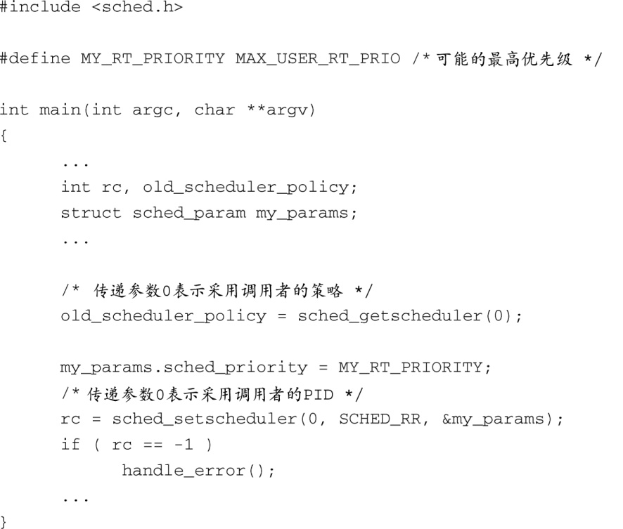

### 17.3.3　创建实时进程

可以通过设置进程属性（调度策略）将某个进程指定为实时进程，而调度器会在其调度算法中使用这个属性。代码清单17-4显示了一种通用的设置方法。

代码清单17-4　创建实时进程

这段代码通过调用 `sched_setscheduler()` 完成了两件事情。一是将进程的调度策略改为 `SCHED_RR` ，二是将进程的优先级提升到系统所允许的最大值。Linux支持3种调度策略。

+ `SCHED_OTHER` ——普通Linux进程，公平调度。
+ `SCHED_RR` ——带时间片的实时进程。也就是说，如果它不阻塞，它会运行一段由调度器决定的时间（即时间片的长度）。
+ `SCHED_FIFO` ——实时进程，它会一直运行，直到它阻塞，主动放弃处理器或是有其他更高优先级的 `SCHED_FIFO` 进程变成可运行状态。

`sched_setscheduler()` 的帮助手册中提供了更多有关这3种不同调度策略的详细信息。

