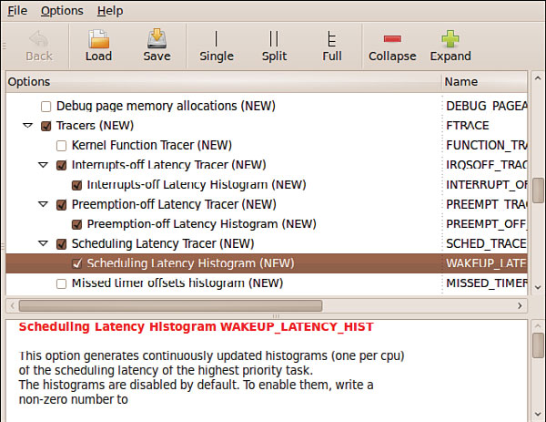

### 17.4.1　使用Ftrace追踪内核行为

在使用Frace之前必须先在内核配置中开启它。图17-5显示了最新内核发布版本中相关的内核配置参数。

<b class="my_markdown">图17-5　Ftrace的内核配置</b>

Ftrace有很多可用的模块。在某个特定的测试会话中，明智的做法是只选择那些可能会用到的模块，因为每个模块都会给内核增加额外的负担。

开启追踪功能的一般方式是通过使用它导出到debugfs文件系统中的接口。假设你已经在内核配置中正确配置了Ftrace，接着必须挂载debugfs，命令如下：

挂载完成后，应该会在/sys/kernel/debug目录中找到一个名为tracing的子目录。tracing目录中包含了所有关于Ftrace数据的控制文件和输出文件。在下面几节中我们会介绍几个使用该系统的例子，到时候你就会清楚这些文件的作用了。我们遵照内核文档中所建议的，创建一个名为 `/tracing` 的符号链接来简化Ftrace子系统的使用：

从这里开始，我们将引用/tracing来代替一长串的/sys/kernel/debug/tracing。

