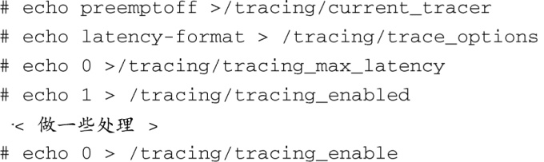
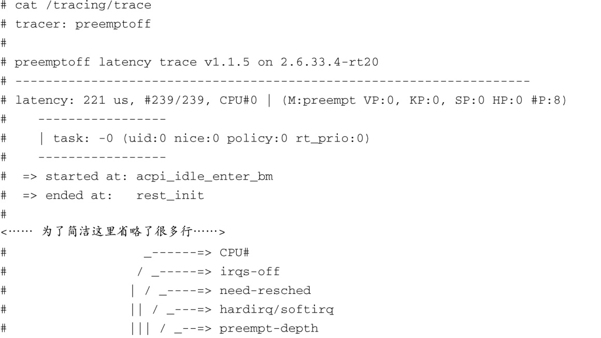
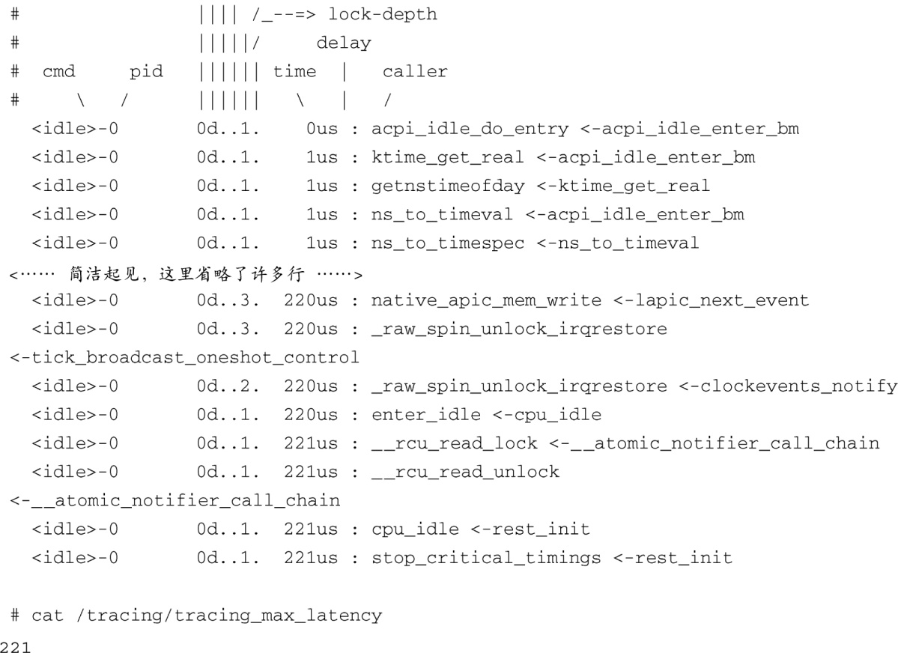

### 17.4.2　检测抢占被关闭的延时

内核在处理临界区中的共享数据结构时会调用函数来禁止抢占。当抢占被禁止时，中断还是可以发生的，但更高优先级的进程却不能运行了。你可以使用Ftrace的preemptoff功能来检测每次抢占被关闭（禁止）的时间。

要检测抢占关闭延时，必须首先在内核配置菜单的Kernel hacking子菜单中开启 `PREEMPT_TRACER` 和 `PREEMPTE_OFF_HIST` 。这个追踪模式使你能够找出哪条执行路径关闭抢占的时间最长。

下面列出了使用Ftrace来检测preemptoff时间的命令：

代码清单17-5显示了这些命令在执行之后输出的追踪信息。注意，输出信息的头部显示最长的延时为221微秒（us）。

代码清单17-5　追踪抢占被关闭的延时

同时注意，代码清单17-5的最后两行也显示了Ftrace检测出的最大延时，也就是文件tracing_max_latency的内容。这个值总是和追踪文件（/tracing/trace，代码清单17-5显示了其完整内容）中输出的最大延时保持一致，追踪文件中还记录了产生这个最长延时的函数执行路径。

