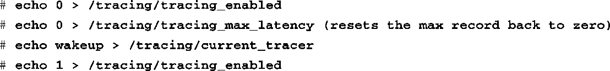
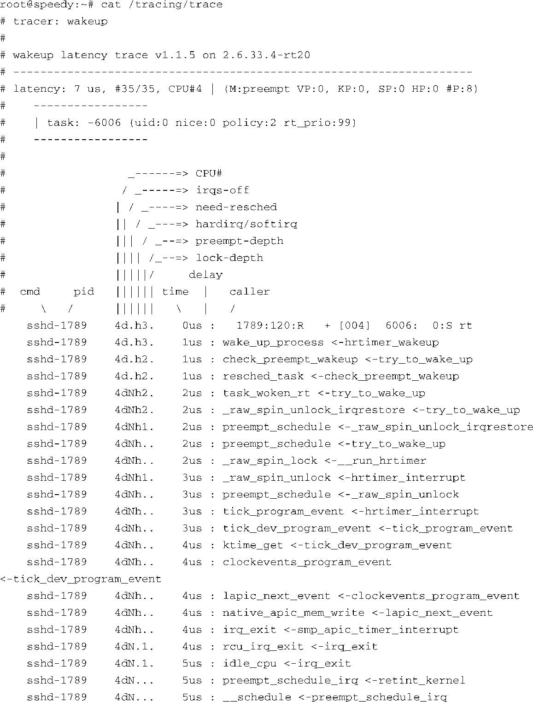
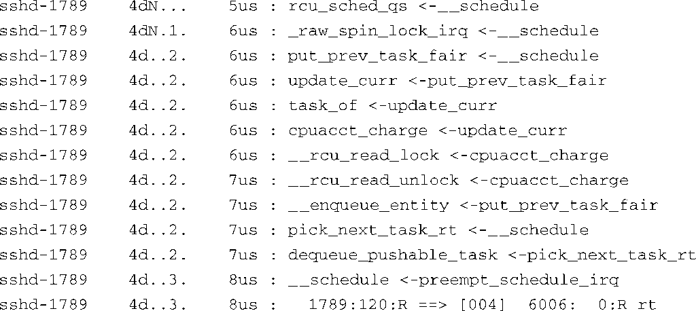
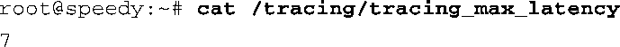

### 17.4.3　检测唤醒延时

实时系统开发人员最关心的一项关键检测数据是高优先级任务从获得运行通知到真正运行需要花多长时间。当一个实时进程（调度属性为 `SCHED_FIFO` 或 `SCHED_RR` ）在系统中运行时，按照定义它会和其他任务共享处理器。当系统需要处理某个事件时，这个实时进程会被唤醒。也就是说，调度器了解到这个实时进程需要运行。唤醒延时是指从唤醒事件发生到任务真正占有处理器并开始运行的这段时间。

Ftrace包含了追踪wakeup和wakeup_rt延时的功能。它们能够记录和追踪进程从唤醒到运行的最长延时。

代码清单17-6是由一个简单的C语言测试程序生成的，它创建了一个文件并向其中写入数据。在进行文件读写之前，测试程序将其自身提升为实时进程（调度策略为 `SCHED_RR` ，优先级为99），并通过写入标准输入输出来设置追踪系统，类似于在shell中执行以下命令：

测试程序执行了这些命令之后，追踪过程就完成了。代码清单17-6显示了结果。注意，这次检测到的最大唤醒延时为7微秒。

代码清单17-6　追踪唤醒延时

当测试程序运行时，它首先执行文件读写操作，然后睡眠。这就保证了它会释放处理器，即使没有阻塞在I/O上。代码清单17-6中显示的追踪结果相当有趣。从头部可以看到，测试程序的进程号（PID）是6006，优先级是99。还可以看到最大延时是7微秒——我们当然非常愿意接受这个值。

追踪信息中的第一行代表唤醒事件<a class="my_markdown" href="['#anchor176']">[6]</a>。此时进程号为1789的进程（ssh守护进程）正在运行。最后一行代表实际的上下文切换，从sshd切换到测试程序（进程号为6006，且具有实时优先级）。唤醒事件和上下文切换之间的消息描述了内核的执行路径和相对时间。

<a class="my_markdown" href="['#ac176']">[6]</a>　这里的唤醒事件是指测试程序的睡眠时间到期了。——译者注

请参考Linux内核源码树的.../Documentation子目录，并查看其中的文件trace/ftrace.txt，以了解更多详细信息。

另一个追踪文件也单独记录了最大延时的值。为了显示某次追踪过程中的最大唤醒延时，只需要执行以下命令：

