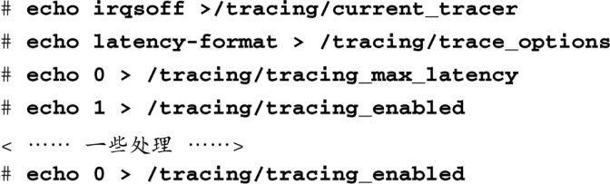
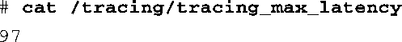

### 17.4.4　检测中断被关闭的延时

要检测中断被关闭的最大延时，首先必须确保已经在内核配置中开启了 `IRQSOFF_TRACER` 。这个选项能够检测程序在关闭了IRQ的临界区中花费的时间。其检测方式和检测唤醒延时的方式相同。要进行检测，只需以root身份执行以下命令：

要获取当前的最大延时，只需显示文件/tracing/tracing_max_latency的内容即可：

也许你已经注意到了，唤醒延时和中断关闭延时的检测都使用了相同的文件。这显然意味着在某个时刻只能进行一项检测，否则检测结果可能是无效的。因为这些检测机制会显著增加内核运行时的负担，所以同时启用多项检测并不是个明智的做法。

